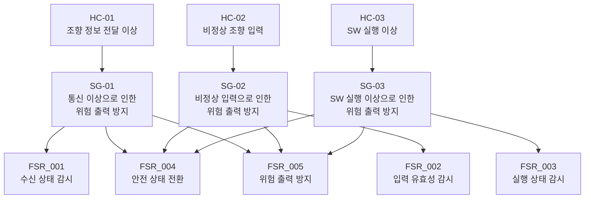

# HARA 워크시트 (Hazard Analysis and Risk Assessment)

**Document ID**: STEER-00A-HARA  
**ISO 26262 Reference**: Part 3 (Concept Phase, Hazard Analysis and Risk Assessment)  
**Version**: 2.0  
**Status**: Baseline (Educational Assessment)  
**Project Title**: AUTOSAR 기반 조향 관련 오류에 대한 복구 및 진단 시스템  
**Subtitle**: 조향 시스템 Hazard 분석 및 Safety Goal 도출

---

> 본 문서는 조향 시스템에서 발생 가능한 Hazardous Event를 식별하고 Severity, Exposure, Controllability를 평가하여 Safety Goal을 도출한다.
>
> 본 프로젝트의 ASIL 값은 교육 프로젝트 내부의 안전 요구사항 전개를 위한 Candidate 값이며, 실제 양산 차량의 공식 ISO 26262 ASIL 판정 결과를 의미하지 않는다.

---

## 1. 목적 및 범위

본 문서는 AUTOSAR 기반 조향 오류 복구 및 진단 시스템에서 발생 가능한 주요 위험 상황을 식별하고, 각 Hazardous Event에 대한 Severity(S), Exposure(E), Controllability(C)를 평가하여 Safety Goal을 도출하는 것을 목적으로 한다.

분석 대상 시스템의 기능 흐름은 다음과 같다.

```text
운전자 조향 입력
      ↓
Steering Sensor
      ↓
입력 ECU
      ↓
CAN Communication
      ↓
출력 ECU
      ↓
Steering Control SW
      ↓
Actuator
      ↓
Motor
```

본 HARA에서는 다음 세 가지 위험 관점을 주요 분석 대상으로 한다.

- 조향 정보 전달 과정의 통신 이상
- 비정상적인 조향 입력
- 조향 제어 관련 SW 실행 이상

HARA 단계에서는 위험 상황과 이를 방지하기 위한 최상위 Safety Goal을 정의한다.

Alive Counter, 조향각 유효 범위, Fault 판정 횟수, Fail-Safe 상태 전이, PWM 출력값, AUTOSAR SWC와 같은 구체적인 안전 메커니즘 및 구현 방법은 후속 FSR, TSR, SW Requirement 및 설계 단계에서 구체화한다.

---

## 2. HARA 수행 흐름

본 프로젝트에서는 다음 순서로 HARA를 수행한다.

```text
Item / Function Definition
        ↓
Malfunction Identification
        ↓
Hazard Identification
        ↓
Operational Situation
        ↓
Hazardous Event
        ↓
S / E / C Evaluation
        ↓
ASIL Candidate
        ↓
Safety Goal
        ↓
Functional Safety Requirements
```

HARA에서는 **어떤 고장이 발생할 수 있는가**보다 해당 고장이 차량 운행 상황과 결합되었을 때 **어떤 위험한 차량 동작으로 이어질 수 있는가**를 중심으로 분석한다.

---

## 3. S/E/C 평가 기준

### 3.1 Severity

| Level | 의미 |
| :---: | --- |
| S0 | 상해 없음 |
| S1 | 경미하거나 중간 수준의 상해 |
| S2 | 중증 또는 생존 가능한 상해 |
| S3 | 생명을 위협하거나 치명적인 상해 |

### 3.2 Exposure

| Level | 의미 |
| :---: | --- |
| E0 | 사실상 발생하지 않음 |
| E1 | 매우 낮은 노출 가능성 |
| E2 | 낮은 노출 가능성 |
| E3 | 중간 수준의 노출 가능성 |
| E4 | 높은 노출 가능성 |

### 3.3 Controllability

| Level | 의미 |
| :---: | --- |
| C0 | 일반적으로 제어 가능 |
| C1 | 대부분의 운전자가 제어 가능 |
| C2 | 일부 상황에서 제어가 어려움 |
| C3 | 제어가 어렵거나 사실상 불가능 |

---

# 4. Hazard Analysis

<a id="hc-01"></a>

## 4.1 HC-01 — 조향 정보 전달 이상

### Malfunction

입력 ECU에서 생성된 조향 정보가 출력 ECU에 정상적으로 전달되지 않는다.

### Operational Situation

차량 주행 중 운전자가 조향 입력을 수행하고 있는 상황.

### Hazardous Event

조향 정보 전달 과정의 통신 이상으로 인해 출력 ECU가 오래되거나 잘못된 조향 정보를 사용하여 **운전자 의도와 다른 조향 출력이 발생한다.**

### Risk Assessment

| 항목 | 평가 | 근거 |
|---|:---:|---|
| Severity | S3 | 의도하지 않은 조향은 차량 진행 방향을 급격히 변경시켜 심각한 사고로 이어질 수 있음 |
| Exposure | E4 | 차량 주행 중 조향 기능은 지속적으로 사용됨 |
| Controllability | C3 | 예상하지 못한 조향 출력이 발생할 경우 운전자가 즉시 보상하기 어려울 수 있음 |
| **ASIL Candidate** | **D** | 교육 프로젝트 기준 Candidate 평가 |

---

<a id="sg-01"></a>

### Safety Goal — SG-01

> **조향 정보 전달 이상으로 인해 운전자 의도와 다른 위험한 조향 출력이 발생하지 않아야 한다.**

**ASIL Candidate:** D

**관련 Hazardous Event**

← [HC-01 — 조향 정보 전달 이상](#hc-01)

**하위 Functional Safety Requirements**

→ [FSR_001 — 조향 정보 수신 상태 감시](00b_Functional_Safety_Requirements.md#fsr-001)  
→ [FSR_004 — 안전 상태 전환](00b_Functional_Safety_Requirements.md#fsr-004)  
→ [FSR_005 — 위험한 조향 출력 방지](00b_Functional_Safety_Requirements.md#fsr-005)

---

<a id="hc-02"></a>

## 4.2 HC-02 — 비정상 조향 입력

### Malfunction

센서 또는 입력 처리 이상으로 인해 정상적인 조향 범위를 벗어난 조향 정보가 생성된다.

### Operational Situation

차량 주행 중 운전자의 조향 입력이 차량 제어에 사용되는 상황.

### Hazardous Event

비정상적인 조향 입력이 정상 입력으로 사용되어 **운전자 의도와 다른 조향 출력이 발생한다.**

### Risk Assessment

| 항목 | 평가 | 근거 |
|---|:---:|---|
| Severity | S3 | 비정상적인 조향 명령은 차량 진행 방향에 직접 영향을 줄 수 있음 |
| Exposure | E4 | 차량 주행 중 조향 입력은 지속적으로 발생할 수 있음 |
| Controllability | C3 | 갑작스러운 비의도 조향 발생 시 운전자의 보상이 어려울 수 있음 |
| **ASIL Candidate** | **D** | 교육 프로젝트 기준 Candidate 평가 |

---

<a id="sg-02"></a>

### Safety Goal — SG-02

> **비정상적인 조향 입력으로 인해 운전자 의도와 다른 위험한 조향 출력이 발생하지 않아야 한다.**

**ASIL Candidate:** D

**관련 Hazardous Event**

← [HC-02 — 비정상 조향 입력](#hc-02)

**하위 Functional Safety Requirements**

→ [FSR_002 — 조향 입력 유효성 감시](00b_Functional_Safety_Requirements.md#fsr-002)  
→ [FSR_004 — 안전 상태 전환](00b_Functional_Safety_Requirements.md#fsr-004)  
→ [FSR_005 — 위험한 조향 출력 방지](00b_Functional_Safety_Requirements.md#fsr-005)

---

<a id="hc-03"></a>

## 4.3 HC-03 — 조향 제어 SW 실행 이상

### Malfunction

출력 ECU의 조향 제어 관련 SW 기능이 의도된 실행 상태를 유지하지 못한다.

### Operational Situation

차량 주행 중 출력 ECU가 수신된 조향 정보를 기반으로 조향 출력을 계산하고 제어하는 상황.

### Hazardous Event

조향 제어 관련 SW 실행 이상으로 인해 오래된 데이터 또는 비정상적인 제어 결과가 사용되어 **운전자 의도와 다른 조향 출력이 발생한다.**

### Risk Assessment

| 항목 | 평가 | 근거 |
|---|:---:|---|
| Severity | S3 | 잘못된 조향 제어 결과는 차량 진행 방향에 직접적인 영향을 줄 수 있음 |
| Exposure | E3 | 특정 SW 실행 이상이 발생한 상태에서 차량이 주행하는 상황을 가정 |
| Controllability | C3 | 비정상 조향 출력이 발생할 경우 운전자의 즉각적인 보상이 어려울 수 있음 |
| **ASIL Candidate** | **D** | 교육 프로젝트 기준 Candidate 평가 |

---

<a id="sg-03"></a>

### Safety Goal — SG-03

> **조향 제어 관련 SW 실행 이상으로 인해 운전자 의도와 다른 위험한 조향 출력이 발생하지 않아야 한다.**

**ASIL Candidate:** D

**관련 Hazardous Event**

← [HC-03 — 조향 제어 SW 실행 이상](#hc-03)

**하위 Functional Safety Requirements**

→ [FSR_003 — 조향 제어 실행 상태 감시](00b_Functional_Safety_Requirements.md#fsr-003)  
→ [FSR_004 — 안전 상태 전환](00b_Functional_Safety_Requirements.md#fsr-004)  
→ [FSR_005 — 위험한 조향 출력 방지](00b_Functional_Safety_Requirements.md#fsr-005)

---

# 5. HARA 요약

| HARA ID | Hazardous Event | S | E | C | ASIL Candidate | Safety Goal |
| :---: | --- | :---: | :---: | :---: | :---: | --- |
| [HC-01](#hc-01) | 통신 이상으로 운전자 의도와 다른 조향 출력 발생 | S3 | E4 | C3 | D | [SG-01](#sg-01) |
| [HC-02](#hc-02) | 비정상 조향 입력으로 운전자 의도와 다른 조향 출력 발생 | S3 | E4 | C3 | D | [SG-02](#sg-02) |
| [HC-03](#hc-03) | SW 실행 이상으로 운전자 의도와 다른 조향 출력 발생 | S3 | E3 | C3 | D | [SG-03](#sg-03) |

---

# 6. Safety Goal 요약

| Safety Goal | 내용 | 하위 FSR |
| :---: | --- | --- |
| [SG-01](#sg-01) | 조향 정보 전달 이상으로 인한 위험한 조향 출력 방지 | [FSR_001](00b_Functional_Safety_Requirements.md#fsr-001), [FSR_004](00b_Functional_Safety_Requirements.md#fsr-004), [FSR_005](00b_Functional_Safety_Requirements.md#fsr-005) |
| [SG-02](#sg-02) | 비정상 조향 입력으로 인한 위험한 조향 출력 방지 | [FSR_002](00b_Functional_Safety_Requirements.md#fsr-002), [FSR_004](00b_Functional_Safety_Requirements.md#fsr-004), [FSR_005](00b_Functional_Safety_Requirements.md#fsr-005) |
| [SG-03](#sg-03) | SW 실행 이상으로 인한 위험한 조향 출력 방지 | [FSR_003](00b_Functional_Safety_Requirements.md#fsr-003), [FSR_004](00b_Functional_Safety_Requirements.md#fsr-004), [FSR_005](00b_Functional_Safety_Requirements.md#fsr-005) |

---

# 7. 요구사항 전개

본 HARA에서 도출한 Safety Goal은 Functional Safety Concept 단계에서 FSR로 구체화한다.



전체 안전 요구사항 전개 구조는 다음과 같다.

```text
Hazardous Event
      ↓
Safety Goal
      ↓
Functional Safety Requirement
      ↓
Technical Safety Requirement
      ↓
System / SW Requirement
      ↓
SW Architecture
      ↓
Detailed Design
      ↓
Implementation
      ↓
Verification
```

---

# 8. 관련 산출물

| 단계 | 산출물 |
|---|---|
| HARA / Safety Goal | **본 문서** |
| Functional Safety Requirement | [00b_Functional_Safety_Requirements.md](00b_Functional_Safety_Requirements.md) |
| Technical Safety Requirement | [00c_Technical_Safety_Requirements.md](00c_Technical_Safety_Requirements.md) |
| System Requirement | [01_System_Requirements.md](01_System_Requirements.md) |
| System Design | [02_System_Design.md](02_System_Design.md) |
| SW Requirement | [03_SW_Requirements.md](03_SW_Requirements.md) |
| SW Architecture | [04_SW_Architecture_Design.md](04_SW_Architecture_Design.md) |
| Detailed Design | [05_SW_Detailed_Design_Unit_Construction.md](05_SW_Detailed_Design_Unit_Construction.md) |
| SW Unit Verification | [06_SW_Unit_Verification.md](06_SW_Unit_Verification.md) |
| SW Integration Verification | [07_SW_Integration_Verification.md](07_SW_Integration_Verification.md) |
| System Verification | [08_System_Verification.md](08_System_Verification.md) |
| Traceability | [Traceability_Matrix.md](Traceability_Matrix.md) |

---

## 9. 다음 단계

본 HARA에서 정의한 Safety Goal을 기반으로 Functional Safety Requirements를 도출한다.

→ **[Functional Safety Requirements로 이동](00b_Functional_Safety_Requirements.md)**
