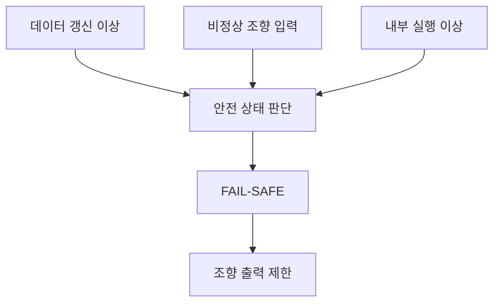

# 시스템 아키텍처 설계 명세서 (System Architecture Design Specification)

**Document ID**: STEER-02-SADS  
**ISO 26262 Reference**: Part 4, Cl.7 (System Design)  
**ASPICE Reference**: SYS.3 (System Architectural Design)  
**Version**: 2.3  
**Date**: 2026-08-27  
**Status**: Draft  
**Project Title**: AUTOSAR 기반 조향 관련 오류에 대한 복구 및 진단 시스템  
**Subtitle**: 조향 입력, ECU 간 통신, 안전 판단 및 조향 출력 시스템 구조

---

## 1. 문서 목적

본 문서는 `01_Requirements.md`에서 정의한 시스템 요구사항 `Req_001~Req_010`을 시스템 요소에 할당하고, 조향 입력 장치, 입력 ECU, 차량 네트워크, 출력 ECU 및 조향 출력 장치 사이의 구조와 상호작용을 정의한다.

본 문서는 시스템 수준의 아키텍처를 다루며 SWC, Runnable, RTE API, 내부 변수, Fault 판정 횟수 및 제어 알고리즘과 같은 소프트웨어 구현 상세는 정의하지 않는다.

해당 내용은 `03_SW_Requirements.md`, `04_SW_Architecture_Design.md`, `05_SW_Detailed_Design_Unit_Construction.md`에서 단계적으로 구체화한다.

---

## 2. 시스템 목적과 범위

| 항목 | 내용 |
|---|---|
| 시스템&nbsp;목적 | 조향 데이터 갱신 상태, 조향 입력 유효성 및 내부 실행 상태를 감시하고, 이상 발생 시 안전 상태로 전환하여 위험한 조향 출력을 방지한다. |
| 시스템&nbsp;입력 | 운전자 조향 입력, 조향 데이터, 출력 ECU 내부 실행 상태 |
| 시스템&nbsp;처리 | 조향 정보 전달, 데이터 갱신 상태 감시, 입력 유효성 판단, 내부 실행 상태 감시, 안전 상태 판단, 정상 상태 복귀, 조향 출력 계산 및 제한 |
| 시스템&nbsp;출력 | 조향 방향 및 출력 크기 |
| 시스템&nbsp;경계 | 조향 입력 장치부터 입력 ECU, CAN Network, 출력 ECU 및 조향 출력 장치까지 포함한다. |
| 범위&nbsp;외 | 실제 차량 조향 동역학, 운전자 경고 HMI, 외부 상태 표시 기능, 양산 수준의 이중화 및 Fail-Operational 제어 |

---

## 3. 시스템 컨텍스트

| 외부 요소 | 시스템과의 관계 | 주요 정보 |
|---|---|---|
| 운전자 | 조향 의도를 입력한다. | 조향 입력 |
| 조향 입력 장치 | 운전자 입력을 전기적 값으로 제공한다. | 조향 입력값 |
| 조향 출력 장치 | 시스템에서 결정한 제어 출력을 물리적 동작으로 변환한다. | 방향 및 출력 크기 |

---

## 4. 시스템 아키텍처

### 시스템 요소 정의

| Element ID | 시스템 요소 | 주요 책임 | HW/SW 구분 |
|---|---|---|---|
| SYS-E-001 | 조향 입력 장치 | 운전자의 조향 입력을 전기적 신호로 제공한다. | HW |
| SYS-E-002 | 입력 ECU | 조향 입력을 수집하고 출력 ECU로 전달할 조향 정보를 생성한다. | HW + SW |
| SYS-E-003 | CAN Network | 입력 ECU와 출력 ECU 사이에서 조향 정보를 전달한다. | Network |
| SYS-E-004 | 출력 ECU | 조향 정보와 내부 실행 상태를 감시하고 안전 상태 및 조향 출력을 결정한다. | HW + SW |
| SYS-E-005 | 조향 출력 장치 | 출력 ECU에서 전달된 조향 제어값을 물리적 조향 동작으로 반영한다. | HW |

---

| Function ID | 시스템 기능 | 설명 | 할당 요소 |
|---|---|---|---|
| SYS-F-001 | 조향 입력 수집 | 운전자의 조향 의도를 나타내는 조향 입력 정보를 수집한다. | SYS-E-001, SYS-E-002 |
| SYS-F-002 | 조향 정보 전달 | 수집된 조향 입력 정보를 입력 ECU에서 출력 ECU의 조향 제어 기능으로 전달한다. | SYS-E-002, SYS-E-003, SYS-E-004 |
| SYS-F-003 | 데이터 갱신 상태 감시 | 조향 입력 데이터가 주기적으로 갱신되고 있는지 감시하고, 갱신 이상을 판단한다. | SYS-E-004 |
| SYS-F-004 | 입력 유효성 판단 | 수신된 조향 입력이 정의된 유효 범위 내에 있는지 판단하고, 비정상 입력을 감지한다. | SYS-E-004 |
| SYS-F-005 | 내부 실행 상태 감시 | 조향 제어 관련 기능의 실행 상태를 감시하고, 실행 이상을 감지한다. | SYS-E-004 |
| SYS-F-006 | 안전 상태 판단 | 감시 결과를 종합하여 NORMAL 또는 FAIL-SAFE 상태를 결정한다. | SYS-E-004 |
| SYS-F-007 | 안전 출력 제한 | FAIL-SAFE 상태에서 운전자 의도와 다른 위험한 조향 출력이 발생하지 않도록 출력을 제한한다. | SYS-E-004, SYS-E-005 |
| SYS-F-008 | 정상 상태 복귀 | 안전 상태 진입 원인이 해소되고 정상 조건이 지속적으로 충족된 경우 NORMAL 상태로 복귀한다. | SYS-E-004 |
| SYS-F-009 | 조향 출력 계산 | 유효한 조향 입력과 현재 시스템 상태를 기반으로 조향 제어값을 계산한다. | SYS-E-004 |
| SYS-F-010 | 조향 하드웨어 출력 | 계산된 조향 제어값에 따라 조향 출력 장치를 제어한다. | SYS-E-004, SYS-E-005 |

---

## 6. 시스템 인터페이스

| Interface ID | 송신 요소 | 수신 요소 | 전달 정보 | 인터페이스 형태 |
|---|---|---|---|---|
| SYS-IF-001 | 조향 입력 장치 | 입력 ECU | 운전자 조향 입력 | Analog Input |
| SYS-IF-002 | 입력 ECU | 출력 ECU | 조향 정보 | CAN Communication |
| SYS-IF-003 | 출력 ECU | 조향 출력 장치 | 조향 방향 및 출력 크기 | PWM / Digital Output |

CAN Identifier, DLC, Signal 배치, 송신 주기와 같은 상세 통신 조건은 후속 SW 요구사항 및 SW 설계 단계에서 정의한다.

---

## 7. 정상 및 고장 동작 개념

### 7.1 시스템 상태

| 시스템 상태 | 진입 조건 | 시스템 동작 | 종료 조건 |
|---|---|---|---|
| **NORMAL** | 조향 데이터, 조향 입력 및 내부 실행 상태가 정상 | 유효한 조향 입력을 기반으로 조향 출력을 결정하고 출력 장치에 전달한다. | 데이터 갱신 이상, 비정상 입력 또는 내부 실행 이상 감지 |
| **FAIL-SAFE** | 데이터 갱신 이상, 비정상 입력 또는 내부 실행 이상 감지 | 위험한 조향 동작이 발생하지 않도록 조향 출력을 제한한다. | 정의된 정상 복귀 조건 충족 |

### 7.2 주요 Fault에 대한 시스템 대응

HARA에서 식별한 세 가지 위험 관점에 대응하여 시스템 수준에서는 다음과 같은 고장 대응 구조를 적용한다.

| Fault 유형 | 시스템 영향 | 시스템 대응 |
|---|---|---|
| 조향 데이터 미수신·미갱신 | 오래된 조향 정보가 계속 사용되어 운전자 의도와 다른 조향이 발생할 수 있음 | 데이터 갱신 이상을 감지하고 안전 상태로 전환한다. |
| 비정상 조향 입력 | 비정상 입력으로 인해 운전자 의도와 다른 조향 출력이 생성될 수 있음 | 입력 유효성을 판단하고 이상 감지 시 안전 상태로 전환한다. |
| 출력 ECU 내부 실행 이상 | 조향 관련 진단·판단·제어 결과를 신뢰할 수 없음 | 내부 실행 이상을 감지하고 안전 상태로 전환한다. |

세 Fault 유형은 서로 다른 감시 기능을 통해 판단하지만, 이상이 확인된 이후에는 공통적으로 안전 상태 판단 및 출력 제한 기능을 통해 위험한 조향 출력을 방지한다.

### 7.3 정상 상태 복귀

정상 상태 복귀는 HARA에서 독립적인 Hazardous Event로 정의하지 않으며, 안전 상태 진입 이후 시스템의 정상 기능을 회복하기 위한 시스템 기능으로 정의한다.

FAIL-SAFE 상태에서 데이터 갱신 상태, 조향 입력 및 내부 실행 상태가 정의된 정상 조건을 지속적으로 만족하는 경우 NORMAL 상태로 복귀할 수 있다.

구체적인 정상 판정 조건 및 연속 정상 확인 횟수는 `03_SW_Requirements.md`에서 정의한다.

---

## 8. 시스템 요구사항 할당

| Requirement ID | 관련 시스템 기능 | 할당 시스템 요소 | 설계 근거 ID |
|---|---|---|---|
| Req_001 | SYS-F-001 | SYS-E-001, SYS-E-002 | SYS-DES-001 |
| Req_002 | SYS-F-002 | SYS-E-002, SYS-E-003, SYS-E-004 | SYS-DES-002 |
| Req_003 | SYS-F-003 | SYS-E-004 | SYS-DES-003 |
| Req_004 | SYS-F-004 | SYS-E-004 | SYS-DES-004 |
| Req_005 | SYS-F-005 | SYS-E-004 | SYS-DES-005 |
| Req_006 | SYS-F-006 | SYS-E-004 | SYS-DES-006 |
| Req_007 | SYS-F-007 | SYS-E-004, SYS-E-005 | SYS-DES-007 |
| Req_008 | SYS-F-008 | SYS-E-004 | SYS-DES-008 |
| Req_009 | SYS-F-009 | SYS-E-004 | SYS-DES-009 |
| Req_010 | SYS-F-010 | SYS-E-004, SYS-E-005 | SYS-DES-010 |

---

## 9. HARA 및 시스템 요구사항 연계

| HARA ID | Safety Goal | 주요 시스템 요구사항 | 시스템 설계 기능 |
|---|---|---|---|
| HC-01 | SG-01 | Req_003, Req_006, Req_007 | SYS-F-003 → SYS-F-006 → SYS-F-007 |
| HC-02 | SG-02 | Req_004, Req_006, Req_007 | SYS-F-004 → SYS-F-006 → SYS-F-007 |
| HC-03 | SG-03 | Req_005, Req_006, Req_007 | SYS-F-005 → SYS-F-006 → SYS-F-007 |

`Req_008 / SYS-F-008`은 HARA의 개별 Safety Goal에 직접 대응하는 기능이 아니라, 안전 상태 진입 이후 정의된 정상 조건이 충족되었을 때 시스템 기능을 회복하기 위한 정상 상태 복귀 기능으로 관리한다.

---

## 10. SW 개발로의 할당

시스템 요소 중 입력 ECU와 출력 ECU에 할당된 기능은 다음 단계에서 SW 요구사항으로 전개한다.

| 시스템 기능 그룹 | SW 요구사항 전개 대상 | 후속 문서 |
|---|---|---|
| SYS-F-001~SYS-F-002 | 조향 입력 수집 및 ECU 간 정보 전달 | `03_SW_Requirements.md` |
| SYS-F-003~SYS-F-005 | 데이터 갱신, 입력 유효성 및 내부 실행 상태 감시 | `03_SW_Requirements.md` |
| SYS-F-006~SYS-F-008 | 안전 상태 판단, 출력 제한 및 정상 복귀 | `03_SW_Requirements.md` |
| SYS-F-009~SYS-F-010 | 조향 출력 계산 및 하드웨어 출력 | `03_SW_Requirements.md` |

---

## 11. 설계 원칙

- 입력 ECU와 출력 ECU의 책임을 분리한다.
- ECU 간 조향 정보는 정의된 시스템 인터페이스를 통해 전달한다.
- 조향 데이터 갱신 상태, 조향 입력 유효성 및 내부 실행 상태를 독립적으로 감시한다.
- 감시 결과를 통합하여 시스템의 NORMAL / FAIL-SAFE 상태를 결정한다.
- Fault 발생 시 정상 조향 제어보다 안전 출력 제한을 우선한다.
- 정상 상태 복귀는 정의된 정상 조건의 지속적인 충족을 기반으로 판단한다.
- 시스템 요구사항, 시스템 기능 및 시스템 요소 간 연결은 `Traceability_Matrix.md`에서 관리한다.

---

본 문서는 시스템 아키텍처의 기준 문서이다.

Alive Counter를 이용한 갱신 판단 방식, 조향 입력 유효 범위, SW 실행 감시 조건, Fault 판정 횟수 및 정상 복귀 횟수 등의 상세 요구사항은 `03_SW_Requirements.md`에서 정의한다.

SWC 구성, Port 및 Interface, Runnable, Event 및 Task Mapping 등의 SW 구조는 `04_SW_Architecture_Design.md`에서 정의한다.

내부 변수, 상태 처리 로직, RTE API 및 PWM 계산 로직 등의 구현 상세는 `05_SW_Detailed_Design_Unit_Construction.md`에서 관리한다.
