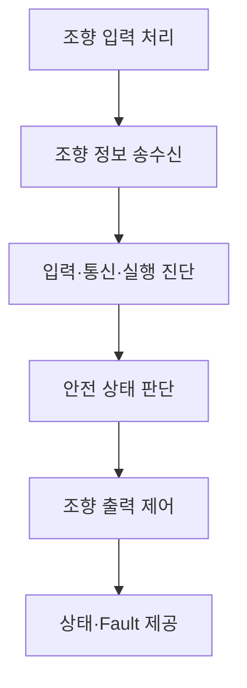

# 소프트웨어 요구사항 명세서 (Software Requirements Specification)

**Document ID**: STEER-03-SWRS  
**ISO 26262 Reference**: Part 6, Cl.6  
**ASPICE Reference**: SWE.1  
**Version**: 1.2  
**Date**: 2026-08-24  
**Status**: Draft  
**Project Title**: AUTOSAR 기반 조향 관련 오류에 대한 복구 및 진단 시스템

---

## 1. 문서 목적

본 문서는 `01_Requirements.md`의 시스템 요구사항과 `02_System_Design.md`의 시스템 기능 할당을 소프트웨어 관점의 요구사항으로 전개한다.

소프트웨어가 수행해야 할 기능과 외부에서 확인할 수 있는 동작을 정의하며, CAN 파라미터, 진단 횟수와 임계값, SWC·Port·Runnable·RTE API, 내부 변수, Task Mapping, PWM 계산식 및 핀 연결은 후속 설계·인터페이스 명세에서 정의한다.

## 2. 작성 원칙

| 원칙 | 적용 내용 |
|---|---|
| 상위 추적 | 모든 `SWR-*`는 `Req`, `SYS-F`, `SYS-DES`를 참조한다. |
| 구현 독립성 | 특정 SWC, API, 변수 또는 알고리즘을 요구사항으로 고정하지 않는다. |
| 검증 가능성 | 입력 조건과 기대 동작을 식별할 수 있게 작성한다. |
| 상세정보 분리 | 통신 파라미터, 진단 기준 및 계산 로직은 후속 명세에서 관리한다. |
| 양방향 추적 | 후속 설계와 Test Case는 검증 대상 `SWR-*`를 역참조한다. |

## 3. 소프트웨어 기능 범위

## 4. SW 요구사항

### 4.1 조향 입력 및 통신

| SW Req. ID | SW 요구사항 | 상위 추적 ID |
|---|---|---|
| SWR-IN-001 | 입력 ECU SW는 운전자의 조향 입력을 취득하여 조향 정보로 제공해야 한다. | Req_001 / SYS-F-001 / SYS-DES-001 |
| SWR-COM-001 | 입력 ECU SW는 조향 정보와 메시지 갱신 여부를 확인할 수 있는 정보를 출력 ECU에 주기적으로 송신해야 한다. | Req_002 / SYS-F-002 / SYS-DES-002 |
| SWR-COM-002 | 출력 ECU SW는 입력 ECU가 송신한 조향 정보를 수신하여 진단 및 제어 기능에 제공해야 한다. | Req_002 / SYS-F-002 / SYS-DES-002 |

### 4.2 입력·통신·내부 실행 진단

| SW Req. ID | SW 요구사항 | 상위 추적 ID |
|---|---|---|
| SWR-DIAG-001 | 출력 ECU SW는 조향 정보가 정상적으로 수신되지 않거나 갱신되지 않는 상태를 감지해야 한다. | Req_003 / SYS-F-003 / SYS-DES-003 |
| SWR-DIAG-002 | 출력 ECU SW는 수신한 조향 정보가 정의된 유효 조건을 만족하는지 검사해야 한다. | Req_004 / SYS-F-004 / SYS-DES-004 |
| SWR-DIAG-003 | 출력 ECU SW는 통신 및 입력 진단 결과를 안전 상태 판단 기능에 제공해야 한다. | Req_003, Req_004 / SYS-F-003, SYS-F-004 / SYS-DES-003, SYS-DES-004 |
| SWR-WDG-001 | 출력 ECU SW는 조향 관련 소프트웨어 기능의 실행 상태를 감시해야 한다. | Req_005 / SYS-F-005 / SYS-DES-005 |
| SWR-WDG-002 | 출력 ECU SW는 내부 실행 이상이 확인되면 그 결과를 안전 상태 판단 기능에 제공해야 한다. | Req_005 / SYS-F-005 / SYS-DES-005 |

### 4.3 안전 상태 전환 및 복귀

| SW Req. ID | SW 요구사항 | 상위 추적 ID |
|---|---|---|
| SWR-SAFE-001 | 출력 ECU SW는 통신, 조향 입력 또는 내부 실행 이상이 감지되면 시스템을 FAIL-SAFE 상태로 전환해야 한다. | Req_006 / SYS-F-006 / SYS-DES-006 |
| SWR-SAFE-002 | 출력 ECU SW는 FAIL-SAFE 상태에서 의도하지 않은 조향 동작이 발생하지 않도록 조향 출력을 제한해야 한다. | Req_007 / SYS-F-007 / SYS-DES-007 |
| SWR-SAFE-003 | 출력 ECU SW는 Fault 조건이 유지되는 동안 FAIL-SAFE 상태와 안전 출력을 유지해야 한다. | Req_006, Req_007 / SYS-F-006, SYS-F-007 / SYS-DES-006, SYS-DES-007 |
| SWR-SAFE-004 | 출력 ECU SW는 정의된 정상 조건이 지속적으로 충족된 경우에만 FAIL-SAFE 상태에서 NORMAL 상태로 복귀해야 한다. | Req_008 / SYS-F-008 / SYS-DES-008 |
| SWR-SAFE-005 | 출력 ECU SW는 정상 복귀 확인 중 Fault가 다시 감지되면 정상 복귀 절차를 중단해야 한다. | Req_008 / SYS-F-008 / SYS-DES-008 |

### 4.4 조향 제어 및 하드웨어 출력

| SW Req. ID | SW 요구사항 | 상위 추적 ID |
|---|---|---|
| SWR-CTRL-001 | 출력 ECU SW는 NORMAL 상태에서 유효한 조향 정보를 기반으로 조향 방향과 출력 크기를 계산해야 한다. | Req_009 / SYS-F-009 / SYS-DES-009 |
| SWR-CTRL-002 | 출력 ECU SW는 조향 입력 변화가 정의된 정지 조건을 만족하면 조향 동작을 정지하도록 결정해야 한다. | Req_009 / SYS-F-009 / SYS-DES-009 |
| SWR-ACT-001 | 출력 ECU SW는 계산된 조향 방향과 출력 크기를 조향 출력 장치에 전달해야 한다. | Req_010 / SYS-F-010 / SYS-DES-010 |
| SWR-ACT-002 | 출력 ECU SW는 출력 제한이 요구되는 상태에서 조향 출력 장치의 동작을 비활성화해야 한다. | Req_007, Req_010 / SYS-F-007, SYS-F-010 / SYS-DES-007, SYS-DES-010 |

### 4.5 상태 및 Fault 정보 제공

| SW Req. ID | SW 요구사항 | 상위 추적 ID |
|---|---|---|
| SWR-MON-001 | 출력 ECU SW는 현재 시스템 동작 상태를 외부 진단·모니터링 환경에 제공해야 한다. | Req_011 / SYS-F-011 / SYS-DES-011 |
| SWR-MON-002 | 출력 ECU SW는 감지된 통신, 조향 입력 및 내부 실행 Fault 정보를 구분하여 제공해야 한다. | Req_011 / SYS-F-011 / SYS-DES-011 |
| SWR-MON-003 | 출력 ECU SW는 안전 상태 판단 및 조향 출력 결과를 검증에 필요한 형태로 관측 가능하게 제공해야 한다. | Req_011 / SYS-F-011 / SYS-DES-011 |

## 5. 상·하위 추적성 요약

| 시스템 요구사항 | 시스템 설계 | 파생 SW 요구사항 |
|---|---|---|
| Req_001 | SYS-F-001 / SYS-DES-001 | SWR-IN-001 |
| Req_002 | SYS-F-002 / SYS-DES-002 | SWR-COM-001–002 |
| Req_003 | SYS-F-003 / SYS-DES-003 | SWR-DIAG-001, SWR-DIAG-003 |
| Req_004 | SYS-F-004 / SYS-DES-004 | SWR-DIAG-002–003 |
| Req_005 | SYS-F-005 / SYS-DES-005 | SWR-WDG-001–002 |
| Req_006 | SYS-F-006 / SYS-DES-006 | SWR-SAFE-001, SWR-SAFE-003 |
| Req_007 | SYS-F-007 / SYS-DES-007 | SWR-SAFE-002–003, SWR-ACT-002 |
| Req_008 | SYS-F-008 / SYS-DES-008 | SWR-SAFE-004–005 |
| Req_009 | SYS-F-009 / SYS-DES-009 | SWR-CTRL-001–002 |
| Req_010 | SYS-F-010 / SYS-DES-010 | SWR-ACT-001–002 |
| Req_011 | SYS-F-011 / SYS-DES-011 | SWR-MON-001–003 |

## 6. 후속 산출물 할당

| 후속 산출물 | 관련 SW 요구사항 | 구체화할 내용 |
|---|---|---|
| `0301_SW_Architecture_Design.md` | 전체 `SWR-*` | SWC, Port, Interface, Runnable 및 Event |
| `04_SW_Detailed_Design_Unit_Construction.md` | 전체 `SWR-*` | CAN·Signal 상세, 상태값, Counter, 임계값, RTE API, 내부 로직, Task Mapping, IoHwAb 및 코드 |
| `05_SW_Unit_Verification.md` | 전체 `SWR-*`와 `SWD-*` | 단위시험, 경계값, Fault Injection, 정적 분석 및 코드 리뷰 |
| `06_SW_Integration_Verification.md` | SW Interface와 Runnable 관련 `SWR-*` | Stub/Mock 기반 SWC Interface 및 Runnable 통합시험 |
| `07_System_Verification.md` | 시스템 요구사항과 외부 관측 가능한 SW 동작 | CANoe/CAPL Restbus, 실제 출력 ECU 및 조향 출력 검증 |

## 7. 상세정보 관리 기준

| 상세정보 | 관리 문서 |
|---|---|
| CAN ID, DLC, Signal, 자료형, 범위, 10 ms 송신 주기 | `04_SW_Detailed_Design_Unit_Construction.md` |
| Alive Counter 증가 방식과 Timeout 판정 횟수 | `04_SW_Detailed_Design_Unit_Construction.md` |
| WdgM 상태값, Checkpoint 및 Supervised Entity | `0301_SW_Architecture_Design.md`, `04_SW_Detailed_Design_Unit_Construction.md` |
| 정상 복귀 확인 횟수와 상태 전이 조건 | `04_SW_Detailed_Design_Unit_Construction.md` |
| 방향 판정 임계값과 PWM 계산식 | `04_SW_Detailed_Design_Unit_Construction.md` |
| SWC, Port, Interface, Runnable 및 Event | `0301_SW_Architecture_Design.md` |
| RTE API, Task Mapping, IoHwAb 채널과 실제 핀 연결 | `04_SW_Detailed_Design_Unit_Construction.md` |

---

본 문서는 SW 요구사항의 기준 문서이다. 후속 설계·구현·시험 문서는 관련 `SWR-*` ID를 참조하고, 전체 양방향 연결은 `Traceability_Matrix.md`에서 관리한다.
