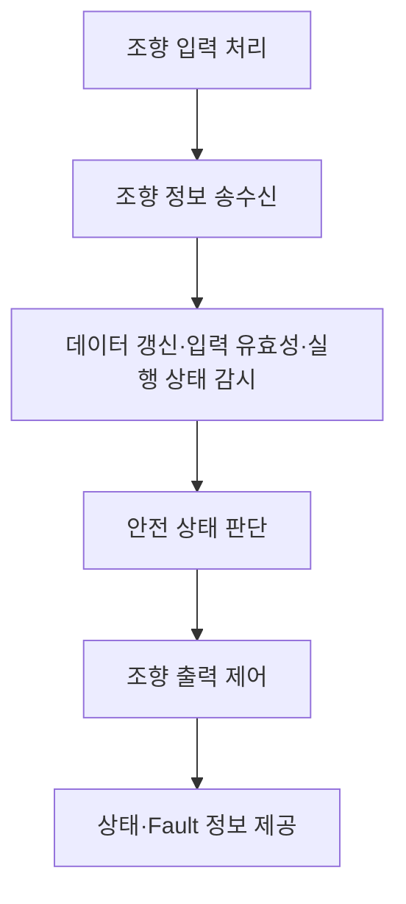

# 소프트웨어 요구사항 명세서 (Software Requirements Specification)

**Document ID**: STEER-03-SWRS  
**ISO 26262 Reference**: Part 6, Cl.6  
**ASPICE Reference**: SWE.1  
**Version**: 1.3  
**Date**: 2026-08-27  
**Status**: Draft  
**Project Title**: AUTOSAR 기반 조향 관련 오류에 대한 복구 및 진단 시스템  
**Subtitle**: 조향 데이터 갱신 감시, 입력 유효성 진단, 실행 상태 감시 및 FAIL-SAFE 제어

---

## 1. 문서 목적

본 문서는 `01_Requirements.md`의 시스템 요구사항과 `02_System_Design.md`의 시스템 기능 할당을 소프트웨어 관점의 요구사항으로 구체화한다.

소프트웨어가 수행해야 하는 기능과 Fault 판정 조건, 안전 상태 전환 및 정상 복귀 조건을 검증 가능한 수준으로 정의한다.

SWC 구성, Port 및 Interface, Runnable, RTE API, 내부 변수, Task Mapping과 같은 구조 및 구현 상세는 후속 SW Architecture 및 Detailed Design 문서에서 정의한다.

---

## 2. 작성 원칙

| 원칙        | 적용 내용                                                            |
| --------- | ---------------------------------------------------------------- |
| 상위 추적     | 모든 `SWR-*`는 관련 `Req`, `SYS-F`, `SYS-DES`를 참조한다.                  |
| 검증 가능성    | 입력 조건, Fault 판정 기준 및 기대 동작을 명확하게 정의한다.                           |
| 구현 독립성    | 특정 SWC, RTE API, 내부 변수 및 코드 구조는 요구사항에서 고정하지 않는다.                 |
| 안전 상태 일관성 | 통신, 입력 및 실행 이상은 공통 안전 상태 판단 및 출력 제한 기능으로 연결한다.                   |
| 양방향 추적    | SW Architecture, Detailed Design 및 Test Case는 관련 `SWR-*`를 역참조한다. |

---

## 3. 소프트웨어 기능 범위

출력 ECU SW는 다음 세 가지 주요 Fault를 감시 대상으로 한다.

* 조향 데이터 갱신 이상
* 조향 입력 유효 범위 이탈
* 조향 제어 관련 SW 실행 이상

Fault가 확인된 경우 공통적으로 FAIL-SAFE 상태로 전환하고 위험한 조향 출력을 제한한다.

---

# 4. SW 요구사항

## 4.1 조향 입력 및 통신

| SW Req. ID      | SW 요구사항                                                                  | 상위 추적 ID                          |
| --------------- | ------------------------------------------------------------------------ | --------------------------------- |
| **SWR-IN-001**  | 입력 ECU SW는 운전자의 조향 입력을 취득하여 조향 정보로 제공해야 한다.                              | Req_001 / SYS-F-001 / SYS-DES-001 |
| **SWR-COM-001** | 입력 ECU SW는 조향 정보와 데이터 갱신 여부를 판단할 수 있는 정보를 출력 ECU에 **10 ms 주기**로 송신해야 한다. | Req_002 / SYS-F-002 / SYS-DES-002 |
| **SWR-COM-002** | 출력 ECU SW는 입력 ECU가 송신한 조향 정보를 수신하여 진단 및 제어 기능에 제공해야 한다.                  | Req_002 / SYS-F-002 / SYS-DES-002 |

---

## 4.2 조향 데이터 갱신 상태 진단

HC-01 / SG-01에 대응하여 출력 ECU SW는 조향 정보가 정상적으로 갱신되는지 판단해야 한다.

| SW Req. ID       | SW 요구사항                                                          | 상위 추적 ID                                                           |
| ---------------- | ---------------------------------------------------------------- | ------------------------------------------------------------------ |
| **SWR-DIAG-001** | 출력 ECU SW는 수신한 조향 정보의 Alive Counter를 이용하여 데이터 갱신 여부를 판단해야 한다.    | Req_003 / SYS-F-003 / SYS-DES-003                                  |
| **SWR-DIAG-002** | Alive Counter가 정상적으로 변경되는 경우 조향 데이터가 정상적으로 갱신된 것으로 판단해야 한다.      | Req_003 / SYS-F-003 / SYS-DES-003                                  |
| **SWR-DIAG-003** | 동일한 Alive Counter가 **연속 2회 이상 확인된 경우** 조향 데이터 갱신 Fault로 판정해야 한다. | Req_003 / SYS-F-003 / SYS-DES-003                                  |
| **SWR-DIAG-004** | 출력 ECU SW는 조향 데이터 갱신 Fault 판정 결과를 안전 상태 판단 기능에 제공해야 한다.          | Req_003, Req_006 / SYS-F-003, SYS-F-006 / SYS-DES-003, SYS-DES-006 |

---

## 4.3 조향 입력 유효성 진단

HC-02 / SG-02에 대응하여 출력 ECU SW는 수신한 조향 입력의 유효성을 판단해야 한다.

| SW Req. ID       | SW 요구사항                                                         | 상위 추적 ID                                                           |
| ---------------- | --------------------------------------------------------------- | ------------------------------------------------------------------ |
| **SWR-DIAG-005** | 출력 ECU SW는 수신한 조향 입력값이 정의된 유효 범위 내에 있는지 검사해야 한다.                | Req_004 / SYS-F-004 / SYS-DES-004                                  |
| **SWR-DIAG-006** | 조향 입력값이 **-512 이상 511 이하**인 경우 유효한 조향 입력으로 판단해야 한다.             | Req_004 / SYS-F-004 / SYS-DES-004                                  |
| **SWR-DIAG-007** | 조향 입력값이 **-512 미만 또는 511 초과**인 경우 조향 입력 Invalid Fault로 판정해야 한다. | Req_004 / SYS-F-004 / SYS-DES-004                                  |
| **SWR-DIAG-008** | 출력 ECU SW는 조향 입력 Invalid Fault 판정 결과를 안전 상태 판단 기능에 제공해야 한다.     | Req_004, Req_006 / SYS-F-004, SYS-F-006 / SYS-DES-004, SYS-DES-006 |

---

## 4.4 SW 실행 상태 감시

HC-03 / SG-03에 대응하여 출력 ECU SW는 조향 제어 관련 소프트웨어 기능의 실행 상태를 감시해야 한다.

| SW Req. ID       | SW 요구사항                                                             | 상위 추적 ID                                                           |
| ---------------- | ------------------------------------------------------------------- | ------------------------------------------------------------------ |
| **SWR-EXEC-001** | 출력 ECU SW는 조향 제어 관련 소프트웨어 기능이 정의된 실행 조건에 따라 정상적으로 실행되고 있는지 감시해야 한다. | Req_005 / SYS-F-005 / SYS-DES-005                                  |
| **SWR-EXEC-002** | 조향 제어 관련 소프트웨어 기능의 실행 이상이 확인된 경우 SW 실행 Fault로 판정해야 한다.              | Req_005 / SYS-F-005 / SYS-DES-005                                  |
| **SWR-EXEC-003** | 출력 ECU SW는 SW 실행 Fault 판정 결과를 안전 상태 판단 기능에 제공해야 한다.                 | Req_005, Req_006 / SYS-F-005, SYS-F-006 / SYS-DES-005, SYS-DES-006 |

> SW 실행 상태 감시를 위한 구체적인 AUTOSAR WdgM 구성, Supervised Entity, Checkpoint 및 상태 인터페이스는 `04_SW_Architecture_Design.md`와 `05_SW_Detailed_Design_Unit_Construction.md`에서 정의한다.

---

## 4.5 안전 상태 전환 및 유지

통신, 입력 또는 SW 실행 Fault가 감지된 경우 공통 안전 동작을 수행한다.

| SW Req. ID       | SW 요구사항                                                                                                        | 상위 추적 ID                                                           |
| ---------------- | -------------------------------------------------------------------------------------------------------------- | ------------------------------------------------------------------ |
| **SWR-SAFE-001** | 출력 ECU SW는 조향 데이터 갱신 Fault, 조향 입력 Invalid Fault 또는 SW 실행 Fault 중 하나 이상이 확인된 경우 시스템 상태를 **FAIL-SAFE**로 전환해야 한다. | Req_006 / SYS-F-006 / SYS-DES-006                                  |
| **SWR-SAFE-002** | 출력 ECU SW는 FAIL-SAFE 상태에서 위험한 조향 동작이 발생하지 않도록 조향 출력을 제한해야 한다.                                                  | Req_007 / SYS-F-007 / SYS-DES-007                                  |
| **SWR-SAFE-003** | 출력 ECU SW는 FAIL-SAFE 상태에서 PWM 출력을 **0% Duty**로 제한해야 한다.                                                        | Req_007 / SYS-F-007 / SYS-DES-007                                  |
| **SWR-SAFE-004** | 출력 ECU SW는 FAIL-SAFE 상태에서 조향 방향 출력을 비활성 상태로 유지해야 한다.                                                           | Req_007 / SYS-F-007 / SYS-DES-007                                  |
| **SWR-SAFE-005** | 하나 이상의 Fault 조건이 유지되는 동안 FAIL-SAFE 상태와 안전 출력을 유지해야 한다.                                                         | Req_006, Req_007 / SYS-F-006, SYS-F-007 / SYS-DES-006, SYS-DES-007 |

---

## 4.6 정상 상태 복귀

정상 상태 복귀는 독립적인 HARA 항목이 아니라, Fault가 해소된 이후 시스템 기능을 안전하게 회복하기 위한 SW 기능으로 정의한다.

| SW Req. ID      | SW 요구사항                                                                     | 상위 추적 ID                                                           |
| --------------- | --------------------------------------------------------------------------- | ------------------------------------------------------------------ |
| **SWR-REC-001** | 출력 ECU SW는 모든 Fault 조건이 해제된 경우 정상 상태 복귀 조건 확인을 시작해야 한다.                     | Req_008 / SYS-F-008 / SYS-DES-008                                  |
| **SWR-REC-002** | 출력 ECU SW는 정상 조건이 **연속 3회 확인된 경우에만** FAIL-SAFE 상태에서 NORMAL 상태로 복귀해야 한다.     | Req_008 / SYS-F-008 / SYS-DES-008                                  |
| **SWR-REC-003** | 정상 상태 복귀 조건 확인 중 Fault가 다시 감지된 경우 정상 확인 누적 상태를 초기화하고 FAIL-SAFE 상태를 유지해야 한다. | Req_008 / SYS-F-008 / SYS-DES-008                                  |
| **SWR-REC-004** | NORMAL 상태로 복귀한 이후에는 정상 조향 제어 출력을 다시 활성화해야 한다.                               | Req_008, Req_009 / SYS-F-008, SYS-F-009 / SYS-DES-008, SYS-DES-009 |

---

## 4.7 조향 제어 및 출력

| SW Req. ID       | SW 요구사항                                                       | 상위 추적 ID                                                           |
| ---------------- | ------------------------------------------------------------- | ------------------------------------------------------------------ |
| **SWR-CTRL-001** | 출력 ECU SW는 NORMAL 상태에서 유효한 조향 입력을 기반으로 조향 방향과 출력 크기를 계산해야 한다. | Req_009 / SYS-F-009 / SYS-DES-009                                  |
| **SWR-CTRL-002** | 출력 ECU SW는 조향 입력이 정의된 정지 조건을 만족하는 경우 조향 출력을 정지하도록 결정해야 한다.    | Req_009 / SYS-F-009 / SYS-DES-009                                  |
| **SWR-ACT-001**  | 출력 ECU SW는 계산된 조향 방향과 출력 크기를 조향 출력 장치에 전달해야 한다.               | Req_010 / SYS-F-010 / SYS-DES-010                                  |
| **SWR-ACT-002**  | 출력 ECU SW는 FAIL-SAFE 상태에서 정상 조향 제어 결과보다 안전 출력 제한을 우선 적용해야 한다. | Req_007, Req_010 / SYS-F-007, SYS-F-010 / SYS-DES-007, SYS-DES-010 |

---

## 4.8 상태 및 Fault 정보 제공

| SW Req. ID      | SW 요구사항                                                                             | 상위 추적 ID                          |
| --------------- | ----------------------------------------------------------------------------------- | --------------------------------- |
| **SWR-MON-001** | 출력 ECU SW는 현재 시스템 상태가 NORMAL 또는 FAIL-SAFE인지 외부에서 확인할 수 있도록 제공해야 한다.                 | Req_011 / SYS-F-011 / SYS-DES-011 |
| **SWR-MON-002** | 출력 ECU SW는 데이터 갱신 Fault, 조향 입력 Invalid Fault 및 SW 실행 Fault를 구분하여 확인할 수 있도록 제공해야 한다. | Req_011 / SYS-F-011 / SYS-DES-011 |
| **SWR-MON-003** | 출력 ECU SW는 안전 상태 판단 결과와 최종 조향 출력 상태를 검증 환경에서 관측할 수 있도록 제공해야 한다.                     | Req_011 / SYS-F-011 / SYS-DES-011 |

---

# 5. HARA-SW 요구사항 추적성

| HARA ID   | Safety Goal | 주요 SW 요구사항                                               |
| --------- | ----------- | -------------------------------------------------------- |
| **HC-01** | SG-01       | SWR-DIAG-001 ~ SWR-DIAG-004, SWR-SAFE-001 ~ SWR-SAFE-005 |
| **HC-02** | SG-02       | SWR-DIAG-005 ~ SWR-DIAG-008, SWR-SAFE-001 ~ SWR-SAFE-005 |
| **HC-03** | SG-03       | SWR-EXEC-001 ~ SWR-EXEC-003, SWR-SAFE-001 ~ SWR-SAFE-005 |

`SWR-REC-*`는 특정 Safety Goal에서 직접 파생되는 Fault 대응 기능이 아니라, Fault 해소 후 시스템의 정상 기능을 안전하게 복구하기 위해 `Req_008`에서 파생된 SW 요구사항으로 관리한다.

---

# 6. 상·하위 요구사항 추적성

| 시스템 요구사항 | 시스템 기능    | 파생 SW 요구사항                                                           |
| -------- | --------- | -------------------------------------------------------------------- |
| Req_001  | SYS-F-001 | SWR-IN-001                                                           |
| Req_002  | SYS-F-002 | SWR-COM-001, SWR-COM-002                                             |
| Req_003  | SYS-F-003 | SWR-DIAG-001 ~ SWR-DIAG-004                                          |
| Req_004  | SYS-F-004 | SWR-DIAG-005 ~ SWR-DIAG-008                                          |
| Req_005  | SYS-F-005 | SWR-EXEC-001 ~ SWR-EXEC-003                                          |
| Req_006  | SYS-F-006 | SWR-DIAG-004, SWR-DIAG-008, SWR-EXEC-003, SWR-SAFE-001, SWR-SAFE-005 |
| Req_007  | SYS-F-007 | SWR-SAFE-002 ~ SWR-SAFE-005, SWR-ACT-002                             |
| Req_008  | SYS-F-008 | SWR-REC-001 ~ SWR-REC-004                                            |
| Req_009  | SYS-F-009 | SWR-REC-004, SWR-CTRL-001, SWR-CTRL-002                              |
| Req_010  | SYS-F-010 | SWR-ACT-001, SWR-ACT-002                                             |
| Req_011  | SYS-F-011 | SWR-MON-001 ~ SWR-MON-003                                            |

---

# 7. 후속 산출물 할당

| 후속 산출물                                       | 관련 SW 요구사항                       | 구체화할 내용                                                      |
| -------------------------------------------- | -------------------------------- | ------------------------------------------------------------ |
| `04_SW_Architecture_Design.md`               | 전체 `SWR-*`                       | SWC, Port, Interface, Runnable, Event 및 SW 기능 배치             |
| `05_SW_Detailed_Design_Unit_Construction.md` | 전체 `SWR-*`                       | 내부 변수, Counter, 상태 처리 로직, RTE API, Task Mapping 및 실제 코드      |
| `06_SW_Unit_Verification.md`                 | 단위 수준 검증 가능한 `SWR-*`             | 정상·경계·Fault 조건에 대한 단위검증                                      |
| `07_SW_Integration_Verification.md`          | SW Interface 및 데이터 흐름 관련 `SWR-*` | SWC 간 Fault 전달, 상태 판단 및 출력 제한 통합검증                           |
| `08_System_Verification.md`                  | 시스템 외부에서 관측 가능한 요구사항             | CAN Fault Injection, Invalid 입력, 실행 이상, FAIL-SAFE 및 정상 복귀 검증 |

---

# 8. Architecture 및 Detailed Design 관리 정보

다음 항목은 SW 요구사항의 동작 조건을 구현하기 위한 설계 정보로 후속 문서에서 관리한다.

| 상세정보                                   | 관리 문서                                        |
| -------------------------------------- | -------------------------------------------- |
| SWC 구성 및 SW 기능 배치                      | `04_SW_Architecture_Design.md`               |
| Port, Interface 및 RTE 연결               | `04_SW_Architecture_Design.md`               |
| Runnable 및 Event 구성                    | `04_SW_Architecture_Design.md`               |
| WdgM Supervised Entity 및 Checkpoint 구조 | `04_SW_Architecture_Design.md`               |
| Alive Counter 저장 변수 및 연속 횟수 Counter 구현 | `05_SW_Detailed_Design_Unit_Construction.md` |
| 조향 입력 유효 범위 비교 로직                      | `05_SW_Detailed_Design_Unit_Construction.md` |
| NORMAL / FAIL-SAFE 상태 변수 및 상태 전이 코드    | `05_SW_Detailed_Design_Unit_Construction.md` |
| 정상 복귀 Counter 구현                       | `05_SW_Detailed_Design_Unit_Construction.md` |
| RTE Read / Write API                   | `05_SW_Detailed_Design_Unit_Construction.md` |
| PWM 계산 로직 및 실제 출력 Interface            | `05_SW_Detailed_Design_Unit_Construction.md` |

---

본 문서는 SW 요구사항의 기준 문서이다.

SW 요구사항에서는 **무엇을 어떤 조건에서 수행해야 하는지**를 정의하며, SW Architecture에서는 해당 기능을 **어떤 SW 구조에 배치할지**, Detailed Design에서는 이를 **어떤 로직과 코드로 구현할지**를 정의한다.

전체 HARA, 시스템 요구사항, SW 요구사항, 설계 및 검증 간 양방향 연결은 `Traceability_Matrix.md`에서 관리한다.
