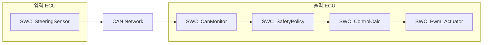
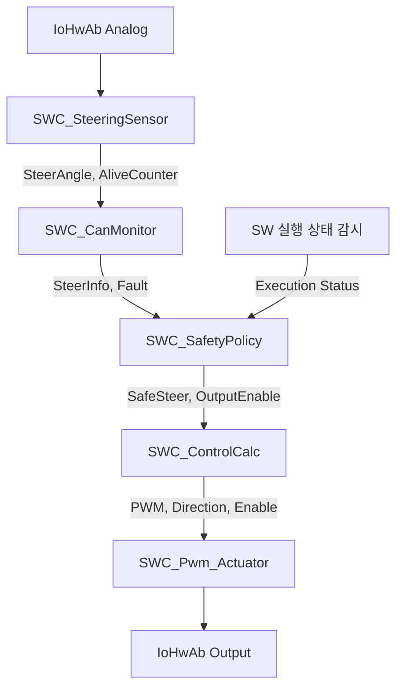
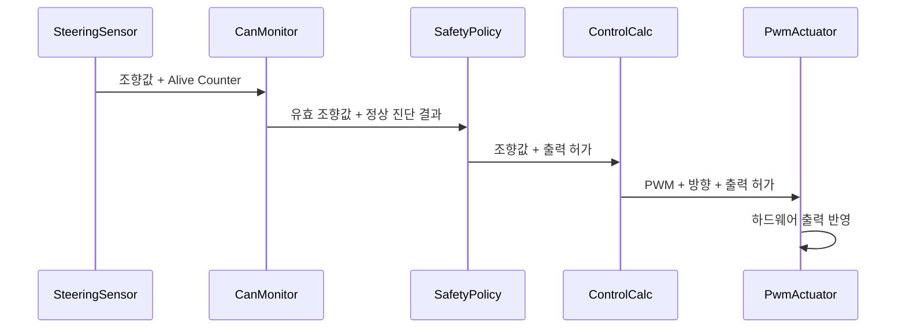
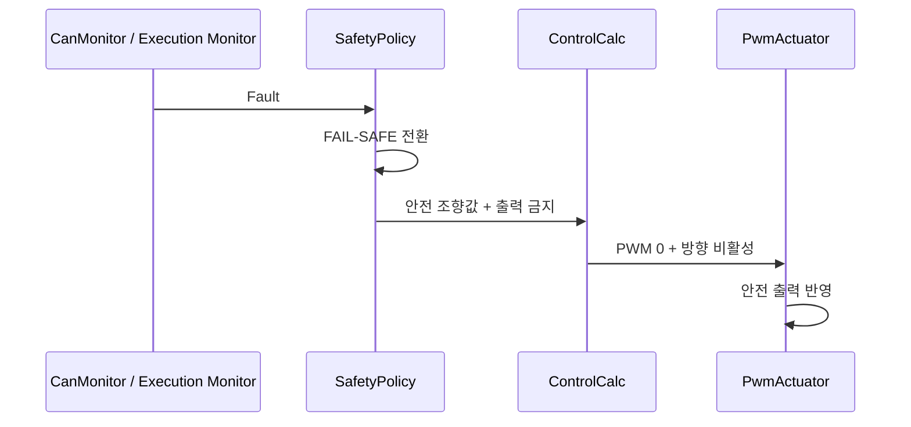
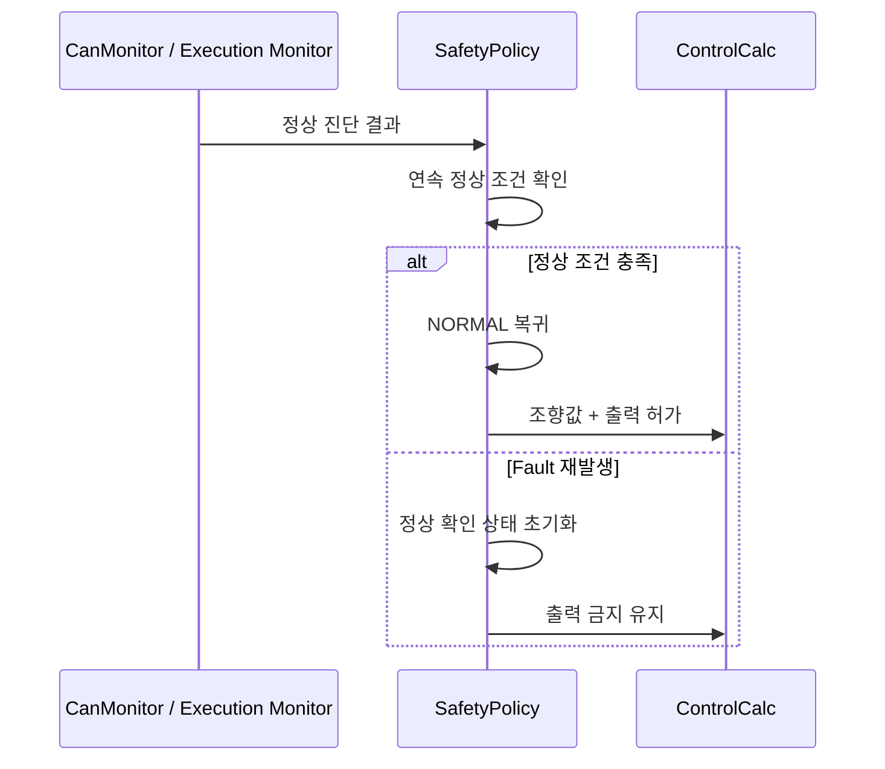

# 소프트웨어 아키텍처 설계 명세서 (Software Architecture Design Specification)

**Document ID**: STEER-04-SWADS  
**ISO 26262 Reference**: Part 6, Cl.7  
**ASPICE Reference**: SWE.2  
**Version**: 1.4  
**Date**: 2026-08-27  
**Status**: Draft  
**Project Title**: AUTOSAR 기반 조향 관련 오류에 대한 복구 및 진단 시스템  
**Subtitle**: 조향 진단, 안전 상태 관리 및 조향 출력 SW 아키텍처

---

## 1. 문서 목적

본 문서는 `03_SW_Requirements.md`에서 정의한 `SWR-*`를 소프트웨어 구성요소에 할당하고, 입력 ECU와 출력 ECU의 SWC 구조, 책임, 인터페이스 및 실행 관계를 정의한다.

본 문서는 소프트웨어 아키텍처 수준을 다룬다.

SWC 간 기능 분리, 데이터 흐름, Port 및 Interface, Runnable과 Event 구조를 정의하며, 내부 변수, Counter 구현, RTE API 호출 코드, 조건문 및 제어 알고리즘과 같은 구현 상세는 `05_SW_Detailed_Design_Unit_Construction.md`에서 관리한다.

---

## 2. 아키텍처 설계 원칙

| 원칙 | 적용 내용 |
|---|---|
| 기능 분리 | 입력, 통신·입력 진단, 안전 판단, 제어 계산 및 하드웨어 출력을 별도 SWC로 분리한다. |
| 단방향 데이터 흐름 | 조향 입력부터 하드웨어 출력까지 기능 책임 순서에 따라 데이터를 전달한다. |
| 안전 우선 | Fault 판정 결과를 정상 조향 제어보다 우선하여 안전 상태 판단에 반영한다. |
| 인터페이스 기반 결합 | SWC 간 데이터는 정의된 Port와 Interface를 통해 전달한다. |
| ECU 책임 분리 | 입력 ECU는 입력 취득·송신, 출력 ECU는 진단·안전 판단·제어·출력을 담당한다. |
| 추적 가능성 | 각 SWC와 Interface는 관련 `SWR-*`와 연결한다. |

---

## 3. ECU별 소프트웨어 구성

| SW Component ID | SWC | ECU 할당 | 주요 책임 |
|---|---|---|---|
| SWC-001 | SWC_SteeringSensor | 입력 ECU | 조향 입력 취득, 조향 정보 및 Alive Counter 생성, CAN 송신 |
| SWC-002 | SWC_CanMonitor | 출력 ECU | 조향 정보 수신, 데이터 갱신 상태 및 조향 입력 유효성 진단 |
| SWC-003 | SWC_SafetyPolicy | 출력 ECU | Fault 결과와 내부 실행 상태 통합, NORMAL/FAIL-SAFE 상태 관리 및 정상 복귀 판단 |
| SWC-004 | SWC_ControlCalc | 출력 ECU | 안전 판단 결과를 반영한 조향 방향 및 출력 크기 계산 |
| SWC-005 | SWC_Pwm_Actuator | 출력 ECU | PWM 및 방향 출력을 하드웨어에 반영 |

---

## 4. SWC별 책임과 요구사항 할당

### 4.1 SWC_SteeringSensor

| 항목 | 내용 |
|---|---|
| 입력 | 조향 입력 장치의 아날로그 값 |
| 처리 | 입력 취득, 조향 정보 변환, Alive Counter 갱신 |
| 출력 | 조향값, Alive Counter |
| 실행 방식 | Timing Event 기반 주기 실행 |
| 할당 SW 요구사항 | SWR-IN-001, SWR-COM-001 |

---

### 4.2 SWC_CanMonitor

| 항목 | 내용 |
|---|---|
| 입력 | CAN으로 수신된 조향값, Alive Counter |
| 처리 | 조향 데이터 갱신 상태 판단, 조향 입력 유효성 판단 |
| 출력 | 진단된 조향값, Fault 판정 결과 |
| 실행 방식 | 조향 정보 수신에 따른 실행 |
| 할당 SW 요구사항 | SWR-COM-002, SWR-DIAG-001 ~ SWR-DIAG-008 |

SWC_CanMonitor는 조향 데이터 갱신 이상과 조향 입력 유효 범위 이탈을 독립적으로 판단하고 그 결과를 SWC_SafetyPolicy에 전달한다.

Alive Counter 비교를 위한 이전 값, 연속 동일 횟수 및 입력 범위 비교 로직은 `05_SW_Detailed_Design_Unit_Construction.md`에서 정의한다.

---

### 4.3 SWC_SafetyPolicy

| 항목 | 내용 |
|---|---|
| 입력 | 진단된 조향값, CanMonitor Fault 결과, SW 실행 상태 |
| 처리 | Fault 통합, NORMAL/FAIL-SAFE 상태 관리, 안전 상태 유지 및 정상 복귀 판단 |
| 출력 | 안전 판단이 반영된 조향값, 출력 허가 Flag |
| 실행 방식 | CanMonitor 결과 수신에 따른 실행 및 SW 실행 상태 감시 기능과 연동 |
| 할당 SW 요구사항 | SWR-EXEC-001 ~ SWR-EXEC-003, SWR-SAFE-001 ~ SWR-SAFE-005, SWR-REC-001 ~ SWR-REC-004 |

SWC_SafetyPolicy는 시스템의 NORMAL / FAIL-SAFE 상태를 내부적으로 관리한다.

NORMAL / FAIL-SAFE 상태 자체를 외부 표시용 인터페이스로 제공하지 않으며, 안전 판단 결과는 조향값과 출력 허가 Flag를 통해 SWC_ControlCalc에 전달한다.

정상 복귀를 위한 연속 정상 판정 횟수의 저장 및 갱신 방법은 `05_SW_Detailed_Design_Unit_Construction.md`에서 정의한다.

---

### 4.4 SWC_ControlCalc

| 항목 | 내용 |
|---|---|
| 입력 | 안전 판단이 반영된 조향값, 출력 허가 Flag |
| 처리 | 조향 방향 결정, 출력 크기 계산, FAIL-SAFE 상태에 따른 출력 제한 반영 |
| 출력 | PWM 값, 좌·우 방향, 출력 허가 상태 |
| 실행 방식 | SafetyPolicy 결과 수신에 따른 실행 |
| 할당 SW 요구사항 | SWR-SAFE-002 ~ SWR-SAFE-004, SWR-REC-004, SWR-CTRL-001, SWR-CTRL-002, SWR-ACT-002 |

SWC_ControlCalc는 정상 조향 제어 결과보다 SafetyPolicy에서 전달된 안전 판단 결과를 우선 적용한다.

---

### 4.5 SWC_Pwm_Actuator

| 항목 | 내용 |
|---|---|
| 입력 | PWM 값, 좌·우 방향, 출력 허가 상태 |
| 처리 | 출력 허가 상태 확인 및 하드웨어 출력 요청 |
| 출력 | PWM 및 Digital 방향 출력 |
| 실행 방식 | ControlCalc 결과 수신에 따른 실행 |
| 할당 SW 요구사항 | SWR-SAFE-003, SWR-SAFE-004, SWR-ACT-001, SWR-ACT-002 |

SWC_Pwm_Actuator는 전달받은 최종 출력 명령을 실제 하드웨어 출력으로 반영한다.

---

## 5. SWC 인터페이스 구조

| Interface ID | 제공자 | 사용자 | 전달 정보 | 인터페이스 유형 | 관련 SW 요구사항 |
|---|---|---|---|---|---|
| SW-IF-001 | IoHwAb Analog | SWC_SteeringSensor | 조향 입력값 | Client-Server | SWR-IN-001 |
| SW-IF-002 | SWC_SteeringSensor | SWC_CanMonitor | 조향값, Alive Counter | Sender-Receiver / CAN Mapping | SWR-COM-001, SWR-COM-002 |
| SW-IF-003 | SWC_CanMonitor | SWC_SafetyPolicy | 진단 조향값, Fault 결과 | Sender-Receiver | SWR-DIAG-001 ~ SWR-DIAG-008 |
| SW-IF-004 | SW 실행 상태 감시 기능 | SWC_SafetyPolicy | SW 실행 상태 | SW 실행 감시 Interface | SWR-EXEC-001 ~ SWR-EXEC-003 |
| SW-IF-005 | SWC_SafetyPolicy | SWC_ControlCalc | 안전 조향값, 출력 허가 Flag | Sender-Receiver | SWR-SAFE-001 ~ SWR-SAFE-005, SWR-REC-001 ~ SWR-REC-004 |
| SW-IF-006 | SWC_ControlCalc | SWC_Pwm_Actuator | PWM 값, 좌·우 방향, 출력 허가 | Sender-Receiver | SWR-CTRL-001, SWR-CTRL-002, SWR-ACT-001, SWR-ACT-002 |
| SW-IF-007 | SWC_Pwm_Actuator | IoHwAb Output | PWM 및 Digital 출력 요청 | Client-Server | SWR-ACT-001, SWR-ACT-002 |

별도의 외부 상태 표시 또는 진단 모니터링 Interface는 본 프로젝트 범위에 포함하지 않는다.

---

## 6. Runnable 및 Event 구조

| Runnable ID | SWC | 역할 | 기동 Event | 상세 실행 조건 관리 |
|---|---|---|---|---|
| RUN-001 | SWC_SteeringSensor | 조향 입력 취득 및 메시지 송신 | 10 ms Timing Event | `05_SW_Detailed_Design_Unit_Construction.md` |
| RUN-002 | SWC_CanMonitor | CAN 수신 정보 진단 | Data Received Event | `05_SW_Detailed_Design_Unit_Construction.md` |
| RUN-003 | SWC_SafetyPolicy | Fault 통합, 안전 상태 판단 및 정상 복귀 관리 | Data Received Event | `05_SW_Detailed_Design_Unit_Construction.md` |
| RUN-004 | SWC_ControlCalc | 방향 및 출력 크기 계산 | Data Received Event | `05_SW_Detailed_Design_Unit_Construction.md` |
| RUN-005 | SWC_Pwm_Actuator | 하드웨어 출력 반영 | Data Received Event | `05_SW_Detailed_Design_Unit_Construction.md` |

입력 ECU의 SWC_SteeringSensor Runnable은 10 ms 주기로 실행한다.

출력 ECU에서는 조향 정보 수신 이후 진단 → 안전 판단 → 제어 계산 → 하드웨어 출력의 순서로 기능이 수행되도록 구성한다.

구체적인 Runnable 이름, RTE Event 설정 및 Task Mapping은 `05_SW_Detailed_Design_Unit_Construction.md`에서 정의한다.

---

## 7. 정상 동작 데이터 흐름

정상 상태에서는 CanMonitor에서 데이터 갱신 상태와 입력 유효성이 정상으로 판단되고, SafetyPolicy에서 정상 조향 제어를 허가한다.

ControlCalc는 유효한 조향 입력을 기반으로 조향 방향과 출력 크기를 계산하고, PwmActuator가 최종 하드웨어 출력을 수행한다.

---

## 8. 고장 동작 데이터 흐름

조향 데이터 갱신 이상, 조향 입력 Invalid 또는 SW 실행 이상 중 하나 이상이 확인되면 SafetyPolicy는 FAIL-SAFE 상태로 전환한다.

FAIL-SAFE 상태에서는 정상 조향 제어 결과보다 안전 출력 제한이 우선 적용된다.

---

## 9. 정상 상태 복귀 데이터 흐름

정상 상태 복귀는 SafetyPolicy에서 관리한다.

FAIL-SAFE 상태에서 모든 Fault가 해제되고 `03_SW_Requirements.md`에서 정의한 정상 조건이 연속적으로 충족되는 경우 NORMAL 상태로 복귀한다.

정상 확인 과정에서 Fault가 다시 발생하면 정상 확인 누적 상태를 초기화하고 FAIL-SAFE 상태를 유지한다.

---

## 10. SW 요구사항-아키텍처 추적성

| SW 요구사항 | 할당 SWC | Interface / Runnable |
|---|---|---|
| SWR-IN-001 | SWC-001 | SW-IF-001 / RUN-001 |
| SWR-COM-001 | SWC-001 | SW-IF-002 / RUN-001 |
| SWR-COM-002 | SWC-002 | SW-IF-002 / RUN-002 |
| SWR-DIAG-001 ~ SWR-DIAG-004 | SWC-002 | SW-IF-002, SW-IF-003 / RUN-002 |
| SWR-DIAG-005 ~ SWR-DIAG-008 | SWC-002 | SW-IF-002, SW-IF-003 / RUN-002 |
| SWR-EXEC-001 ~ SWR-EXEC-003 | SWC-003 | SW-IF-004 / RUN-003 |
| SWR-SAFE-001 | SWC-003 | SW-IF-003, SW-IF-004, SW-IF-005 / RUN-003 |
| SWR-SAFE-002 | SWC-003, SWC-004 | SW-IF-005, SW-IF-006 / RUN-003, RUN-004 |
| SWR-SAFE-003 | SWC-003, SWC-004, SWC-005 | SW-IF-005, SW-IF-006, SW-IF-007 / RUN-003, RUN-004, RUN-005 |
| SWR-SAFE-004 | SWC-003, SWC-004, SWC-005 | SW-IF-005, SW-IF-006, SW-IF-007 / RUN-003, RUN-004, RUN-005 |
| SWR-SAFE-005 | SWC-003 | SW-IF-003, SW-IF-004, SW-IF-005 / RUN-003 |
| SWR-REC-001 ~ SWR-REC-003 | SWC-003 | SW-IF-003, SW-IF-004, SW-IF-005 / RUN-003 |
| SWR-REC-004 | SWC-003, SWC-004 | SW-IF-005, SW-IF-006 / RUN-003, RUN-004 |
| SWR-CTRL-001 | SWC-004 | SW-IF-005, SW-IF-006 / RUN-004 |
| SWR-CTRL-002 | SWC-004 | SW-IF-005, SW-IF-006 / RUN-004 |
| SWR-ACT-001 | SWC-005 | SW-IF-006, SW-IF-007 / RUN-005 |
| SWR-ACT-002 | SWC-004, SWC-005 | SW-IF-005, SW-IF-006, SW-IF-007 / RUN-004, RUN-005 |

---

## 11. SWC별 상위 기능 추적성

| SWC | 주요 시스템 기능 | 주요 SW 요구사항 |
|---|---|---|
| SWC_SteeringSensor | SYS-F-001, SYS-F-002 | SWR-IN-001, SWR-COM-001 |
| SWC_CanMonitor | SYS-F-002, SYS-F-003, SYS-F-004 | SWR-COM-002, SWR-DIAG-001 ~ SWR-DIAG-008 |
| SWC_SafetyPolicy | SYS-F-005, SYS-F-006, SYS-F-007, SYS-F-008 | SWR-EXEC-001 ~ SWR-EXEC-003, SWR-SAFE-001 ~ SWR-SAFE-005, SWR-REC-001 ~ SWR-REC-004 |
| SWC_ControlCalc | SYS-F-007, SYS-F-009 | SWR-SAFE-002 ~ SWR-SAFE-004, SWR-CTRL-001, SWR-CTRL-002, SWR-ACT-002 |
| SWC_Pwm_Actuator | SYS-F-007, SYS-F-010 | SWR-SAFE-003, SWR-SAFE-004, SWR-ACT-001, SWR-ACT-002 |

---

## 12. 후속 상세 설계 전개

| 아키텍처 항목 | 후속 문서 | 구체화 내용 |
|---|---|---|
| SWC_SteeringSensor | `05_SW_Detailed_Design_Unit_Construction.md` | ADC 입력 처리, Alive Counter 생성 및 갱신 |
| SWC_CanMonitor | `05_SW_Detailed_Design_Unit_Construction.md` | 이전 Alive Counter 저장, 동일 Counter 연속 횟수 판단, 입력 범위 비교 |
| SWC_SafetyPolicy | `05_SW_Detailed_Design_Unit_Construction.md` | Fault 통합, FAIL-SAFE 상태 변수, 정상 복귀 Counter 및 상태 전이 |
| SWC_ControlCalc | `05_SW_Detailed_Design_Unit_Construction.md` | 방향 결정, PWM 계산, 안전 출력 우선 적용 |
| SWC_Pwm_Actuator | `05_SW_Detailed_Design_Unit_Construction.md` | PWM 및 Digital Output 처리 |
| SW-IF-001 ~ SW-IF-007 | `05_SW_Detailed_Design_Unit_Construction.md` | 실제 RTE API 및 데이터 타입 |
| RUN-001 ~ RUN-005 | `05_SW_Detailed_Design_Unit_Construction.md` | Runnable 구현 및 Task Mapping |

---

## 13. 설계 경계

본 SW Architecture에서는 다음 항목을 정의한다.

- 입력 ECU와 출력 ECU의 SWC 구성
- SWC별 기능 책임
- SWC 간 데이터 흐름
- Port 및 Interface 관계
- Runnable 및 Event 구조
- SW 요구사항과 SWC 간 할당 관계
- Fault 감지 이후 FAIL-SAFE 상태까지의 SW 구조
- FAIL-SAFE 상태에서 NORMAL 상태로 복귀하는 SW 구조

다음 항목은 Detailed Design에서 정의한다.

- 내부 변수명 및 데이터 타입
- Alive Counter 비교 코드
- 연속 Fault Counter 구현
- 정상 복귀 Counter 구현
- NORMAL / FAIL-SAFE 상태 변수
- RTE Read / Write API
- WdgM 세부 설정 및 Checkpoint
- PWM 계산식
- 방향 판단 조건
- Runnable의 실제 함수 구현
- Task Mapping 상세

---

본 문서는 SW Architecture의 기준 문서이다.

`03_SW_Requirements.md`에서 정의한 SW 요구사항을 SWC와 Interface에 할당하며, 실제 내부 로직과 코드 구현은 `05_SW_Detailed_Design_Unit_Construction.md`에서 관리한다.

NORMAL / FAIL-SAFE 상태는 SWC_SafetyPolicy 내부에서 안전 판단을 위해 관리하며 별도의 외부 상태 표시 기능은 두지 않는다.

전체 요구사항, SW Architecture, Detailed Design 및 검증 간 양방향 추적성은 `Traceability_Matrix.md`에서 관리한다.
