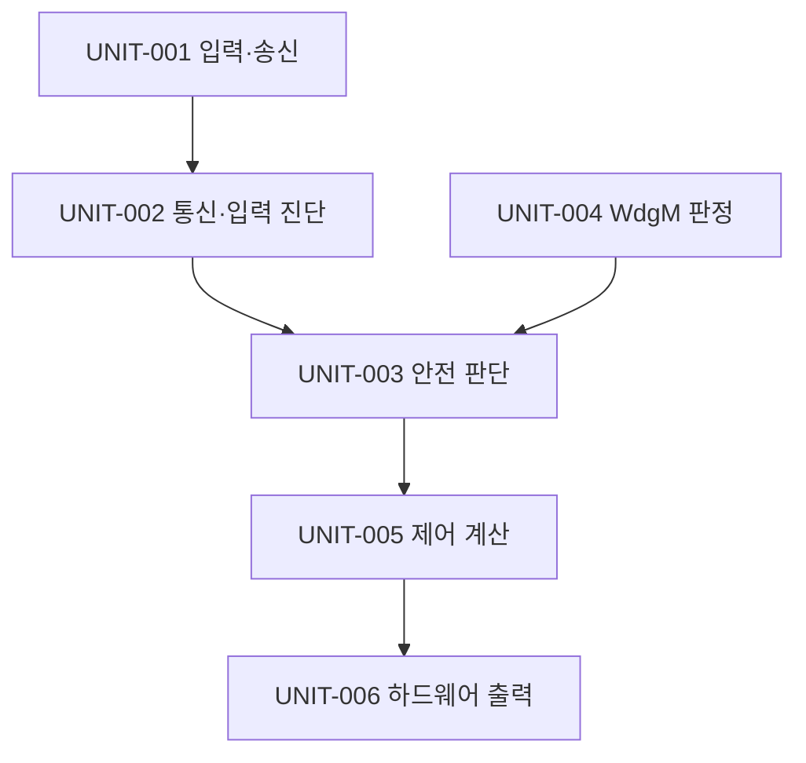
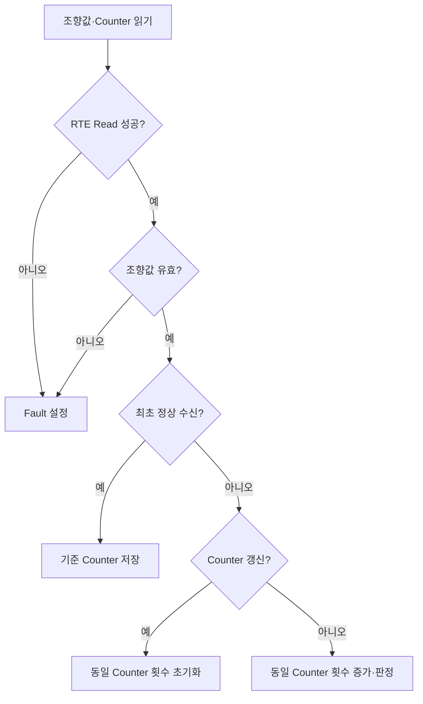
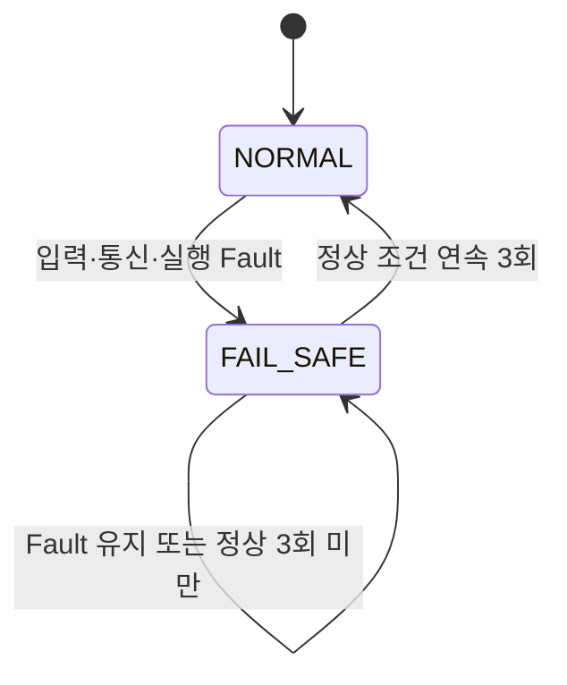

# 소프트웨어 상세설계 및 단위 구현 명세서

**Document ID**: STEER-05-SWDDUC  
**ISO 26262 Reference**: Part 6, Cl.8  
**ASPICE Reference**: SWE.3 (Software Detailed Design and Unit Construction)  
**Version**: 1.2  
**Date**: 2026-08-24  
**Status**: Completed  
**Project Title**: AUTOSAR 기반 조향 관련 오류에 대한 복구 및 진단 시스템

---

## 1. 문서 목적

본 문서는 `04_SW_Architecture_Design.md`에서 정의한 SWC, Interface 및 Runnable을 구현 가능한 소프트웨어 단위로 상세화한다. 각 단위의 입출력, 내부 상태, 상세 처리 로직, RTE·WdgM·IoHwAb 연동 및 소스 구성을 정의하고 `SWR-*`까지의 추적성을 유지한다.

본 문서의 단위 설계는 첨부 결과보고서에 수록된 실제 구현 코드를 기준으로 한다. 본 문서는 단위시험 결과를 기록하지 않으며, 각 단위의 시험 조건과 결과는 후속 SWE.4 산출물에서 관리한다.

## 2. 상세설계 기준

| 항목 | 설계 기준 |
|---|---|
| 구현 언어 | C |
| 플랫폼 | AUTOSAR Classic / Mobilgene Classic |
| 대상 HW | MPC-5606B |
| 입력 ECU 실행 | 조향 입력 송신 Runnable, 10 ms Timing Event |
| 출력 ECU 실행 | 수신 데이터 기반 Runnable 연쇄 실행 |
| SWC 통신 | Sender-Receiver Interface 및 RTE Read/Write |
| HW 접근 | IoHwAb Client-Server Interface |
| 실행 감시 | WdgM Client-Server Interface 및 Checkpoint |

## 3. 소프트웨어 단위 구성

| Unit ID | SWC ID | 소프트웨어 단위 | 구현 함수 | 소스 기준 |
|---|---|---|---|---|
| UNIT-001 | SWC-001 | Steering Sensor Unit | `RE_Can_Tx_10ms()` | `SWC_SteerSensor.c` |
| UNIT-002 | SWC-002 | CAN Monitor Unit | `CanMonitor_func()` | `App_CanMonitor.c` |
| UNIT-003 | SWC-003 | Safety Policy Unit | `SafetyPolicy_PreCheck_func()` | `App_SafetyPolicy.c` |
| UNIT-004 | SWC-003 | WdgM Status Evaluation Unit | `App_IsWdgmFault()` | `App_SafetyPolicy.c` |
| UNIT-005 | SWC-004 | Control Calculation Unit | `ControlCalc_func()` | `App_ControlCalc.c` |
| UNIT-006 | SWC-005 | PWM Actuator Unit | `Pwm_Actuator_func()` | `App_Pwm_Actuator.c` |

## 4. UNIT-001 Steering Sensor Unit

### 4.1 단위 인터페이스

| 구분 | 인터페이스 | 데이터 | 설명 |
|---|---|---|---|
| 입력 | `R_Potentiometer` | Analog Level | IoHwAb를 통해 조향 입력을 읽는다. |
| 출력 | `Project_SSU_SteerInfo` | `SSU_SteerAngle` | 변환된 조향값을 제공한다. |
| 출력 | `Project_SSU_SteerInfo` | `SSU_AliveCounter` | 메시지 갱신 정보를 제공한다. |
| Event | Timing Event | 10 ms | `RE_Can_Tx_10ms()`를 기동한다. |

### 4.2 내부 상태

| 변수 ID | 변수 | 자료형 | 초기값 | 역할 |
|---|---|---|---|---|
| VAR-IN-001 | `aliveCounter` | `uint8` | `0` | 메시지 생성마다 증가하는 갱신 정보 |
| VAR-IN-002 | `level` | `IoHwAb_ValueType` | 실행 시 취득 | 아날로그 입력값 |
| VAR-IN-003 | `angle` | `sint16` | 실행 시 계산 | 변환된 조향값 |

### 4.3 처리 절차

1. IoHwAb를 통해 아날로그 조향 입력을 읽는다.
2. 아날로그 입력에서 기준 오프셋 `512`를 차감하여 조향값을 생성한다.
3. 현재 Alive Counter를 RTE를 통해 출력한다.
4. 조향값을 RTE를 통해 출력한다.
5. 다음 메시지를 위해 Alive Counter를 1 증가시킨다.

| 상세설계 ID | 설계 내용 | 추적 대상 |
|---|---|---|
| SWD-IN-001 | 조향 입력은 IoHwAb ReadDirect 연산으로 취득한다. | SWR-IN-001 / SW-IF-001 / RUN-001 |
| SWD-IN-002 | 조향값은 아날로그 입력값에서 `512`를 차감하여 `sint16`으로 생성한다. | SWR-IN-001 / SW-IF-002 / RUN-001 |
| SWD-COM-001 | 조향값과 Alive Counter는 10 ms마다 RTE Write로 제공한다. | SWR-COM-001 / SW-IF-002 / RUN-001 |
| SWD-COM-002 | Alive Counter는 메시지 생성마다 `uint8` 범위에서 1 증가한다. | SWR-COM-001 / SW-IF-002 / RUN-001 |

## 5. UNIT-002 CAN Monitor Unit

### 5.1 단위 인터페이스

| 구분 | 인터페이스 | 데이터 | 설명 |
|---|---|---|---|
| 입력 | `Project_SSU_SteerInfo` | 조향값, Alive Counter | CAN Mapping을 통해 수신한다. |
| 출력 | `P_CanMonitorToSafetyPolicy` | 조향값, Fault Flag | 안전 판단 단위에 전달한다. |
| Event | Data Received Event | 조향 정보 수신 | `CanMonitor_func()`를 기동한다. |

### 5.2 내부 상태와 기준값

| 변수 ID | 변수 | 자료형 | 초기값 | 역할 |
|---|---|---|---|---|
| VAR-DIAG-001 | `prevAliveCounter` | `uint8` | `0` | 이전 Alive Counter 저장 |
| VAR-DIAG-002 | `firstValid` | `boolean` | `FALSE` | 최초 정상 수신 여부 |
| VAR-DIAG-003 | `sameCounterCnt` | `uint8` | `0` | 동일 Counter 연속 수신 횟수 |
| VAR-DIAG-004 | `flag` | `boolean` | `FALSE` | 통신 또는 입력 Fault 결과 |
| CONST-DIAG-001 | 조향값 하한 | `sint16` | `-512` | Invalid 판정 하한 |
| CONST-DIAG-002 | 조향값 상한 | `sint16` | `511` | Invalid 판정 상한 |
| CONST-DIAG-003 | Timeout 판정값 | `uint8` | `2` | 동일 Counter 추가 수신 허용 기준 |

### 5.3 진단 결정 순서

### 5.4 처리 규칙

| 상세설계 ID | 설계 내용 | 추적 대상 |
|---|---|---|
| SWD-DIAG-001 | 조향값 또는 Alive Counter의 RTE Read가 실패하면 Fault를 설정한다. | SWR-COM-002, SWR-DIAG-001 / SW-IF-002, SW-IF-003 / RUN-002 |
| SWD-DIAG-002 | 조향값이 `-512` 미만 또는 `511` 초과이면 Invalid Fault를 설정한다. | SWR-DIAG-002 / SW-IF-003 / RUN-002 |
| SWD-DIAG-003 | 최초 정상 수신에서는 Counter 비교 없이 기준값을 저장한다. | SWR-DIAG-001 / RUN-002 |
| SWD-DIAG-004 | 현재 Counter가 이전 Counter와 같으면 동일 Counter 횟수를 증가시킨다. | SWR-DIAG-001 / RUN-002 |
| SWD-DIAG-005 | 동일 Counter가 추가로 연속 2회 수신되면 Timeout Fault를 설정한다. | SWR-DIAG-001 / RUN-002 |
| SWD-DIAG-006 | Counter가 갱신되면 동일 Counter 횟수와 Fault를 초기화한다. | SWR-DIAG-001 / RUN-002 |
| SWD-DIAG-007 | 진단 조향값과 Fault 결과를 SafetyPolicy에 RTE Write로 전달한다. | SWR-DIAG-003 / SW-IF-003 / RUN-002 |

## 6. UNIT-003 Safety Policy Unit

### 6.1 단위 인터페이스

| 구분 | 인터페이스 | 데이터 | 설명 |
|---|---|---|---|
| 입력 | `R_CanMonitorToSafetyPolicy` | 조향값, Fault Flag | 통신·입력 진단 결과 |
| 입력 | `WdgM_API_R` | Global Status | 내부 실행 감시 결과 |
| 출력 | `P_SafetyPolicyToControlCalc` | 조향값, 출력 결정 Flag | 안전 상태가 반영된 제어 입력 |
| Event | Data Received Event | CanMonitor 결과 | 안전 판단 Runnable 기동 |

### 6.2 내부 상태

| 변수 ID | 변수 | 자료형 | 초기값 | 역할 |
|---|---|---|---|---|
| VAR-SAFE-001 | `gIsFailsafe` | `boolean` | `FALSE` | 현재 FAIL-SAFE 상태 |
| VAR-SAFE-002 | `gNormalRecoverCnt` | `uint8` | `0` | 연속 정상 확인 횟수 |
| VAR-SAFE-003 | `curFault` | `boolean` | `FALSE` | 현재 입력·실행 Fault 통합 결과 |
| CONST-SAFE-001 | 정상 복귀 기준 | `uint8` | `3` | NORMAL 복귀에 필요한 연속 정상 횟수 |

### 6.3 상태 전이

### 6.4 처리 규칙

| 상세설계 ID | 설계 내용 | 추적 대상 |
|---|---|---|
| SWD-SAFE-001 | Runnable 진입 시 SafetyPolicy의 WdgM Checkpoint를 보고한다. | SWR-WDG-001 / SW-IF-004 / RUN-003 |
| SWD-SAFE-002 | CanMonitor Fault 또는 WdgM Fault가 존재하면 통합 Fault를 설정한다. | SWR-WDG-002, SWR-SAFE-001 / SW-IF-003, SW-IF-004 / RUN-003 |
| SWD-SAFE-003 | 통합 Fault 발생 시 FAIL-SAFE를 설정하고 정상 복귀 Counter를 초기화한다. | SWR-SAFE-001, SWR-SAFE-003 / RUN-003 |
| SWD-SAFE-004 | FAIL-SAFE 출력은 조향값 `0`과 출력 금지 Flag로 구성한다. | SWR-SAFE-002, SWR-SAFE-003 / SW-IF-005 / RUN-003 |
| SWD-SAFE-005 | FAIL-SAFE 상태에서 정상 조건이 확인될 때마다 복귀 Counter를 증가시킨다. | SWR-SAFE-004 / RUN-003 |
| SWD-SAFE-006 | 정상 조건이 연속 3회 확인되면 NORMAL로 복귀하고 유효 조향값을 전달한다. | SWR-SAFE-004 / SW-IF-005 / RUN-003 |
| SWD-SAFE-007 | 정상 확인 중 Fault가 재발하면 복귀 Counter를 초기화한다. | SWR-SAFE-005 / RUN-003 |
| SWD-SAFE-008 | 시스템 상태와 Fault 결과를 제어 및 모니터링 경로에 제공한다. | SWR-MON-001, SWR-MON-002 / SW-IF-005, SW-IF-008 / RUN-003 |

## 7. UNIT-004 WdgM Status Evaluation Unit

| WdgM Global Status | 내부 실행 Fault | 처리 |
|---|---|---|
| `OK` | FALSE | 정상 실행 상태로 판단한다. |
| `FAILED` | TRUE | 내부 실행 Fault를 설정한다. |
| `EXPIRED` | TRUE | 내부 실행 Fault를 설정하고 최초 만료 SE ID를 조회한다. |
| `STOPPED` | TRUE | 내부 실행 Fault를 설정한다. |
| 그 외 상태 | FALSE | 현재 구현의 Fault 조건에 포함하지 않는다. |

| 상세설계 ID | 설계 내용 | 추적 대상 |
|---|---|---|
| SWD-WDG-001 | `App_IsWdgmFault()`는 FAILED, EXPIRED, STOPPED 상태를 Fault로 반환한다. | SWR-WDG-001, SWR-WDG-002 / SW-IF-004 / RUN-003 |
| SWD-WDG-002 | EXPIRED 상태에서는 `GetFirstExpiredSEID`를 호출하여 만료 대상을 취득한다. | SWR-WDG-002, SWR-MON-002 / SW-IF-004, SW-IF-008 / RUN-003 |

## 8. UNIT-005 Control Calculation Unit

### 8.1 단위 인터페이스

| 구분 | 인터페이스 | 데이터 | 설명 |
|---|---|---|---|
| 입력 | `R_SafetyPolicyToControlCalc` | 조향값, Fault Flag | 안전 상태가 반영된 제어 입력 |
| 출력 | `P_ControlCalcToActuator` | PWM, Left, Right, Keep_Go | Actuator 제어 요청 |
| Event | Data Received Event | SafetyPolicy 결과 | 제어 계산 Runnable 기동 |

### 8.2 내부 상태와 상수

| 변수 ID | 변수 또는 상수 | 값·초기값 | 역할 |
|---|---|---|---|
| VAR-CTRL-001 | `prev_input_steer` | `0` | 이전 조향값 |
| CONST-CTRL-001 | `STEER_DIFF_THRESHOLD` | `2` | 방향 동작 판정 임계값 |
| CONST-CTRL-002 | `STEER_DUTY` | `16384` | PWM 계산 기준 Duty |
| CONST-CTRL-003 | `PWM_MAX` | `32768` | PWM 출력 상한 |
| CONST-CTRL-004 | `PWM_MIN` | `0` | PWM 출력 하한 |
| CONST-CTRL-005 | 변화량 상한 | `512` | PWM 계산에 사용하는 최대 변화량 |

### 8.3 처리 규칙

| 상세설계 ID | 설계 내용 | 추적 대상 |
|---|---|---|
| SWD-CTRL-001 | Fault Flag가 TRUE이면 PWM, Left, Right 및 동작 Flag를 모두 비활성 상태로 설정한다. | SWR-SAFE-002, SWR-SAFE-003 / SW-IF-005, SW-IF-006 / RUN-004 |
| SWD-CTRL-002 | 정상 상태에서는 현재 조향값과 이전 조향값의 차이를 계산한다. | SWR-CTRL-001 / RUN-004 |
| SWD-CTRL-003 | 조향 변화량이 `2`보다 크면 Right, `-2`보다 작으면 Left로 결정한다. | SWR-CTRL-001 / SW-IF-006 / RUN-004 |
| SWD-CTRL-004 | 조향 변화량의 절댓값이 `2` 이하이면 정지 상태로 결정한다. | SWR-CTRL-002 / SW-IF-006 / RUN-004 |
| SWD-CTRL-005 | PWM 계산에 사용하는 절대 변화량은 `512`로 제한한다. | SWR-CTRL-001 / RUN-004 |
| SWD-CTRL-006 | 상대 Duty는 `abs_diff × 32768 ÷ 512`로 계산한다. | SWR-CTRL-001 / RUN-004 |
| SWD-CTRL-007 | 최종 PWM은 `STEER_DUTY × RelativeDutyCycle`의 Q15 연산 결과로 계산하고 `PWM_MAX` 이하로 제한한다. | SWR-CTRL-001 / SW-IF-006 / RUN-004 |
| SWD-CTRL-008 | 정지 상태이면 PWM을 `0`으로 설정한다. | SWR-CTRL-002 / SW-IF-006 / RUN-004 |
| SWD-CTRL-009 | 실행 종료 전 현재 조향값을 이전 조향값으로 저장하고 결과를 RTE Write로 전달한다. | SWR-CTRL-001, SWR-ACT-001 / SW-IF-006 / RUN-004 |

## 9. UNIT-006 PWM Actuator Unit

### 9.1 하드웨어 인터페이스

| 출력 | IoHwAb 이름 | HW 할당 | 역할 |
|---|---|---|---|
| PWM | `IoHwAbPWMMotor` | `PwmChannel_eMIOS_A23` | PWM Duty 출력 |
| 상태 표시 | `StopLed` | `PortE_Pin4` | 정상·정지 상태 표시 |
| 방향 1 | `MotorIn1` / Forward | `PortE_Pin5` | 방향 출력 |
| 방향 2 | `MotorIn2` / Reverse | `PortE_Pin6` | 반대 방향 출력 |

### 9.2 처리 규칙

| 상세설계 ID | 설계 내용 | 추적 대상 |
|---|---|---|
| SWD-ACT-001 | PWM, Left, Right 및 Keep_Go를 RTE Read로 취득한다. | SWR-ACT-001 / SW-IF-006 / RUN-005 |
| SWD-ACT-002 | Keep_Go가 FALSE이면 PWM Duty를 `0`으로 설정하고 두 방향 출력을 FALSE로 설정한다. | SWR-ACT-002, SWR-SAFE-002, SWR-SAFE-003 / SW-IF-007 / RUN-005 |
| SWD-ACT-003 | Keep_Go가 TRUE이면 Left와 Right를 Digital Output에 반영하고 계산된 PWM Duty를 출력한다. | SWR-ACT-001 / SW-IF-007 / RUN-005 |
| SWD-ACT-004 | 정지 여부를 상태 표시 출력에 반영한다. | SWR-MON-003 / SW-IF-007, SW-IF-008 / RUN-005 |

## 10. RTE 및 BSW 연동

| Integration ID | 호출 유형 | 목적 | 사용 단위 |
|---|---|---|---|
| INT-001 | `Rte_Call_*_ReadDirect` | 조향 아날로그 입력 취득 | UNIT-001 |
| INT-002 | `Rte_Write_Project_SSU_SteerInfo_*` | 조향값과 Alive Counter 제공 | UNIT-001 |
| INT-003 | `Rte_Read_Project_SSU_SteerInfo_*` | CAN 수신 조향 정보 읽기 | UNIT-002 |
| INT-004 | `Rte_Write_P_CanMonitorToSafetyPolicy_*` | 진단 결과 제공 | UNIT-002 |
| INT-005 | `Rte_Call_*CheckpointReached` | WdgM Checkpoint 보고 | UNIT-003 |
| INT-006 | `Rte_Call_WdgM_API_R_GetGlobalStatus` | WdgM 상태 취득 | UNIT-003, UNIT-004 |
| INT-007 | `Rte_Read_R_CanMonitorToSafetyPolicy_*` | 진단 결과 읽기 | UNIT-003 |
| INT-008 | `Rte_Write_P_SafetyPolicyToControlCalc_*` | 안전 제어 입력 제공 | UNIT-003 |
| INT-009 | `Rte_Read_R_SafetyPolicyToControlCalc_*` | 안전 제어 입력 읽기 | UNIT-005 |
| INT-010 | `Rte_Write_P_ControlCalcToActuator_*` | PWM·방향·동작 결과 제공 | UNIT-005 |
| INT-011 | `Rte_Read_R_ControlCalcToActuator_*` | Actuator 제어값 읽기 | UNIT-006 |
| INT-012 | `Rte_Call_R_PwmMotor_SetDutyCycle` | PWM Duty 하드웨어 출력 | UNIT-006 |
| INT-013 | `Rte_Call_R_MotorIn*_WriteDirect` | 방향 Digital Output | UNIT-006 |

## 11. 단위 간 실행 순서와 데이터 일관성

1. UNIT-001이 주기적으로 조향값과 Alive Counter를 갱신한다.
2. CAN 수신으로 UNIT-002가 기동되어 통신·입력 진단을 수행한다.
3. UNIT-002 결과 수신으로 UNIT-003이 기동되고 UNIT-004의 WdgM 판정을 함께 사용한다.
4. UNIT-003이 안전 상태가 반영된 조향값과 출력 허가 상태를 제공한다.
5. UNIT-005가 방향과 PWM을 계산하거나 안전 출력으로 제한한다.
6. UNIT-006이 결과를 IoHwAb 하드웨어 출력에 반영한다.

> 실제 OS Task 이름, 우선순위 및 하나의 Task 내 호출 순서는 Mobilgene 설정 결과와 일치하도록 구성 관리 대상에 포함한다.

## 12. SW 요구사항–상세설계 추적성

| SW 요구사항 | 아키텍처 요소 | 상세설계 ID / Unit ID |
|---|---|---|
| SWR-IN-001 | SWC-001 / RUN-001 | SWD-IN-001, SWD-IN-002 / UNIT-001 |
| SWR-COM-001 | SWC-001 / RUN-001 | SWD-COM-001, SWD-COM-002 / UNIT-001 |
| SWR-COM-002 | SWC-002 / RUN-002 | SWD-DIAG-001 / UNIT-002 |
| SWR-DIAG-001 | SWC-002 / RUN-002 | SWD-DIAG-001, SWD-DIAG-003, SWD-DIAG-004, SWD-DIAG-005, SWD-DIAG-006 / UNIT-002 |
| SWR-DIAG-002 | SWC-002 / RUN-002 | SWD-DIAG-002 / UNIT-002 |
| SWR-DIAG-003 | SWC-002 / RUN-002 | SWD-DIAG-007 / UNIT-002 |
| SWR-WDG-001 | SWC-003 / RUN-003 | SWD-SAFE-001, SWD-WDG-001 / UNIT-003, UNIT-004 |
| SWR-WDG-002 | SWC-003 / RUN-003 | SWD-SAFE-002, SWD-WDG-001, SWD-WDG-002 / UNIT-003, UNIT-004 |
| SWR-SAFE-001 | SWC-003 / RUN-003 | SWD-SAFE-002, SWD-SAFE-003 / UNIT-003 |
| SWR-SAFE-002 | SWC-003, SWC-004, SWC-005 | SWD-SAFE-004, SWD-CTRL-001, SWD-ACT-002 / UNIT-003, UNIT-005, UNIT-006 |
| SWR-SAFE-003 | SWC-003, SWC-004, SWC-005 | SWD-SAFE-003, SWD-SAFE-004, SWD-CTRL-001, SWD-ACT-002 / UNIT-003, UNIT-005, UNIT-006 |
| SWR-SAFE-004 | SWC-003 / RUN-003 | SWD-SAFE-005, SWD-SAFE-006 / UNIT-003 |
| SWR-SAFE-005 | SWC-003 / RUN-003 | SWD-SAFE-007 / UNIT-003 |
| SWR-CTRL-001 | SWC-004 / RUN-004 | SWD-CTRL-002, SWD-CTRL-003, SWD-CTRL-005, SWD-CTRL-006, SWD-CTRL-007, SWD-CTRL-009 / UNIT-005 |
| SWR-CTRL-002 | SWC-004 / RUN-004 | SWD-CTRL-004, SWD-CTRL-008 / UNIT-005 |
| SWR-ACT-001 | SWC-005 / RUN-005 | SWD-ACT-001, SWD-ACT-003 / UNIT-006 |
| SWR-ACT-002 | SWC-005 / RUN-005 | SWD-ACT-002 / UNIT-006 |
| SWR-MON-001 | SWC-003 / RUN-003 | SWD-SAFE-008 / UNIT-003 |
| SWR-MON-002 | SWC-003 / RUN-003 | SWD-SAFE-008, SWD-WDG-002 / UNIT-003, UNIT-004 |
| SWR-MON-003 | SWC-003, SWC-004, SWC-005 | SWD-SAFE-008, SWD-ACT-004 / UNIT-003, UNIT-005, UNIT-006 |

## 13. 단위 구현 및 검토 기준

| 검토 항목 | 기준 |
|---|---|
| 인터페이스 일치 | RTE API의 Port, Data Element 및 자료형이 아키텍처와 일치해야 한다. |
| 초기화 | 정적 상태 변수와 출력값의 초기 상태가 정의되어야 한다. |
| 범위와 오버플로 | 조향값, Counter 및 PWM 계산의 자료형 범위를 벗어나지 않아야 한다. |
| 안전 출력 우선 | Fault 경로에서 정상 제어 계산보다 출력 차단이 우선되어야 한다. |
| 결정 가능성 | 동일 입력과 동일 상태에서 동일 결과를 생성해야 한다. |
| 추적성 | 각 구현 함수와 단위시험은 관련 `SWD-*` 및 `SWR-*`를 참조해야 한다. |
| 정적 분석 | 컴파일 경고, 미사용 값, 형 변환 및 범위 관련 위반을 검토해야 한다. |

---

본 문서는 SWE.3 상세설계와 단위 구현의 기준 문서이다. 후속 SWE.4 단위시험 명세는 각 `UNIT-*`와 `SWD-*`를 검증 대상으로 사용하고, 전체 연결은 `Traceability_Matrix.md`에서 관리한다.
