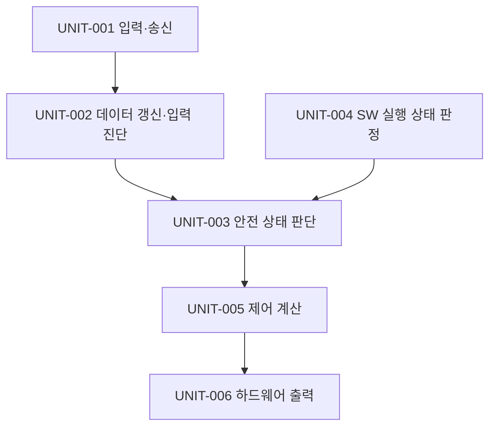
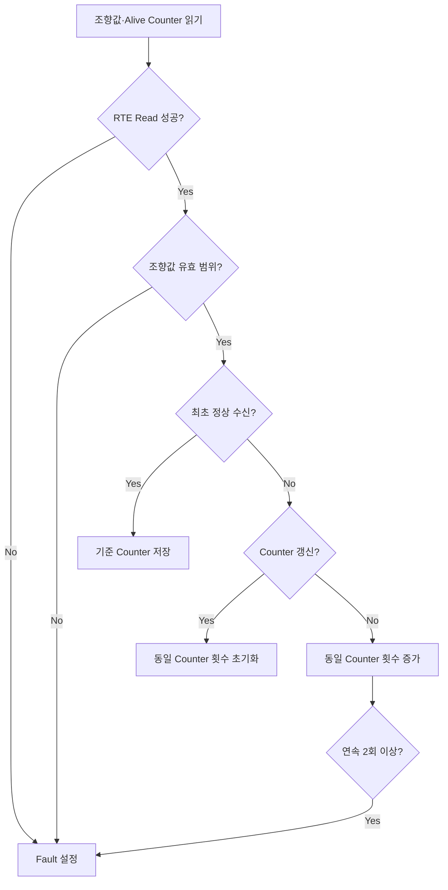
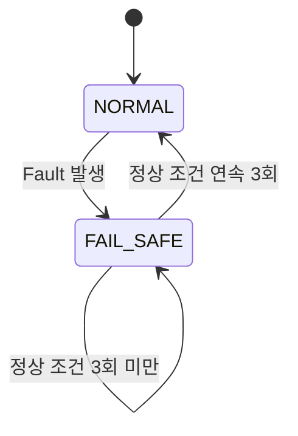
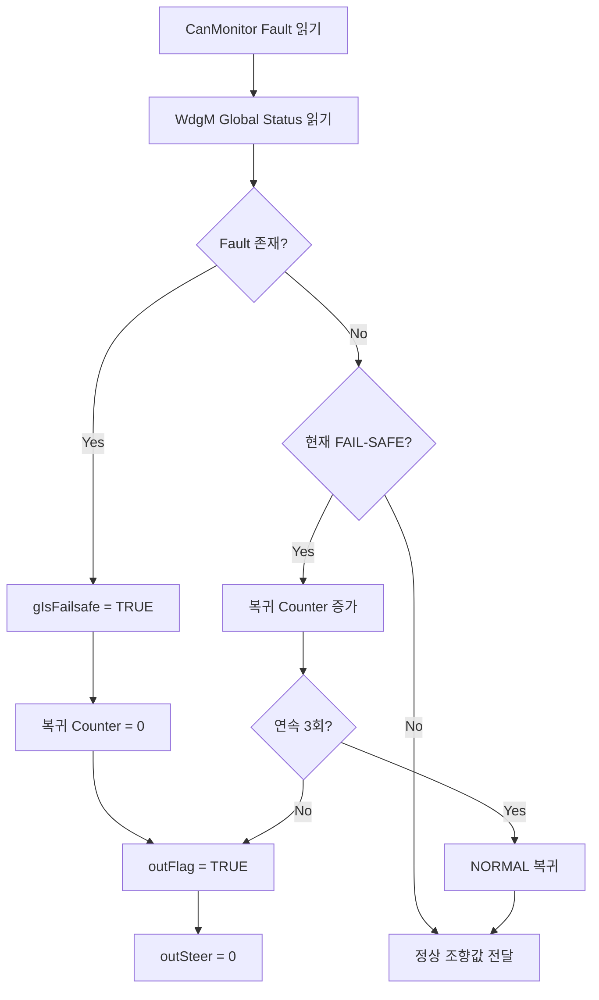
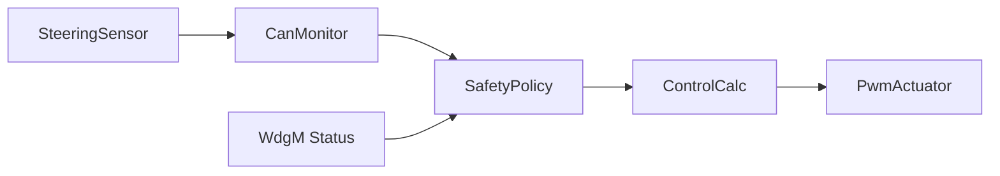

# 소프트웨어 상세설계 및 단위 구현 명세서

**Document ID**: STEER-05-SWDDUC  
**ISO 26262 Reference**: Part 6, Cl.8  
**ASPICE Reference**: SWE.3 (Software Detailed Design and Unit Construction)  
**Version**: 1.4  
**Date**: 2026-08-28  
**Status**: Completed  
**Project Title**: AUTOSAR 기반 조향 관련 오류에 대한 복구 및 진단 시스템  
**Subtitle**: SW Unit 상세 로직, 상태 관리 및 AUTOSAR Interface 구현

---

## 1. 문서 목적

본 문서는 `04_SW_Architecture_Design.md`에서 정의한 SWC, Interface 및 Runnable을 구현 가능한 소프트웨어 단위로 상세화한다.

각 Unit의 입출력, 내부 상태, Fault 판정 로직, NORMAL / FAIL-SAFE 상태 처리, 정상 복귀 로직, RTE·WdgM·IoHwAb 연동 및 실제 소스 구성을 정의하고 `SWR-*`까지의 추적성을 유지한다.

본 문서의 상세설계는 `src/`에 포함된 실제 구현 코드를 기준으로 한다.

단위시험 조건과 결과는 `06_SW_Unit_Verification.md`에서 별도로 관리한다.

---

## 2. 상세설계 기준

| 항목 | 설계 기준 |
|---|---|
| 구현 언어 | C |
| 플랫폼 | AUTOSAR Classic / Mobilgene Classic |
| 대상 HW | MPC-5606B |
| 입력 ECU 실행 | 조향 입력 송신 Runnable, 10 ms Timing Event |
| 출력 ECU 실행 | 수신 데이터 기반 Runnable 연쇄 실행 |
| SWC 통신 | Sender-Receiver Interface 및 RTE Read / Write |
| HW 접근 | IoHwAb Client-Server Interface |
| 실행 감시 | WdgM Client-Server Interface 및 Checkpoint |
| 안전 상태 | NORMAL / FAIL-SAFE 내부 상태 관리 |
| 정상 복귀 | 모든 Fault 해제 후 정상 조건 연속 3회 확인 |

---

## 3. 소프트웨어 단위 구성

| Unit ID | SWC ID | 소프트웨어 단위 | 구현 함수 | 소스 기준 |
|---|---|---|---|---|
| UNIT-001 | SWC-001 | Steering Sensor Unit | `RE_Can_Tx_10ms()` | `SWC_SteerSensor.c` |
| UNIT-002 | SWC-002 | CAN Monitor Unit | `CanMonitor_func()` | `App_CanMonitor.c` |
| UNIT-003 | SWC-003 | Safety Policy Unit | `SafetyPolicy_PreCheck_func()` | `App_SafetyPolicy.c` |
| UNIT-004 | SWC-003 | SW Execution Status Evaluation Unit | `App_IsWdgmFault()` | `App_SafetyPolicy.c` |
| UNIT-005 | SWC-004 | Control Calculation Unit | `ControlCalc_func()` | `App_ControlCalc.c` |
| UNIT-006 | SWC-005 | PWM Actuator Unit | `Pwm_Actuator_func()` | `App_Pwm_Actuator.c` |

---

## 4. UNIT-001 Steering Sensor Unit

### 4.1 단위 인터페이스

| 구분 | 인터페이스 | 데이터 | 설명 |
|---|---|---|---|
| 입력 | `R_Potentiometer` | Analog Level | IoHwAb를 통해 조향 입력을 읽는다. |
| 출력 | `Project_SSU_SteerInfo` | `SSU_SteerAngle` | 변환된 조향값을 제공한다. |
| 출력 | `Project_SSU_SteerInfo` | `SSU_AliveCounter` | 데이터 갱신 판단을 위한 Counter를 제공한다. |
| Event | Timing Event | 10 ms | `RE_Can_Tx_10ms()`를 기동한다. |

### 4.2 내부 상태

| 변수 ID | 변수 | 자료형 | 초기값 | 역할 |
|---|---|---|---|---|
| VAR-IN-001 | `aliveCounter` | `uint8` | `0` | 메시지 생성마다 증가하는 갱신 정보 |
| VAR-IN-002 | `level` | `IoHwAb_ValueType` | 실행 시 취득 | 아날로그 입력값 |
| VAR-IN-003 | `angle` | `sint16` | 실행 시 계산 | 변환된 조향값 |

### 4.3 처리 절차

1. IoHwAb를 통해 아날로그 조향 입력을 읽는다.
2. 아날로그 입력에서 기준 오프셋 `512`를 차감하여 조향값을 생성한다.
3. 현재 Alive Counter를 RTE를 통해 출력한다.
4. 조향값을 RTE를 통해 출력한다.
5. 다음 메시지를 위해 Alive Counter를 1 증가시킨다.

### 4.4 상세설계 규칙

| 상세설계 ID | 설계 내용 | 추적 대상 |
|---|---|---|
| SWD-IN-001 | 조향 입력은 IoHwAb ReadDirect 연산으로 취득한다. | SWR-IN-001 / SW-IF-001 / RUN-001 |
| SWD-IN-002 | 조향값은 아날로그 입력값에서 `512`를 차감하여 `sint16`으로 생성한다. | SWR-IN-001 / SW-IF-002 / RUN-001 |
| SWD-COM-001 | 조향값과 Alive Counter는 10 ms마다 RTE Write로 제공한다. | SWR-COM-001 / SW-IF-002 / RUN-001 |
| SWD-COM-002 | Alive Counter는 메시지 생성마다 `uint8` 범위에서 1 증가한다. | SWR-COM-001 / SW-IF-002 / RUN-001 |

---

## 5. UNIT-002 CAN Monitor Unit

### 5.1 단위 인터페이스

| 구분 | 인터페이스 | 데이터 | 설명 |
|---|---|---|---|
| 입력 | `Project_SSU_SteerInfo` | 조향값, Alive Counter | CAN Mapping을 통해 수신한다. |
| 출력 | `P_CanMonitorToSafetyPolicy` | 조향값, Fault Flag | 진단 결과를 SafetyPolicy에 전달한다. |
| Event | Data Received Event | 조향 정보 수신 | `CanMonitor_func()`를 기동한다. |

### 5.2 내부 상태 및 기준값

| 변수 ID | 변수 또는 상수 | 자료형 | 초기값 / 값 | 역할 |
|---|---|---|---|---|
| VAR-DIAG-001 | `prevAliveCounter` | `uint8` | `0` | 이전 Alive Counter 저장 |
| VAR-DIAG-002 | `firstValid` | `boolean` | `FALSE` | 최초 정상 수신 여부 |
| VAR-DIAG-003 | `sameCounterCnt` | `uint8` | `0` | 동일 Counter 연속 확인 횟수 |
| VAR-DIAG-004 | `flag` | `boolean` | `FALSE` | 데이터 갱신 또는 입력 Fault 결과 |
| CONST-DIAG-001 | 조향값 하한 | `sint16` | `-512` | 유효 범위 하한 |
| CONST-DIAG-002 | 조향값 상한 | `sint16` | `511` | 유효 범위 상한 |
| CONST-DIAG-003 | 동일 Counter Fault 기준 | `uint8` | `2` | 연속 동일 Counter Fault 판정 기준 |

### 5.3 진단 결정 순서

### 5.4 처리 규칙

| 상세설계 ID | 설계 내용 | 추적 대상 |
|---|---|---|
| SWD-DIAG-001 | 조향값 또는 Alive Counter의 RTE Read가 실패하면 Fault를 설정한다. | SWR-COM-002 / SW-IF-002 / RUN-002 |
| SWD-DIAG-002 | 조향값이 `-512` 미만 또는 `511` 초과인 경우 Invalid Fault를 설정한다. | SWR-DIAG-005 ~ SWR-DIAG-008 / SW-IF-003 / RUN-002 |
| SWD-DIAG-003 | 최초 정상 수신에서는 Counter 비교 없이 현재 Alive Counter를 기준값으로 저장한다. | SWR-DIAG-001, SWR-DIAG-002 / RUN-002 |
| SWD-DIAG-004 | 현재 Alive Counter가 이전 값과 동일하면 `sameCounterCnt`를 증가시킨다. | SWR-DIAG-001 ~ SWR-DIAG-003 / RUN-002 |
| SWD-DIAG-005 | 동일한 Alive Counter가 연속 2회 이상 확인되면 데이터 갱신 Fault를 설정한다. | SWR-DIAG-003 / RUN-002 |
| SWD-DIAG-006 | Alive Counter가 정상적으로 변경되면 동일 Counter 횟수를 초기화한다. | SWR-DIAG-002 / RUN-002 |
| SWD-DIAG-007 | 진단 조향값과 Fault 결과를 SafetyPolicy에 RTE Write로 전달한다. | SWR-DIAG-004, SWR-DIAG-008 / SW-IF-003 / RUN-002 |

---

## 6. UNIT-003 Safety Policy Unit

### 6.1 단위 인터페이스

| 구분 | 인터페이스 | 데이터 | 설명 |
|---|---|---|---|
| 입력 | `R_CanMonitorToSafetyPolicy` | 조향값, Fault Flag | 데이터 갱신 및 입력 진단 결과 |
| 입력 | `WdgM_API_R` | Global Status | SW 실행 감시 결과 |
| 출력 | `P_SafetyPolicyToControlCalc` | 조향값, 출력 결정 Flag | 안전 판단이 반영된 제어 입력 |
| Event | Data Received Event | CanMonitor 결과 | `SafetyPolicy_PreCheck_func()` 기동 |

### 6.2 내부 상태

| 변수 ID | 변수 | 자료형 | 초기값 | 역할 |
|---|---|---|---|---|
| VAR-SAFE-001 | `gIsFailsafe` | `boolean` | `FALSE` | 현재 FAIL-SAFE 여부 |
| VAR-SAFE-002 | `gNormalRecoverCnt` | `uint8` | `0` | 정상 조건 연속 확인 횟수 |
| VAR-SAFE-003 | `curFault` | `boolean` | `FALSE` | 현재 진단 및 실행 Fault 통합 결과 |
| CONST-SAFE-001 | 정상 복귀 기준 | `uint8` | `3` | NORMAL 복귀에 필요한 연속 정상 횟수 |

`gIsFailsafe`는 SafetyPolicy 내부 상태로 관리하며 별도의 외부 상태 표시 Interface로 제공하지 않는다.

### 6.3 상태 전이

### 6.4 처리 순서

### 6.5 상세설계 규칙

| 상세설계 ID | 설계 내용 | 추적 대상 |
|---|---|---|
| SWD-SAFE-001 | Runnable 진입 및 종료 시 SafetyPolicy WdgM Checkpoint를 보고한다. | SWR-EXEC-001 / SW-IF-004 / RUN-003 |
| SWD-SAFE-002 | CanMonitor Fault 또는 SW 실행 Fault가 존재하면 `curFault`를 TRUE로 설정한다. | SWR-EXEC-002, SWR-EXEC-003, SWR-SAFE-001 / SW-IF-003, SW-IF-004 / RUN-003 |
| SWD-SAFE-003 | `curFault == TRUE`이면 `gIsFailsafe`를 TRUE로 설정하고 정상 복귀 Counter를 0으로 초기화한다. | SWR-SAFE-001, SWR-SAFE-005 / RUN-003 |
| SWD-SAFE-004 | FAIL-SAFE 상태에서는 `outSteer = 0`, `outFlag = TRUE`로 설정하여 정상 제어를 제한한다. | SWR-SAFE-002 ~ SWR-SAFE-004 / SW-IF-005 / RUN-003 |
| SWD-REC-001 | 모든 Fault가 해제된 상태에서 `gIsFailsafe == TRUE`이면 정상 복귀 확인을 시작한다. | SWR-REC-001 / RUN-003 |
| SWD-REC-002 | Fault가 없는 실행마다 `gNormalRecoverCnt`를 1 증가시킨다. | SWR-REC-002 / RUN-003 |
| SWD-REC-003 | `gNormalRecoverCnt >= 3`인 경우 `gIsFailsafe`를 FALSE로 전환하고 정상 조향값을 다시 전달한다. | SWR-REC-002, SWR-REC-004 / SW-IF-005 / RUN-003 |
| SWD-REC-004 | 정상 복귀 확인 중 Fault가 다시 감지되면 복귀 Counter를 0으로 초기화하고 FAIL-SAFE 상태를 유지한다. | SWR-REC-003 / RUN-003 |

---

## 7. UNIT-004 SW Execution Status Evaluation Unit

UNIT-004는 WdgM Global Status를 이용하여 조향 제어 관련 SW 실행 상태를 Fault 여부로 변환한다.

### 7.1 WdgM 상태 판정

| WdgM Global Status | SW 실행 Fault | 처리 |
|---|---|---|
| `WDGM_GLOBAL_STATUS_OK` | FALSE | 정상 실행 상태로 판단 |
| `WDGM_GLOBAL_STATUS_FAILED` | TRUE | SW 실행 Fault 판정 |
| `WDGM_GLOBAL_STATUS_EXPIRED` | TRUE | SW 실행 Fault 판정 |
| `WDGM_GLOBAL_STATUS_STOPPED` | TRUE | SW 실행 Fault 판정 |
| 그 외 상태 | FALSE | 현재 구현에서는 Fault 조건에 포함하지 않음 |

### 7.2 상세설계 규칙

| 상세설계 ID | 설계 내용 | 추적 대상 |
|---|---|---|
| SWD-EXEC-001 | `App_IsWdgmFault()`는 FAILED, EXPIRED, STOPPED 상태에서 TRUE를 반환한다. | SWR-EXEC-001, SWR-EXEC-002 / SW-IF-004 / RUN-003 |
| SWD-EXEC-002 | WdgM Global Status를 읽어 실행 Fault 여부를 SafetyPolicy Fault 통합에 반영한다. | SWR-EXEC-002, SWR-EXEC-003 / SW-IF-004 / RUN-003 |
| SWD-EXEC-003 | EXPIRED 상태에서는 `GetFirstExpiredSEID()`를 호출하여 최초 만료 Supervised Entity ID를 취득한다. | SWR-EXEC-002 / SW-IF-004 / RUN-003 |

---

## 8. UNIT-005 Control Calculation Unit

### 8.1 단위 인터페이스

| 구분 | 인터페이스 | 데이터 | 설명 |
|---|---|---|---|
| 입력 | `R_SafetyPolicyToControlCalc` | 조향값, Fault Flag | 안전 판단이 반영된 제어 입력 |
| 출력 | `P_ControlCalcToActuator` | PWM, Left, Right, Keep_Go | Actuator 제어 요청 |
| Event | Data Received Event | SafetyPolicy 결과 | `ControlCalc_func()` 기동 |

### 8.2 내부 상태 및 상수

| 변수 ID | 변수 또는 상수 | 값 / 초기값 | 역할 |
|---|---|---|---|
| VAR-CTRL-001 | `prev_input_steer` | `0` | 이전 조향값 |
| CONST-CTRL-001 | `STEER_DIFF_THRESHOLD` | `2` | 방향 동작 판정 임계값 |
| CONST-CTRL-002 | `STEER_DUTY` | `16384` | PWM 계산 기준 Duty |
| CONST-CTRL-003 | `PWM_MAX` | `32768` | PWM 출력 상한 |
| CONST-CTRL-004 | `PWM_MIN` | `0` | PWM 출력 하한 |
| CONST-CTRL-005 | 변화량 상한 | `512` | PWM 계산에 사용하는 최대 변화량 |

### 8.3 상세설계 규칙

| 상세설계 ID | 설계 내용 | 추적 대상 |
|---|---|---|
| SWD-CTRL-001 | SafetyPolicy Fault Flag가 TRUE이면 PWM, Left, Right 및 Keep_Go를 비활성 상태로 설정한다. | SWR-SAFE-002 ~ SWR-SAFE-004, SWR-ACT-002 / SW-IF-005, SW-IF-006 / RUN-004 |
| SWD-CTRL-002 | 정상 상태에서는 현재 조향값과 이전 조향값의 차이를 계산한다. | SWR-REC-004, SWR-CTRL-001 / RUN-004 |
| SWD-CTRL-003 | 조향 변화량이 `2`보다 크면 Right 방향으로 결정한다. | SWR-CTRL-001 / SW-IF-006 / RUN-004 |
| SWD-CTRL-004 | 조향 변화량이 `-2`보다 작으면 Left 방향으로 결정한다. | SWR-CTRL-001 / SW-IF-006 / RUN-004 |
| SWD-CTRL-005 | 조향 변화량의 절댓값이 `2` 이하이면 정지 상태로 결정한다. | SWR-CTRL-002 / SW-IF-006 / RUN-004 |
| SWD-CTRL-006 | PWM 계산에 사용하는 절대 변화량은 최대 `512`로 제한한다. | SWR-CTRL-001 / RUN-004 |
| SWD-CTRL-007 | 상대 Duty는 `abs_diff × 32768 ÷ 512`로 계산한다. | SWR-CTRL-001 / RUN-004 |
| SWD-CTRL-008 | 최종 PWM은 `STEER_DUTY × RelativeDutyCycle`의 Q15 연산 결과로 계산하고 `PWM_MAX` 이하로 제한한다. | SWR-CTRL-001 / SW-IF-006 / RUN-004 |
| SWD-CTRL-009 | 정지 상태이면 PWM을 `0`으로 설정한다. | SWR-CTRL-002 / SW-IF-006 / RUN-004 |
| SWD-CTRL-010 | 실행 종료 전 현재 조향값을 이전 조향값으로 저장하고 계산 결과를 RTE Write로 전달한다. | SWR-REC-004, SWR-CTRL-001, SWR-ACT-001 / SW-IF-006 / RUN-004 |

---

## 9. UNIT-006 PWM Actuator Unit

### 9.1 단위 인터페이스

| 구분 | 인터페이스 | 데이터 | 설명 |
|---|---|---|---|
| 입력 | `R_ControlCalcToActuator` | PWM, Left, Right, Keep_Go | ControlCalc의 최종 출력 명령 |
| 출력 | `R_PwmMotor` | PWM Duty | 모터 PWM 출력 |
| 출력 | `R_MotorIn1`, `R_MotorIn2` | Digital | 좌·우 방향 출력 |
| 출력 | `R_StopLed` | Digital | 출력 정지 여부를 반영하는 보조 출력 |

### 9.2 하드웨어 할당

| 출력 | IoHwAb 이름 | HW 할당 | 역할 |
|---|---|---|---|
| PWM | `IoHwAbPWMMotor` | `PwmChannel_eMIOS_A23` | PWM Duty 출력 |
| Stop LED | `StopLed` | `PortE_Pin4` | 출력 정지 상태 반영 |
| 방향 1 | `MotorIn1` / Forward | `PortE_Pin5` | 방향 출력 |
| 방향 2 | `MotorIn2` / Reverse | `PortE_Pin6` | 반대 방향 출력 |

`StopLed`는 별도의 시스템 상태 모니터링 기능으로 정의하지 않으며, Actuator의 출력 정지 여부를 직접 반영하는 보조 하드웨어 출력으로 취급한다.

### 9.3 상세설계 규칙

| 상세설계 ID | 설계 내용 | 추적 대상 |
|---|---|---|
| SWD-ACT-001 | PWM, Left, Right 및 Keep_Go를 RTE Read로 취득한다. | SWR-ACT-001 / SW-IF-006 / RUN-005 |
| SWD-ACT-002 | Keep_Go가 FALSE이면 PWM Duty를 `0`으로 설정하고 두 방향 출력을 FALSE로 설정한다. | SWR-ACT-002, SWR-SAFE-003, SWR-SAFE-004 / SW-IF-007 / RUN-005 |
| SWD-ACT-003 | Keep_Go가 FALSE이면 StopLed를 TRUE로 설정한다. | SWR-ACT-002 / RUN-005 |
| SWD-ACT-004 | Keep_Go가 TRUE이면 Left와 Right를 Digital Output에 반영하고 계산된 PWM Duty를 출력한다. | SWR-ACT-001 / SW-IF-007 / RUN-005 |
| SWD-ACT-005 | Keep_Go가 TRUE이면 StopLed를 FALSE로 설정한다. | SWR-ACT-001 / RUN-005 |

---

## 10. RTE 및 BSW 연동

| Integration ID | 호출 유형 | 목적 | 사용 단위 |
|---|---|---|---|
| INT-001 | `Rte_Call_*_ReadDirect` | 조향 아날로그 입력 취득 | UNIT-001 |
| INT-002 | `Rte_Write_Project_SSU_SteerInfo_*` | 조향값과 Alive Counter 제공 | UNIT-001 |
| INT-003 | `Rte_Read_Project_SSU_SteerInfo_*` | CAN 수신 조향 정보 읽기 | UNIT-002 |
| INT-004 | `Rte_Write_P_CanMonitorToSafetyPolicy_*` | 진단 결과 제공 | UNIT-002 |
| INT-005 | `Rte_Call_*CheckpointReached` | WdgM Checkpoint 보고 | UNIT-003 |
| INT-006 | `Rte_Call_WdgM_API_R_GetGlobalStatus` | WdgM Global Status 취득 | UNIT-003, UNIT-004 |
| INT-007 | `Rte_Call_WdgM_API_R_GetFirstExpiredSEID` | EXPIRED Supervised Entity 확인 | UNIT-003, UNIT-004 |
| INT-008 | `Rte_Read_R_CanMonitorToSafetyPolicy_*` | 진단 조향값 및 Fault Flag 읽기 | UNIT-003 |
| INT-009 | `Rte_Write_P_SafetyPolicyToControlCalc_*` | 안전 판단 결과 제공 | UNIT-003 |
| INT-010 | `Rte_Read_R_SafetyPolicyToControlCalc_*` | 안전 판단 결과 읽기 | UNIT-005 |
| INT-011 | `Rte_Write_P_ControlCalcToActuator_*` | PWM·방향·동작 결과 제공 | UNIT-005 |
| INT-012 | `Rte_Read_R_ControlCalcToActuator_*` | Actuator 제어값 읽기 | UNIT-006 |
| INT-013 | `Rte_Call_R_PwmMotor_SetDutyCycle` | PWM Duty 하드웨어 출력 | UNIT-006 |
| INT-014 | `Rte_Call_R_MotorIn*_WriteDirect` | 방향 Digital Output | UNIT-006 |
| INT-015 | `Rte_Call_R_StopLed_WriteDirect` | 출력 정지 상태 보조 출력 | UNIT-006 |

---

## 11. 단위 간 실행 순서 및 데이터 흐름

1. UNIT-001이 10 ms 주기로 조향값과 Alive Counter를 생성한다.
2. CAN 수신 이후 UNIT-002가 데이터 갱신 상태 및 조향 입력 유효성을 판단한다.
3. UNIT-002의 조향값과 Fault 결과가 UNIT-003으로 전달된다.
4. UNIT-003은 UNIT-004에서 판정한 SW 실행 Fault를 함께 반영하여 NORMAL / FAIL-SAFE 상태를 결정한다.
5. FAIL-SAFE 상태에서는 안전 조향값과 출력 금지 Flag를 UNIT-005에 전달한다.
6. Fault가 해제된 경우 UNIT-003은 정상 조건을 연속 3회 확인한 후 NORMAL 상태로 복귀한다.
7. UNIT-005는 NORMAL 상태에서는 조향 방향과 PWM을 계산하고, FAIL-SAFE 상태에서는 출력을 제한한다.
8. UNIT-006은 최종 PWM 및 방향 정보를 하드웨어에 반영한다.

---

## 12. SW 요구사항-상세설계 추적성

| SW 요구사항 | 아키텍처 요소 | 상세설계 ID / Unit |
|---|---|---|
| SWR-IN-001 | SWC-001 / RUN-001 | SWD-IN-001, SWD-IN-002 / UNIT-001 |
| SWR-COM-001 | SWC-001 / RUN-001 | SWD-COM-001, SWD-COM-002 / UNIT-001 |
| SWR-COM-002 | SWC-002 / RUN-002 | SWD-DIAG-001 / UNIT-002 |
| SWR-DIAG-001 ~ SWR-DIAG-004 | SWC-002 / RUN-002 | SWD-DIAG-003 ~ SWD-DIAG-007 / UNIT-002 |
| SWR-DIAG-005 ~ SWR-DIAG-008 | SWC-002 / RUN-002 | SWD-DIAG-002, SWD-DIAG-007 / UNIT-002 |
| SWR-EXEC-001 ~ SWR-EXEC-003 | SWC-003 / RUN-003 | SWD-SAFE-001, SWD-SAFE-002, SWD-EXEC-001 ~ SWD-EXEC-003 / UNIT-003, UNIT-004 |
| SWR-SAFE-001 | SWC-003 / RUN-003 | SWD-SAFE-002, SWD-SAFE-003 / UNIT-003 |
| SWR-SAFE-002 | SWC-003, SWC-004 | SWD-SAFE-004, SWD-CTRL-001 / UNIT-003, UNIT-005 |
| SWR-SAFE-003 | SWC-003, SWC-004, SWC-005 | SWD-SAFE-004, SWD-CTRL-001, SWD-ACT-002 / UNIT-003, UNIT-005, UNIT-006 |
| SWR-SAFE-004 | SWC-003, SWC-004, SWC-005 | SWD-SAFE-004, SWD-CTRL-001, SWD-ACT-002 / UNIT-003, UNIT-005, UNIT-006 |
| SWR-SAFE-005 | SWC-003 | SWD-SAFE-003 / UNIT-003 |
| SWR-REC-001 | SWC-003 | SWD-REC-001 / UNIT-003 |
| SWR-REC-002 | SWC-003 | SWD-REC-002, SWD-REC-003 / UNIT-003 |
| SWR-REC-003 | SWC-003 | SWD-REC-004 / UNIT-003 |
| SWR-REC-004 | SWC-003, SWC-004 | SWD-REC-003, SWD-CTRL-002, SWD-CTRL-010 / UNIT-003, UNIT-005 |
| SWR-CTRL-001 | SWC-004 | SWD-CTRL-002 ~ SWD-CTRL-008, SWD-CTRL-010 / UNIT-005 |
| SWR-CTRL-002 | SWC-004 | SWD-CTRL-005, SWD-CTRL-009 / UNIT-005 |
| SWR-ACT-001 | SWC-005 | SWD-ACT-001, SWD-ACT-004, SWD-ACT-005 / UNIT-006 |
| SWR-ACT-002 | SWC-004, SWC-005 | SWD-CTRL-001, SWD-ACT-002, SWD-ACT-003 / UNIT-005, UNIT-006 |

---

## 13. 소스 파일 구성

| 소스 파일 | 주요 Unit | 주요 역할 |
|---|---|---|
| `SWC_SteerSensor.c` | UNIT-001 | 입력 취득, 조향값 변환, Alive Counter 생성 |
| `App_CanMonitor.c` | UNIT-002 | 데이터 갱신 및 입력 유효성 진단 |
| `App_SafetyPolicy.c` | UNIT-003, UNIT-004 | SW 실행 상태 판정, Fault 통합, FAIL-SAFE 및 정상 복귀 |
| `App_ControlCalc.c` | UNIT-005 | 조향 방향 및 PWM 계산, 안전 출력 처리 |
| `App_Pwm_Actuator.c` | UNIT-006 | PWM, 방향 및 StopLed 하드웨어 출력 |

---

## 14. 설계 경계

본 문서에서는 다음 항목을 상세설계 수준으로 정의한다.

- 실제 Unit 및 구현 함수
- Unit 입출력 Interface
- 내부 상태 변수
- Alive Counter 및 정상 복귀 Counter
- 조향 입력 유효 범위
- 데이터 갱신 Fault 판정 로직
- SW 실행 Fault 판정 로직
- NORMAL / FAIL-SAFE 상태 전이
- PWM 및 방향 계산 로직
- RTE / WdgM / IoHwAb 연동
- 하드웨어 출력 처리

별도의 외부 NORMAL / FAIL-SAFE 상태 표시 기능은 정의하지 않는다.

`StopLed`는 시스템 상태 모니터링 Interface가 아니라 `Keep_Go` 결과에 따라 출력 정지 여부를 직접 반영하는 Actuator 보조 출력으로 관리한다.

---

본 문서는 SW Unit Detailed Design 및 Unit Construction의 기준 문서이다.

`03_SW_Requirements.md`에서 정의한 요구사항과 `04_SW_Architecture_Design.md`에서 정의한 SWC 구조를 실제 코드 수준의 Unit 설계로 구체화한다.

상세설계와 실제 구현 코드의 일치 여부 및 요구사항 충족 여부는 `06_SW_Unit_Verification.md`에서 검증한다.

전체 요구사항, Architecture, Detailed Design, Unit Verification 간 양방향 추적성은 `Traceability_Matrix.md`에서 관리한다.
