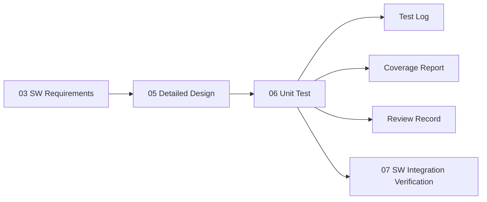

# 소프트웨어 단위 검증 명세서 및 결과서

**Document ID**: STEER-06-SWUV  
**ISO 26262 Reference**: Part 6, Cl.9  
**ASPICE Reference**: SWE.4 (Software Unit Verification)  
**Version**: 1.5  
**Date**: 2026-08-27  
**Status**: Completed  
**Project Title**: AUTOSAR 기반 조향 관련 오류에 대한 복구 및 진단 시스템  
**Subtitle**: SW Unit 기능, Fault 진단, FAIL-SAFE 및 정상 복귀 단위검증

---

## 1. 문서 목적

본 문서는 `05_SW_Detailed_Design_Unit_Construction.md`에서 정의한 `UNIT-*`와 `SWD-*`가 관련 `SWR-*` 요구사항에 따라 올바르게 구현되었는지 검증하기 위한 단위시험 기준과 결과를 정의한다.

각 Test Case는 검증 대상 `UNIT`, `SWD`, `SWR` ID를 참조하여 요구사항부터 구현 및 검증까지의 추적성을 유지한다.

주요 검증 대상은 다음과 같다.

- 조향 입력 변환 및 Alive Counter 생성
- 조향 데이터 갱신 이상 진단
- 조향 입력 유효 범위 진단
- SW 실행 상태 Fault 판정
- FAIL-SAFE 전환 및 안전 출력
- 정상 조건 연속 확인을 통한 NORMAL 복귀
- 조향 방향 및 PWM 계산
- 최종 하드웨어 출력 차단

별도의 외부 NORMAL / FAIL-SAFE 상태 표시 기능은 본 단위검증 범위에 포함하지 않는다.

---

## 2. 검증 범위

| 검증 대상 | 구현 함수 | 주요 검증 내용 |
|---|---|---|
| UNIT-001 | `RE_Can_Tx_10ms()` | 입력 변환, Alive Counter 증가, RTE 출력 |
| UNIT-002 | `CanMonitor_func()` | RTE Read 실패, Invalid 입력, Alive Counter 갱신 이상 |
| UNIT-003 | `SafetyPolicy_PreCheck_func()` | Fault 통합, FAIL-SAFE 전환·유지·정상 복귀 |
| UNIT-004 | `App_IsWdgmFault()` | WdgM 상태에 따른 SW 실행 Fault 판정 |
| UNIT-005 | `ControlCalc_func()` | 방향 판단, 정지 조건, PWM 계산, Fault 출력 제한 |
| UNIT-006 | `Pwm_Actuator_func()` | PWM·방향 하드웨어 출력 및 안전 차단 |

---

## 3. 검증 전략

| Verification Method ID | 방법 | 적용 목적 | 산출 증적 |
|---|---|---|---|
| VM-01 | 요구사항 기반 단위시험 | 정상 입력에 대한 기능 및 요구사항 충족 확인 | Test Log |
| VM-02 | 경계값 분석 | 조향 범위, Counter, 방향 임계값, 정상 복귀 횟수의 경계 조건 확인 | Test Log |
| VM-03 | Fault Injection | RTE Read 실패, Invalid 입력, 데이터 갱신 이상, SW 실행 Fault 및 출력 차단 확인 | Test Log |
| VM-04 | 구조적 커버리지 | Statement, Branch 및 MC/DC 커버리지 측정 | Coverage Report |
| VM-05 | 코드 리뷰 | 초기화, 자료형, 오류 처리, 상세설계 일치성 및 추적성 확인 | Review Record |

### 3.1 구조적 커버리지 목표

| 대상 | 목표 |
|---|---:|
| Statement Coverage | 100% |
| Branch Coverage | 100% |
| MC/DC Coverage | 안전 관련 의사결정 100% 목표 |

구조적 커버리지는 단위시험 수행 과정에서 소스코드의 Statement와 Branch 실행 여부를 확인하고, 안전 관련 주요 조건 분기에 대해서는 MC/DC 만족 여부를 확인한다.

실제 커버리지 결과는 별도의 Coverage Report에서 관리한다.

---

## 4. 단위시험 환경

| 항목 | 구성 |
|---|---|
| 시험 대상 | 각 SWC의 C 단위 함수 |
| 시험 방식 | 검증 대상 함수 단독 실행 |
| Test Harness | 함수 입력 및 Stub 반환값 설정이 가능한 C Test Harness |
| RTE 대체 | `Rte_Read`, `Rte_Write`, `Rte_Call` Stub |
| BSW 대체 | WdgM 및 IoHwAb Stub |
| 입력 제어 | Stub 반환값 및 입력 데이터 직접 설정 |
| 출력 관측 | RTE 출력값, IoHwAb 호출값 및 호출 횟수 확인 |
| 커버리지 | Statement, Branch 및 안전 관련 MC/DC 측정 |

AUTOSAR Runtime 및 실제 ECU 환경에 의존하는 RTE, WdgM, IoHwAb Interface는 Stub으로 대체하여 검증 대상 Unit의 내부 로직을 독립적으로 시험한다.

### 4.1 시험 판정 상태

| 상태 | 의미 |
|---|---|
| PASS | 실제 결과가 기대 결과와 일치함 |
| FAIL | 실제 결과가 기대 결과와 다름 |
| BLOCKED | 시험 환경 또는 결함으로 시험 수행 불가 |
| NE | 아직 시험하지 않음 |

---

# 5. UNIT-001 Steering Sensor Unit 시험

## 5.1 시험 목적

조향 입력값 변환, Alive Counter 생성 및 RTE 출력 기능을 검증한다.

| TC ID | 시험 조건·입력 | 기대 결과 | 방법 | 추적 ID | 상태 |
|---|---|---|---|---|---|
| UT-IN-001 | Analog Level `0`, Alive Counter `0` | 조향값 `-512`, Counter `0` 출력 후 내부 Counter 1 증가 | VM-01, VM-02 | UNIT-001 / SWD-IN-001, SWD-IN-002, SWD-COM-001, SWD-COM-002 / SWR-IN-001, SWR-COM-001 | PASS |
| UT-IN-002 | Analog Level `512` | 조향값 `0` 출력 | VM-01, VM-02 | UNIT-001 / SWD-IN-002 / SWR-IN-001 | PASS |
| UT-IN-003 | Analog Level `1023` | 조향값 `511` 출력 | VM-01, VM-02 | UNIT-001 / SWD-IN-002 / SWR-IN-001 | PASS |
| UT-IN-004 | Runnable 연속 3회 호출 | Counter가 `0, 1, 2` 순서로 출력되고 조향값이 매회 제공됨 | VM-01 | UNIT-001 / SWD-COM-001, SWD-COM-002 / SWR-COM-001 | PASS |
| UT-IN-005 | Counter `255`에서 Runnable 호출 | `uint8` 순환 규칙에 따라 다음 Counter가 `0`이 됨 | VM-02 | UNIT-001 / SWD-COM-002 / SWR-COM-001 | PASS |

---

# 6. UNIT-002 CAN Monitor Unit 시험

## 6.1 RTE Read 및 기본 Fault 처리

| TC ID | 시험 조건·입력 | 기대 결과 | 방법 | 추적 ID | 상태 |
|---|---|---|---|---|---|
| UT-DIAG-001 | 조향값 RTE Read 실패 | Fault TRUE 출력 | VM-03 | UNIT-002 / SWD-DIAG-001, SWD-DIAG-007 / SWR-COM-002, SWR-DIAG-004 | PASS |
| UT-DIAG-002 | Alive Counter RTE Read 실패 | Fault TRUE 출력 | VM-03 | UNIT-002 / SWD-DIAG-001, SWD-DIAG-007 / SWR-COM-002, SWR-DIAG-004 | PASS |

---

## 6.2 조향 입력 유효 범위 시험

조향 입력의 유효 범위 `-512 ~ 511`에 대해 정상값과 경계값을 검증한다.

| TC ID | 시험 조건·입력 | 기대 결과 | 방법 | 추적 ID | 상태 |
|---|---|---|---|---|---|
| UT-DIAG-003 | 조향값 `-513` | Invalid Fault TRUE | VM-02, VM-03 | UNIT-002 / SWD-DIAG-002, SWD-DIAG-007 / SWR-DIAG-005, SWR-DIAG-007, SWR-DIAG-008 | PASS |
| UT-DIAG-004 | 조향값 `-512` | 유효 입력으로 판단, Invalid Fault FALSE | VM-02 | UNIT-002 / SWD-DIAG-002 / SWR-DIAG-005, SWR-DIAG-006 | PASS |
| UT-DIAG-005 | 조향값 `511` | 유효 입력으로 판단, Invalid Fault FALSE | VM-02 | UNIT-002 / SWD-DIAG-002 / SWR-DIAG-005, SWR-DIAG-006 | PASS |
| UT-DIAG-006 | 조향값 `512` | Invalid Fault TRUE | VM-02, VM-03 | UNIT-002 / SWD-DIAG-002, SWD-DIAG-007 / SWR-DIAG-005, SWR-DIAG-007, SWR-DIAG-008 | PASS |

---

## 6.3 Alive Counter 갱신 진단 시험

Alive Counter의 변화 여부를 이용하여 조향 데이터가 정상적으로 갱신되는지 검증한다.

| TC ID | 시험 조건·입력 | 기대 결과 | 방법 | 추적 ID | 상태 |
|---|---|---|---|---|---|
| UT-DIAG-007 | 최초 정상 수신, Counter `10` | 기준 Counter 저장, Fault FALSE | VM-01 | UNIT-002 / SWD-DIAG-003 / SWR-DIAG-001, SWR-DIAG-002 | PASS |
| UT-DIAG-008 | 기준 Counter `10`, 동일 Counter 1회 추가 수신 | 동일 Counter 횟수 1, Fault FALSE | VM-02 | UNIT-002 / SWD-DIAG-004 / SWR-DIAG-001, SWR-DIAG-003 | PASS |
| UT-DIAG-009 | 기준 Counter `10`, 동일 Counter 2회 추가 수신 | 데이터 갱신 Fault TRUE | VM-02, VM-03 | UNIT-002 / SWD-DIAG-004, SWD-DIAG-005, SWD-DIAG-007 / SWR-DIAG-003, SWR-DIAG-004 | PASS |
| UT-DIAG-010 | 동일 Counter 1회 후 Counter 갱신 | 동일 Counter 횟수 초기화, Fault FALSE | VM-01 | UNIT-002 / SWD-DIAG-006 / SWR-DIAG-002 | PASS |

---

# 7. UNIT-003 Safety Policy Unit 시험

## 7.1 NORMAL 및 FAIL-SAFE 전환

CanMonitor의 Fault 결과와 SW 실행 상태를 통합하여 FAIL-SAFE 상태가 올바르게 결정되는지 검증한다.

| TC ID | 시험 조건·입력 | 기대 결과 | 방법 | 추적 ID | 상태 |
|---|---|---|---|---|---|
| UT-SAFE-001 | CanMonitor Fault FALSE, WdgM OK, 초기 NORMAL | NORMAL 유지, 유효 조향값 및 출력 허가 제공 | VM-01 | UNIT-003 / SWD-SAFE-001, SWD-SAFE-002 / SWR-EXEC-001, SWR-SAFE-001 | PASS |
| UT-SAFE-002 | CanMonitor Fault TRUE, WdgM OK | FAIL-SAFE 전환, 조향값 0, 출력 금지, 복귀 Counter 0 | VM-03 | UNIT-003 / SWD-SAFE-002, SWD-SAFE-003, SWD-SAFE-004 / SWR-SAFE-001 ~ SWR-SAFE-005 | PASS |
| UT-SAFE-003 | CanMonitor Fault FALSE, WdgM Fault | FAIL-SAFE 전환 및 안전 출력 제공 | VM-03 | UNIT-003 / SWD-SAFE-002, SWD-SAFE-003, SWD-SAFE-004 / SWR-EXEC-002, SWR-EXEC-003, SWR-SAFE-001 ~ SWR-SAFE-004 | PASS |
| UT-SAFE-004 | Fault가 지속되는 동안 반복 호출 | FAIL-SAFE 상태, 조향값 0 및 출력 금지 유지 | VM-03 | UNIT-003 / SWD-SAFE-003, SWD-SAFE-004 / SWR-SAFE-005 | PASS |

---

## 7.2 정상 상태 복귀

FAIL-SAFE 상태에서 Fault가 해제된 이후 정상 조건을 연속적으로 확인해야만 NORMAL 상태로 복귀하는지 검증한다.

| TC ID | 시험 조건·입력 | 기대 결과 | 방법 | 추적 ID | 상태 |
|---|---|---|---|---|---|
| UT-REC-001 | FAIL-SAFE 상태, 모든 Fault 해제 후 정상 조건 1회 | FAIL-SAFE 유지, 복귀 Counter 1 | VM-02 | UNIT-003 / SWD-REC-001, SWD-REC-002 / SWR-REC-001, SWR-REC-002 | PASS |
| UT-REC-002 | FAIL-SAFE 상태, 정상 조건 연속 2회 | FAIL-SAFE 유지, 복귀 Counter 2 | VM-02 | UNIT-003 / SWD-REC-002 / SWR-REC-002 | PASS |
| UT-REC-003 | FAIL-SAFE 상태, 정상 조건 연속 3회 | NORMAL 복귀, 복귀 Counter 초기화, 유효 조향값 및 출력 허가 제공 | VM-02 | UNIT-003 / SWD-REC-002, SWD-REC-003 / SWR-REC-002, SWR-REC-004 | PASS |
| UT-REC-004 | 정상 조건 2회 확인 후 Fault 재발 | FAIL-SAFE 유지, 복귀 Counter 0 | VM-03 | UNIT-003 / SWD-REC-004 / SWR-REC-003 | PASS |

---

# 8. UNIT-004 SW Execution Status Evaluation Unit 시험

WdgM Global Status에 따라 SW 실행 Fault가 올바르게 판정되는지 검증한다.

| TC ID | 시험 조건·입력 | 기대 결과 | 방법 | 추적 ID | 상태 |
|---|---|---|---|---|---|
| UT-EXEC-001 | Global Status `WDGM_GLOBAL_STATUS_OK` | SW 실행 Fault FALSE | VM-01 | UNIT-004 / SWD-EXEC-001 / SWR-EXEC-001, SWR-EXEC-002 | PASS |
| UT-EXEC-002 | Global Status `WDGM_GLOBAL_STATUS_FAILED` | SW 실행 Fault TRUE | VM-03 | UNIT-004 / SWD-EXEC-001 / SWR-EXEC-002 | PASS |
| UT-EXEC-003 | Global Status `WDGM_GLOBAL_STATUS_EXPIRED` | SW 실행 Fault TRUE, 최초 만료 SE ID 조회 | VM-03 | UNIT-004 / SWD-EXEC-001, SWD-EXEC-003 / SWR-EXEC-002 | PASS |
| UT-EXEC-004 | Global Status `WDGM_GLOBAL_STATUS_STOPPED` | SW 실행 Fault TRUE | VM-03 | UNIT-004 / SWD-EXEC-001 / SWR-EXEC-002 | PASS |
| UT-EXEC-005 | Fault 조건에 포함되지 않은 상태 | 현재 구현 기준 SW 실행 Fault FALSE | VM-01 | UNIT-004 / SWD-EXEC-001 / SWR-EXEC-002 | PASS |

---

# 9. UNIT-005 Control Calculation Unit 시험

SafetyPolicy 결과에 따라 정상 조향 제어와 안전 출력 제한이 올바르게 수행되는지 검증한다.

| TC ID | 시험 조건·입력 | 기대 결과 | 방법 | 추적 ID | 상태 |
|---|---|---|---|---|---|
| UT-CTRL-001 | Fault TRUE, 임의 조향값 | PWM 0, Left FALSE, Right FALSE, Keep_Go FALSE | VM-03 | UNIT-005 / SWD-CTRL-001 / SWR-SAFE-002 ~ SWR-SAFE-004, SWR-ACT-002 | PASS |
| UT-CTRL-002 | 이전값 0, 현재값 2 | 정지, Left FALSE, Right FALSE, PWM 0 | VM-02 | UNIT-005 / SWD-CTRL-002, SWD-CTRL-005, SWD-CTRL-009 / SWR-CTRL-001, SWR-CTRL-002 | PASS |
| UT-CTRL-003 | 이전값 0, 현재값 3 | Right TRUE, Left FALSE, Keep_Go TRUE | VM-02 | UNIT-005 / SWD-CTRL-002, SWD-CTRL-003 / SWR-CTRL-001 | PASS |
| UT-CTRL-004 | 이전값 0, 현재값 `-2` | 정지, Left FALSE, Right FALSE, PWM 0 | VM-02 | UNIT-005 / SWD-CTRL-002, SWD-CTRL-005, SWD-CTRL-009 / SWR-CTRL-002 | PASS |
| UT-CTRL-005 | 이전값 0, 현재값 `-3` | Left TRUE, Right FALSE, Keep_Go TRUE | VM-02 | UNIT-005 / SWD-CTRL-002, SWD-CTRL-004 / SWR-CTRL-001 | PASS |
| UT-CTRL-006 | 절대 변화량 `256` | 정의된 Relative Duty 및 PWM 계산 결과 출력 | VM-01 | UNIT-005 / SWD-CTRL-006 ~ SWD-CTRL-008 / SWR-CTRL-001 | PASS |
| UT-CTRL-007 | 절대 변화량 `512` | 변화량 상한 기준 최대 계산 결과 출력 | VM-02 | UNIT-005 / SWD-CTRL-006 ~ SWD-CTRL-008 / SWR-CTRL-001 | PASS |
| UT-CTRL-008 | 절대 변화량 `512` 초과 | 계산 입력이 512로 제한되고 PWM 상한을 초과하지 않음 | VM-02 | UNIT-005 / SWD-CTRL-006, SWD-CTRL-008 / SWR-CTRL-001 | PASS |
| UT-CTRL-009 | 정상 입력으로 함수 연속 호출 | 현재 조향값이 다음 호출의 이전 조향값으로 저장되고 RTE 결과 출력 | VM-01 | UNIT-005 / SWD-CTRL-010 / SWR-CTRL-001, SWR-ACT-001 | PASS |

---

# 10. UNIT-006 PWM Actuator Unit 시험

ControlCalc에서 전달된 최종 출력 명령이 하드웨어 Interface에 올바르게 반영되고, 출력 금지 상태에서 안전 출력이 적용되는지 검증한다.

| TC ID | 시험 조건·입력 | 기대 결과 | 방법 | 추적 ID | 상태 |
|---|---|---|---|---|---|
| UT-ACT-001 | Keep_Go FALSE, 임의 PWM·방향 입력 | PWM 0, MotorIn1 FALSE, MotorIn2 FALSE, StopLed TRUE | VM-03 | UNIT-006 / SWD-ACT-001, SWD-ACT-002, SWD-ACT-003 / SWR-ACT-002, SWR-SAFE-003, SWR-SAFE-004 | PASS |
| UT-ACT-002 | Keep_Go TRUE, Left TRUE, Right FALSE, 유효 PWM | MotorIn1 TRUE, MotorIn2 FALSE 및 PWM 입력값 출력, StopLed FALSE | VM-01 | UNIT-006 / SWD-ACT-001, SWD-ACT-004, SWD-ACT-005 / SWR-ACT-001 | PASS |
| UT-ACT-003 | Keep_Go TRUE, Left FALSE, Right TRUE, 유효 PWM | MotorIn1 FALSE, MotorIn2 TRUE 및 PWM 입력값 출력 | VM-01 | UNIT-006 / SWD-ACT-004 / SWR-ACT-001 | PASS |
| UT-ACT-004 | Keep_Go TRUE, PWM 0 | 방향 입력은 반영되고 PWM Duty는 0으로 출력 | VM-02 | UNIT-006 / SWD-ACT-004 / SWR-ACT-001 | PASS |
| UT-ACT-005 | Keep_Go FALSE → TRUE 전환 | StopLed가 TRUE → FALSE로 변경되고 하드웨어 출력 허용 상태가 반영됨 | VM-01 | UNIT-006 / SWD-ACT-003, SWD-ACT-005 / SWR-ACT-001, SWR-ACT-002 | PASS |

> `StopLed`는 별도의 시스템 상태 모니터링 요구사항에 대한 검증 대상이 아니라, `Keep_Go` 결과에 따라 출력 정지 여부를 반영하는 Actuator 보조 출력으로 취급한다.

---

# 11. 코드 리뷰

동적 단위시험과 별도로 구현 코드가 상세설계와 일치하는지 기본적인 코드 리뷰를 수행한다.

별도의 정적 분석 도구를 이용한 MISRA C 검사나 자동 정적 분석은 본 프로젝트의 검증 범위에 포함하지 않는다.

## 11.1 코드 리뷰 항목

| Check ID | 검토 항목 | 합격 기준 | 대상 | 상태 |
|---|---|---|---|---|
| CR-001 | 초기화 | 정적 변수 및 출력값이 정의된 초기 상태를 가짐 | UNIT-001 ~ UNIT-006 | PASS |
| CR-002 | 자료형 | 주요 연산에서 의도하지 않은 부호 및 폭 변환이 없음 | UNIT-001, UNIT-002, UNIT-005, UNIT-006 | PASS |
| CR-003 | 반환값 처리 | 안전 관련 RTE Read / Call 반환값 처리 누락 여부 확인 | UNIT-001 ~ UNIT-006 | PASS |
| CR-004 | 상세설계 일치성 | 코드가 관련 `SWD-*`의 처리 순서와 조건을 구현함 | UNIT-001 ~ UNIT-006 | PASS |
| CR-005 | Interface 일치성 | Port, Data Element, 자료형 및 데이터 방향이 `SW-IF-*`와 일치함 | UNIT-001 ~ UNIT-006 | PASS |
| CR-006 | 안전 출력 우선성 | Fault 경로에서 정상 제어보다 안전 출력 제한이 우선함 | UNIT-003, UNIT-005, UNIT-006 | PASS |

---

# 12. 구조적 커버리지 확인

## 12.1 커버리지 대상

구조적 커버리지는 주요 안전 관련 분기와 Fault 처리 로직을 중심으로 확인한다.

| Unit | 주요 Coverage 대상 |
|---|---|
| UNIT-001 | 입력 변환 및 Alive Counter 처리 |
| UNIT-002 | RTE Read 결과, 입력 범위 판정, Alive Counter 동일 여부 및 연속 횟수 판정 |
| UNIT-003 | Fault 존재 여부, 현재 FAIL-SAFE 상태, 정상 복귀 횟수 판정 |
| UNIT-004 | WdgM Global Status 판정 |
| UNIT-005 | Fault Flag, 방향 임계값 및 PWM 제한 조건 |
| UNIT-006 | Keep_Go 및 방향 출력 조건 |

## 12.2 안전 관련 주요 Decision

| Decision ID | Unit | 주요 조건 |
|---|---|---|
| DEC-001 | UNIT-002 | 조향값 또는 Alive Counter RTE Read 실패 여부 |
| DEC-002 | UNIT-002 | 조향 입력 유효 범위 만족 여부 |
| DEC-003 | UNIT-002 | Alive Counter 동일 여부 |
| DEC-004 | UNIT-002 | 동일 Counter 연속 2회 이상 여부 |
| DEC-005 | UNIT-003 | CanMonitor Fault 또는 SW 실행 Fault 존재 여부 |
| DEC-006 | UNIT-003 | 현재 FAIL-SAFE 상태 여부 |
| DEC-007 | UNIT-003 | 정상 조건 연속 3회 만족 여부 |
| DEC-008 | UNIT-004 | WdgM 상태가 Fault 상태인지 여부 |
| DEC-009 | UNIT-005 | SafetyPolicy Fault Flag 여부 |
| DEC-010 | UNIT-005 | 조향 변화량 방향 임계값 판정 |
| DEC-011 | UNIT-006 | Keep_Go 여부 |

각 Decision은 관련 Test Case를 통해 조건 조합과 분기 실행 여부를 확인하고 Coverage Report에서 결과를 관리한다.

---

# 13. 상세설계-단위시험 추적성

| Unit | 검증 대상 상세설계 | 관련 Test / Review |
|---|---|---|
| UNIT-001 | SWD-IN-001, SWD-IN-002, SWD-COM-001, SWD-COM-002 | UT-IN-001 ~ UT-IN-005, CR-001 ~ CR-005 |
| UNIT-002 | SWD-DIAG-001 ~ SWD-DIAG-007 | UT-DIAG-001 ~ UT-DIAG-010, CR-001 ~ CR-005 |
| UNIT-003 | SWD-SAFE-001 ~ SWD-SAFE-004, SWD-REC-001 ~ SWD-REC-004 | UT-SAFE-001 ~ UT-SAFE-004, UT-REC-001 ~ UT-REC-004, CR-001, CR-003 ~ CR-006 |
| UNIT-004 | SWD-EXEC-001 ~ SWD-EXEC-003 | UT-EXEC-001 ~ UT-EXEC-005, CR-003 ~ CR-005 |
| UNIT-005 | SWD-CTRL-001 ~ SWD-CTRL-010 | UT-CTRL-001 ~ UT-CTRL-009, CR-001 ~ CR-006 |
| UNIT-006 | SWD-ACT-001 ~ SWD-ACT-005 | UT-ACT-001 ~ UT-ACT-005, CR-001 ~ CR-006 |

---

# 14. SW 요구사항-단위시험 추적성

| SW 요구사항 | 주요 Test Case |
|---|---|
| SWR-IN-001 | UT-IN-001 ~ UT-IN-003 |
| SWR-COM-001 | UT-IN-004, UT-IN-005 |
| SWR-COM-002 | UT-DIAG-001, UT-DIAG-002 |
| SWR-DIAG-001 ~ SWR-DIAG-004 | UT-DIAG-007 ~ UT-DIAG-010 |
| SWR-DIAG-005 ~ SWR-DIAG-008 | UT-DIAG-003 ~ UT-DIAG-006 |
| SWR-EXEC-001 ~ SWR-EXEC-003 | UT-SAFE-001, UT-SAFE-003, UT-EXEC-001 ~ UT-EXEC-005 |
| SWR-SAFE-001 ~ SWR-SAFE-005 | UT-SAFE-001 ~ UT-SAFE-004, UT-CTRL-001, UT-ACT-001 |
| SWR-REC-001 ~ SWR-REC-004 | UT-REC-001 ~ UT-REC-004 |
| SWR-CTRL-001, SWR-CTRL-002 | UT-CTRL-002 ~ UT-CTRL-009 |
| SWR-ACT-001, SWR-ACT-002 | UT-ACT-001 ~ UT-ACT-005 |

---

# 15. 시험 결과 기록

| Test Group | 주요 검증 내용 | 판정 | 증적 |
|---|---|---|---|
| UT-IN | 입력 변환 및 Alive Counter | PASS | Test Log |
| UT-DIAG | 데이터 갱신 및 Invalid 진단 | PASS | Test Log |
| UT-SAFE | FAIL-SAFE 전환 및 유지 | PASS | Test Log |
| UT-REC | 정상 상태 복귀 | PASS | Test Log |
| UT-EXEC | SW 실행 상태 판정 | PASS | Test Log |
| UT-CTRL | 조향 방향 및 PWM 계산 | PASS | Test Log |
| UT-ACT | 하드웨어 출력 및 안전 차단 | PASS | Test Log |
| Code Review | 상세설계 및 Interface 일치성 | PASS | Review Record |

---

## 15.1 결과 요약

| 항목 | 전체 | PASS | FAIL | BLOCKED | NE |
|---|---:|---:|---:|---:|---:|
| 동적 단위시험 | 42 | 42 | 0 | 0 | 0 |
| 코드 리뷰 | 6 | 6 | 0 | 0 | 0 |

구조적 커버리지 결과는 별도의 Coverage Report에서 관리한다.

---

# 16. 단위검증 완료 기준

단위검증은 다음 조건을 만족할 경우 완료한 것으로 판단한다.

- 정의된 동적 단위 Test Case가 모두 수행되어야 한다.
- 모든 Test Case가 PASS이거나 승인된 편차가 관리되어야 한다.
- FAIL 또는 BLOCKED 항목이 존재하는 경우 결함 및 변경관리 항목과 연결되어야 한다.
- Statement 및 Branch Coverage 목표 달성 여부를 확인해야 한다.
- 안전 관련 주요 Decision에 대해 MC/DC 만족 여부를 확인해야 한다.
- 코드 리뷰에서 발견된 상세설계 불일치 및 오류 처리 누락은 수정 후 재검토해야 한다.
- 변경된 `SWR-*`, `SWD-*` 또는 소스코드에 영향을 받는 Test Case는 재수행해야 한다.
- 시험 결과는 Test Case ID를 통해 재현 가능해야 한다.

단위검증 완료 결과는 후속 `07_SW_Integration_Verification.md`의 SW 통합검증 입력으로 사용한다.

---

# 17. 검증 산출물 관계

| 산출물 | 역할 |
|---|---|
| `03_SW_Requirements.md` | 단위검증의 상위 SW 요구사항 |
| `05_SW_Detailed_Design_Unit_Construction.md` | Unit 및 상세설계 기준 |
| `06_SW_Unit_Verification.md` | Test Case, 검증 방법 및 결과 |
| Test Log | Test Case별 실제 입력 및 결과 증적 |
| Coverage Report | Statement, Branch 및 MC/DC 결과 |
| Review Record | 코드와 상세설계 간 일치성 검토 결과 |
| `07_SW_Integration_Verification.md` | Unit 통합 이후 Interface 및 기능 흐름 검증 |

---

본 문서는 SWE.4 Software Unit Verification의 기준 산출물이다.

단위검증은 `03_SW_Requirements.md`와 `05_SW_Detailed_Design_Unit_Construction.md`에서 정의한 기능 및 상세설계가 각 C Unit에 올바르게 구현되었는지 확인하는 것을 목적으로 한다.

본 프로젝트에서는 요구사항 기반 단위시험, 경계값 분석, Fault Injection, 구조적 커버리지 및 코드 리뷰를 중심으로 단위검증을 수행한다.

별도의 정적 분석 도구를 이용한 MISRA C 검사 및 자동 정적 분석은 본 프로젝트의 검증 범위에 포함하지 않는다.

외부 시스템 상태 표시 기능은 본 프로젝트 범위에 포함하지 않으며, StopLed는 Actuator 출력 정지 상태를 반영하는 보조 출력으로만 검증한다.

전체 요구사항, 상세설계, Unit 및 Test Case 간 양방향 추적성은 `Traceability_Matrix.md`에서 관리한다.
