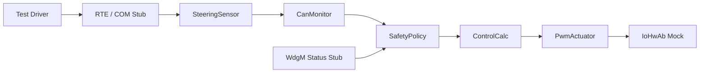
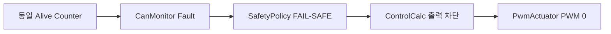
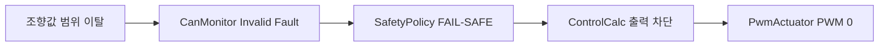
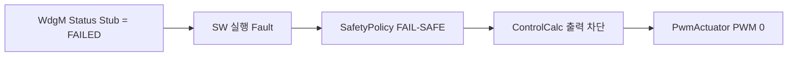
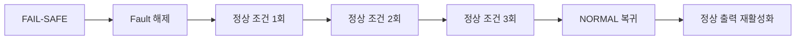
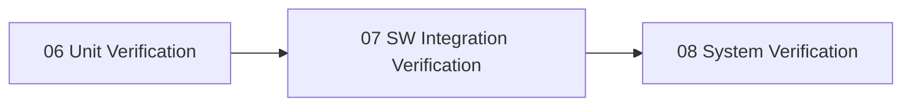

# 소프트웨어 통합 검증 명세서 및 결과서

**Document ID**: STEER-07-SWIV  
**ISO 26262 Reference**: Part 6, Cl.10  
**ASPICE Reference**: SWE.5 (Software Component Verification and Integration Verification)  
**Version**: 1.4  
**Date**: 2026-08-27  
**Status**: Completed  
**Project Title**: AUTOSAR 기반 조향 관련 오류에 대한 복구 및 진단 시스템  
**Subtitle**: SWC Interface, Fault 전파, FAIL-SAFE 및 정상 복귀 통합검증

---

## 1. 문서 목적

본 문서는 단위검증이 완료된 소프트웨어 Unit을 통합하고, SWC 간 데이터 전달, RTE Interface, Fault 전달, 안전 상태 판단 및 최종 출력 제한까지의 소프트웨어 동작 흐름을 검증한다.

본 통합검증은 실제 ECU, 실제 CAN Bus 및 실제 WdgM 동작 자체를 검증하는 것이 아니라, Stub/Mock 기반 호스트 시험환경에서 각 SWC의 실제 C 구현을 연결하여 소프트웨어 Interface와 기능 연동을 검증하는 것을 목적으로 한다.

주요 검증 대상은 다음과 같다.

- SteeringSensor → CanMonitor 데이터 전달
- CanMonitor → SafetyPolicy Fault 전달
- WdgM 상태 Stub → SafetyPolicy 실행 Fault 반영
- SafetyPolicy → ControlCalc 안전 판단 전달
- ControlCalc → PwmActuator 출력 명령 전달
- Fault 발생 시 최종 안전 출력까지의 전파
- Fault 해제 후 연속 정상 조건에 따른 NORMAL 복귀

실제 CAN 통신, 실제 OS Scheduling, 실제 WdgM 감시 동작 및 실제 모터 구동은 `08_System_Verification.md` 또는 실제 ECU 환경의 검증 범위로 관리한다.

---

## 2. 통합검증 범위

### 2.1 포함 범위

| 통합 그룹 | 통합 대상 | 검증 내용 |
|---|---|---|
| SW-INTG-01 | UNIT-001 → UNIT-002 | 조향값 및 Alive Counter 전달 |
| SW-INTG-02 | UNIT-002 → UNIT-003 | 데이터 갱신 Fault, Invalid Fault 및 조향값 전달 |
| SW-INTG-03 | WdgM Stub → UNIT-003 / UNIT-004 | Stub으로 설정한 SW 실행 상태의 SafetyPolicy 반영 |
| SW-INTG-04 | UNIT-003 → UNIT-005 | 안전 조향값 및 출력 허가 Flag 전달 |
| SW-INTG-05 | UNIT-005 → UNIT-006 | PWM, 방향 및 Keep_Go 전달 |
| SW-INTG-06 | UNIT-006 → IoHwAb Mock | 최종 PWM 및 Digital Output 호출값 확인 |
| SW-INTG-07 | UNIT-002 → UNIT-003 → UNIT-005 → UNIT-006 | Fault 발생부터 안전 출력까지 전체 SW 흐름 확인 |

### 2.2 제외 범위

| 제외 대상 | 사유 / 후속 단계 |
|---|---|
| 실제 입력 ECU와 출력 ECU 사이 CAN Frame 송수신 | 실제 ECU 및 CANoe 기반 시스템검증 |
| 실제 CAN Controller / CanIf / PduR / COM 내부 동작 자체 검증 | BSW 및 AUTOSAR 플랫폼 검증 범위 |
| 실제 10 ms OS Task Scheduling | 실제 ECU 통합환경 검증 |
| 실제 WdgM이 Checkpoint Timeout을 검출하는지 여부 | WdgM / BSW 통합환경 검증 |
| 실제 PWM 파형 및 Digital Pin 전기적 출력 | 시스템검증 |
| 실제 모터 동작 | 시스템검증 |
| 별도 외부 NORMAL / FAIL-SAFE 상태 표시 | 프로젝트 범위 외 |

---

## 3. 통합시험 환경

| 시험 구성요소 | 역할 |
|---|---|
| Test Driver | 시험 입력, Fault 조건 및 Stub 반환값 설정 |
| 실제 SW Unit | UNIT-001 ~ UNIT-006의 실제 C 함수 |
| RTE Stub | `Rte_Read`, `Rte_Write` 동작을 Buffer 기반으로 대체 |
| COM Stub | ECU 간 실제 CAN 없이 조향값 및 Alive Counter 전달 |
| WdgM Status Stub | `OK`, `FAILED`, `EXPIRED`, `STOPPED` 상태 강제 제공 |
| IoHwAb Mock | PWM 및 Digital Output 호출값 기록 |

### 3.1 Stub / Mock 적용 원칙

| 대상 | 대체 방식 | 검증 목적 |
|---|---|---|
| Analog Input | Stub | 설정한 조향 입력이 SteeringSensor에 전달되는지 확인 |
| RTE Sender-Receiver | 공유 Buffer | 제공 SWC 출력과 사용자 SWC 입력 일치 확인 |
| CAN / COM | Signal Buffer | 실제 CAN 없이 ECU 간 데이터 흐름 모사 |
| WdgM | Status Stub | WdgM 자체가 아닌 Application의 상태 처리 검증 |
| PWM / Digital Output | Mock | 최종 하드웨어 출력 요청값 검증 |

> WdgM Stub은 실제 WdgM의 감시 기능을 검증하기 위한 것이 아니라, WdgM에서 발생할 수 있는 상태값을 강제로 제공하여 SafetyPolicy의 Application 로직을 검증하기 위해 사용한다.

---

## 4. 통합검증 절차

1. 각 Test Case 시작 전 RTE Buffer, Stub 값, Mock 기록 및 SW 내부 상태를 초기화한다.
2. Test Driver에서 조향 입력, Alive Counter, Fault 조건 또는 WdgM Stub 상태를 설정한다.
3. 검증 대상 흐름에 따라 Unit 함수를 순서대로 호출한다.
4. 각 SWC의 RTE Write 결과와 다음 SWC의 RTE Read 입력값을 비교한다.
5. Fault 발생 시 SafetyPolicy의 안전 판단 결과가 ControlCalc와 PwmActuator까지 전달되는지 확인한다.
6. 정상 복귀 시험에서는 Fault 해제 이후 정상 조건 확인 횟수를 반복 입력한다.
7. 최종 PWM 및 방향 출력 요청은 IoHwAb Mock에서 확인한다.
8. 실제 결과가 기대 결과와 일치하면 PASS로 판정한다.

---

# 5. SWC Interface 통합시험

## 5.1 SteeringSensor → CanMonitor

| ITC ID | 시험 조건 | 기대 결과 | 추적 ID | 결과 |
|---|---|---|---|---|
| ITC-SW-001 | Analog 입력 `0` → UNIT-001 실행 → UNIT-002 연결 | `-512` 조향값이 UNIT-002 입력으로 전달 | SWR-IN-001, SWR-COM-001, SWR-COM-002 / SW-IF-001, SW-IF-002 | PASS |
| ITC-SW-002 | Analog 입력 `512` → UNIT-001 실행 | 조향값 `0`과 Alive Counter가 UNIT-002에 동일하게 전달 | SWR-COM-001, SWR-COM-002 / SW-IF-002 | PASS |
| ITC-SW-003 | UNIT-001을 연속 실행하여 Alive Counter 증가 | UNIT-002에서 Counter 갱신이 정상으로 판단됨 | SWR-DIAG-001, SWR-DIAG-002 / SW-IF-002 | PASS |

---

## 5.2 CanMonitor → SafetyPolicy

| ITC ID | 시험 조건 | 기대 결과 | 추적 ID | 결과 |
|---|---|---|---|---|
| ITC-SW-004 | 정상 조향값 및 정상 갱신 Counter | 조향값과 Fault FALSE가 SafetyPolicy에 전달 | SWR-DIAG-004, SWR-DIAG-008 / SW-IF-003 | PASS |
| ITC-SW-005 | 동일 Alive Counter 연속 2회 | 데이터 갱신 Fault TRUE가 SafetyPolicy에 전달 | SWR-DIAG-003, SWR-DIAG-004 / SW-IF-003 | PASS |
| ITC-SW-006 | 조향값 `512` | Invalid Fault TRUE가 SafetyPolicy에 전달 | SWR-DIAG-007, SWR-DIAG-008 / SW-IF-003 | PASS |
| ITC-SW-007 | 조향값 `-513` | Invalid Fault TRUE가 SafetyPolicy에 전달 | SWR-DIAG-007, SWR-DIAG-008 / SW-IF-003 | PASS |

---

## 5.3 WdgM Status Stub → SafetyPolicy

| ITC ID | 시험 조건 | 기대 결과 | 추적 ID | 결과 |
|---|---|---|---|---|
| ITC-EXEC-001 | WdgM Stub = `WDGM_GLOBAL_STATUS_OK` | SW 실행 Fault FALSE로 처리 | SWR-EXEC-001, SWR-EXEC-002 / SW-IF-004 | PASS |
| ITC-EXEC-002 | WdgM Stub = `WDGM_GLOBAL_STATUS_FAILED` | SW 실행 Fault TRUE, FAIL-SAFE 전환 | SWR-EXEC-002, SWR-EXEC-003, SWR-SAFE-001 / SW-IF-004 | PASS |
| ITC-EXEC-003 | WdgM Stub = `WDGM_GLOBAL_STATUS_EXPIRED` | SW 실행 Fault TRUE, 만료 SE ID 조회 호출 | SWR-EXEC-002, SWR-EXEC-003 / SW-IF-004 | PASS |
| ITC-EXEC-004 | WdgM Stub = `WDGM_GLOBAL_STATUS_STOPPED` | SW 실행 Fault TRUE, FAIL-SAFE 전환 | SWR-EXEC-002, SWR-EXEC-003, SWR-SAFE-001 / SW-IF-004 | PASS |

> 본 시험은 실제 WdgM이 해당 상태를 정상적으로 생성하는지 검증하지 않는다. Stub으로 상태값을 주입한 후 Application에서 Fault가 올바르게 처리되는지만 확인한다.

---

## 5.4 SafetyPolicy → ControlCalc

| ITC ID | 시험 조건 | 기대 결과 | 추적 ID | 결과 |
|---|---|---|---|---|
| ITC-SAFE-001 | 모든 Fault FALSE, NORMAL 상태 | 유효 조향값 및 출력 허가 Flag가 ControlCalc에 전달 | SWR-SAFE-001, SWR-CTRL-001 / SW-IF-005 | PASS |
| ITC-SAFE-002 | CanMonitor Fault TRUE | SafetyPolicy가 조향값 `0`, 출력 금지 Flag 전달 | SWR-SAFE-001 ~ SWR-SAFE-005 / SW-IF-005 | PASS |
| ITC-SAFE-003 | SW 실행 Fault TRUE | 안전 조향값 및 출력 금지 Flag 전달 | SWR-EXEC-002, SWR-SAFE-001 ~ SWR-SAFE-004 / SW-IF-005 | PASS |

---

## 5.5 ControlCalc → PwmActuator

| ITC ID | 시험 조건 | 기대 결과 | 추적 ID | 결과 |
|---|---|---|---|---|
| ITC-CTRL-001 | NORMAL, 양의 조향 변화량 | 계산된 PWM, Right TRUE, Keep_Go TRUE 전달 | SWR-CTRL-001, SWR-ACT-001 / SW-IF-006 | PASS |
| ITC-CTRL-002 | NORMAL, 음의 조향 변화량 | 계산된 PWM, Left TRUE, Keep_Go TRUE 전달 | SWR-CTRL-001, SWR-ACT-001 / SW-IF-006 | PASS |
| ITC-CTRL-003 | 정지 조건 | PWM 0, 방향 FALSE, Keep_Go 상태가 정의된 값으로 전달 | SWR-CTRL-002, SWR-ACT-001 / SW-IF-006 | PASS |
| ITC-CTRL-004 | FAIL-SAFE 입력 | PWM 0, Left FALSE, Right FALSE, Keep_Go FALSE 전달 | SWR-SAFE-002 ~ SWR-SAFE-004, SWR-ACT-002 / SW-IF-006 | PASS |

---

## 5.6 PwmActuator → IoHwAb Mock

| ITC ID | 시험 조건 | 기대 결과 | 추적 ID | 결과 |
|---|---|---|---|---|
| ITC-ACT-001 | Keep_Go TRUE, 유효 PWM 및 Right TRUE | IoHwAb Mock에 PWM 값과 방향 출력 요청 기록 | SWR-ACT-001 / SW-IF-007 | PASS |
| ITC-ACT-002 | Keep_Go TRUE, 유효 PWM 및 Left TRUE | IoHwAb Mock에 반대 방향 출력 요청 기록 | SWR-ACT-001 / SW-IF-007 | PASS |
| ITC-ACT-003 | Keep_Go FALSE | PWM 0, MotorIn1 FALSE, MotorIn2 FALSE 호출 기록 | SWR-SAFE-003, SWR-SAFE-004, SWR-ACT-002 / SW-IF-007 | PASS |

---

# 6. Fault 전파 통합시험

## 6.1 데이터 갱신 Fault 전파

| ITC ID | 시험 조건 | 기대 결과 | 결과 |
|---|---|---|---|
| ITC-FLOW-001 | 동일 Alive Counter 연속 2회 입력 후 UNIT-002 → UNIT-003 → UNIT-005 → UNIT-006 실행 | 데이터 갱신 Fault가 최종 PWM 0 및 방향 FALSE까지 전파 | PASS |

---

## 6.2 Invalid 입력 Fault 전파

| ITC ID | 시험 조건 | 기대 결과 | 결과 |
|---|---|---|---|
| ITC-FLOW-002 | 조향값 `512` 입력 후 전체 출력 ECU SW 흐름 실행 | Invalid Fault가 최종 안전 출력까지 전파 | PASS |
| ITC-FLOW-003 | 조향값 `-513` 입력 후 전체 출력 ECU SW 흐름 실행 | Invalid Fault가 최종 안전 출력까지 전파 | PASS |

---

## 6.3 SW 실행 Fault 전파

| ITC ID | 시험 조건 | 기대 결과 | 결과 |
|---|---|---|---|
| ITC-FLOW-004 | WdgM Stub `FAILED` 후 UNIT-003 → UNIT-005 → UNIT-006 실행 | SW 실행 Fault가 최종 PWM 0 및 방향 FALSE까지 전파 | PASS |

---

# 7. 정상 상태 복귀 통합시험

정상 복귀는 SafetyPolicy 단독 로직만 확인하는 것이 아니라, 복귀 이후 ControlCalc 및 PwmActuator의 정상 출력이 다시 활성화되는지까지 통합적으로 검증한다.

| ITC ID | 시험 조건 | 기대 결과 | 추적 ID | 결과 |
|---|---|---|---|---|
| ITC-REC-001 | FAIL-SAFE 상태에서 Fault 해제 후 정상 조건 1회 | FAIL-SAFE 유지, 출력 차단 유지 | SWR-REC-001, SWR-REC-002 | PASS |
| ITC-REC-002 | 정상 조건 연속 2회 | FAIL-SAFE 유지, 출력 차단 유지 | SWR-REC-002 | PASS |
| ITC-REC-003 | 정상 조건 연속 3회 | NORMAL 복귀 후 ControlCalc 정상 출력 및 PwmActuator 출력 재활성화 | SWR-REC-002, SWR-REC-004 | PASS |
| ITC-REC-004 | 정상 조건 2회 후 Fault 재발 | 복귀 Counter 초기화, FAIL-SAFE 및 출력 차단 유지 | SWR-REC-003 | PASS |

---

# 8. Runnable 연쇄 실행 검증

호스트 시험환경에서는 실제 OS Event 및 Scheduling 자체를 검증하지 않고, 설계된 데이터 흐름과 동일한 순서로 Runnable 함수를 호출하여 데이터 전달 관계를 확인한다.

| ITC ID | 호출 순서 | 기대 결과 | 결과 |
|---|---|---|---|
| ITC-RUN-001 | UNIT-001 → UNIT-002 | SteeringSensor 출력이 CanMonitor 입력으로 사용됨 | PASS |
| ITC-RUN-002 | UNIT-002 → UNIT-003 | CanMonitor Fault 및 조향값이 SafetyPolicy에 반영됨 | PASS |
| ITC-RUN-003 | UNIT-003 → UNIT-005 | SafetyPolicy 출력이 ControlCalc 입력으로 반영됨 | PASS |
| ITC-RUN-004 | UNIT-005 → UNIT-006 | PWM 및 방향 결과가 PwmActuator에 반영됨 | PASS |
| ITC-RUN-005 | UNIT-002 → UNIT-003 → UNIT-005 → UNIT-006 | Fault가 하나의 시험 흐름에서 최종 안전 출력까지 전파됨 | PASS |

> 실제 Data Received Event 및 OS Task Scheduling의 동작 자체는 본 호스트 기반 통합시험의 검증 대상이 아니다.

---

# 9. SW 요구사항-통합시험 추적성

| SW 요구사항 | 주요 통합 Test Case |
|---|---|
| SWR-IN-001 | ITC-SW-001 |
| SWR-COM-001, SWR-COM-002 | ITC-SW-001 ~ ITC-SW-003, ITC-RUN-001 |
| SWR-DIAG-001 ~ SWR-DIAG-004 | ITC-SW-003 ~ ITC-SW-005, ITC-FLOW-001 |
| SWR-DIAG-005 ~ SWR-DIAG-008 | ITC-SW-006, ITC-SW-007, ITC-FLOW-002, ITC-FLOW-003 |
| SWR-EXEC-001 ~ SWR-EXEC-003 | ITC-EXEC-001 ~ ITC-EXEC-004, ITC-FLOW-004 |
| SWR-SAFE-001 ~ SWR-SAFE-005 | ITC-SAFE-001 ~ ITC-SAFE-003, ITC-FLOW-001 ~ ITC-FLOW-004 |
| SWR-REC-001 ~ SWR-REC-004 | ITC-REC-001 ~ ITC-REC-004 |
| SWR-CTRL-001, SWR-CTRL-002 | ITC-CTRL-001 ~ ITC-CTRL-004 |
| SWR-ACT-001, SWR-ACT-002 | ITC-ACT-001 ~ ITC-ACT-003, ITC-FLOW-001 ~ ITC-FLOW-004 |

---

# 10. 시험 결과 요약

| 시험 그룹 | 전체 | PASS | FAIL | BLOCKED |
|---|---:|---:|---:|---:|
| SWC Interface 통합시험 | 17 | 17 | 0 | 0 |
| Fault 전파 통합시험 | 4 | 4 | 0 | 0 |
| 정상 복귀 통합시험 | 4 | 4 | 0 | 0 |
| Runnable 연쇄 실행 검증 | 5 | 5 | 0 | 0 |
| **합계** | **30** | **30** | **0** | **0** |

---

## 10.1 주요 수행 결과

- SteeringSensor에서 생성한 조향값과 Alive Counter가 CanMonitor 입력까지 전달되는 것을 확인하였다.
- 데이터 갱신 Fault와 Invalid 입력 Fault가 CanMonitor에서 SafetyPolicy로 전달되는 것을 확인하였다.
- WdgM Stub으로 주입한 SW 실행 이상 상태가 SafetyPolicy의 FAIL-SAFE 판단에 반영되는 것을 확인하였다.
- FAIL-SAFE 판단 결과가 ControlCalc와 PwmActuator까지 전달되어 PWM 0 및 방향 비활성 출력으로 이어지는 것을 확인하였다.
- Fault 해제 후 정상 조건이 연속 3회 확인된 경우 NORMAL 상태로 복귀하고 정상 조향 출력이 다시 활성화되는 것을 확인하였다.
- 정상 복귀 확인 중 Fault가 재발하면 복귀 조건이 초기화되고 FAIL-SAFE 상태가 유지되는 것을 확인하였다.

---

# 11. 통합검증 완료 기준

통합검증은 다음 조건을 만족할 경우 완료한 것으로 판단한다.

- 정의된 SWC Interface 통합 Test Case가 모두 수행되어야 한다.
- 세 가지 주요 Fault 경로가 SafetyPolicy를 거쳐 최종 안전 출력까지 전파되어야 한다.
- 정상 복귀 조건이 SWC 간 연결 상태에서도 요구사항과 동일하게 동작해야 한다.
- RTE Stub Buffer에서 제공자 출력과 사용자 입력이 일치해야 한다.
- IoHwAb Mock의 PWM 및 방향 호출값이 기대 결과와 일치해야 한다.
- FAIL 또는 BLOCKED 항목이 존재하는 경우 결함 및 변경관리 항목과 연결되어야 한다.
- 변경된 `SWR-*`, `SWD-*`, `SW-IF-*` 또는 소스코드에 영향을 받는 통합 Test Case는 재수행해야 한다.

---

# 12. Unit Verification과 Integration Verification의 구분

| 구분 | Unit Verification | Integration Verification |
|---|---|---|
| 주요 대상 | 개별 C 함수 / Unit | 둘 이상의 Unit / SWC 연결 |
| RTE | Stub으로 개별 함수 입력·출력 검증 | Buffer를 통해 실제 SWC 간 데이터 전달 검증 |
| Fault | 함수 내부 Fault 처리 | Fault가 다음 SWC로 올바르게 전달되는지 확인 |
| WdgM | 상태 판정 함수 검증 | WdgM Stub 상태가 SafetyPolicy와 출력 경로에 반영되는지 확인 |
| FAIL-SAFE | SafetyPolicy 단위 상태 전이 | SafetyPolicy → ControlCalc → Actuator 전체 전파 |
| 정상 복귀 | 복귀 Counter 및 상태 전이 | 복귀 후 정상 출력 재활성화까지 확인 |
| 실제 CAN / ECU | 제외 | 제외 |
| 실제 HW 출력 | 제외 | IoHwAb Mock까지만 확인 |

---

# 13. 후속 시스템검증 연계

본 SW 통합검증에서는 실제 ECU 및 차량 네트워크를 사용하지 않기 때문에 다음 항목은 `08_System_Verification.md`에서 검증한다.

- CANoe를 이용한 실제 CAN 메시지 송수신
- 동일 Alive Counter 또는 메시지 이상 Fault Injection
- 비정상 조향 입력 주입
- 실제 출력 ECU에서의 FAIL-SAFE 동작
- PWM 및 방향 출력 차단
- 정상 조건 회복 후 출력 복귀
- 실제 ECU 환경에서의 WdgM 상태 또는 실행 이상 검증 가능 항목

---

본 문서는 SWE.5 Software Integration Verification의 기준 산출물이다.

본 단계에서는 실제 AUTOSAR BSW 모듈 자체를 검증하는 것이 아니라, Stub/Mock 기반으로 실제 Application SW Unit을 연결하여 SWC Interface, Fault 전달, FAIL-SAFE 전파 및 정상 복귀 동작을 검증한다.

특히 WdgM 관련 시험은 WdgM 모듈 자체의 기능 검증이 아니라, WdgM Status를 Stub으로 주입했을 때 Application의 SafetyPolicy가 요구사항대로 반응하는지를 검증한다.

전체 SW 요구사항, Architecture, Detailed Design, Unit Verification 및 Integration Verification 간 양방향 추적성은 `Traceability_Matrix.md`에서 관리한다.
