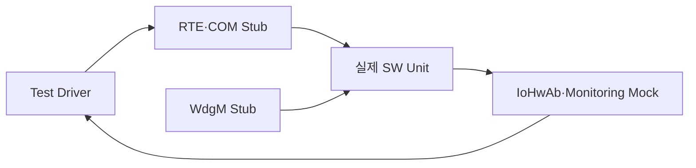

# 소프트웨어 통합 및 통합시험 명세서·결과서

**Document ID**: STEER-07-SWIT  
**ISO 26262 Reference**: Part 6, Cl.10  
**ASPICE Reference**: SWE.5 (Software Integration and Integration Test)  
**Version**: 1.3  
**Date**: 2026-08-24  
**Status**: Completed  
**Project Title**: AUTOSAR 기반 조향 관련 오류에 대한 복구 및 진단 시스템

---

## 1. 문서 목적

본 문서는 단위 검증이 완료된 C 소프트웨어 단위를 호스트 시험환경에서 통합하고, SWC 간 데이터 전달, RTE Interface, Runnable 호출 관계, WdgM 상태 연동 및 안전 출력 전파를 검증한 결과를 기록한다.

실제 ECU 보드, 실제 CAN Bus, PWM 핀, LED 및 모터는 본 SWE.5 시험 범위에 포함하지 않는다. 해당 외부 환경은 Stub/Mock으로 대체하며 실제 하드웨어와 Restbus Simulation을 포함하는 검증은 `08_System_Verification.md`에서 수행한다.

## 2. 시험 범위

### 포함 범위

| 통합 그룹 | 통합 대상 | 검증 내용 |
|---|---|---|
| SW-INTG-01 | UNIT-001 ↔ COM/RTE Stub | 조향값과 Alive Counter 전달 |
| SW-INTG-02 | UNIT-002 ↔ UNIT-003 | 통신·입력 Fault와 조향값 전달 |
| SW-INTG-03 | WdgM Stub ↔ UNIT-003, UNIT-004 | 내부 실행 상태의 안전 판단 반영 |
| SW-INTG-04 | UNIT-003 ↔ UNIT-005 | NORMAL/FAIL-SAFE 상태와 제어 입력 전달 |
| SW-INTG-05 | UNIT-005 ↔ UNIT-006 | PWM·방향·동작 허가 전달 |
| SW-INTG-06 | UNIT-006 ↔ IoHwAb Mock | 하드웨어 출력 API 호출값 검증 |

### 제외 범위

| 제외 대상 | 후속 검증 단계 |
|---|---|
| 실제 입력 ECU와 출력 ECU 사이의 CAN 통신 | 입력 ECU 기능 확인 / 시스템검증 |
| 실제 10 ms Task 주기 및 OS Scheduling | 입력 ECU 기능 확인 / 시스템검증 |
| 실제 PWM 파형, Digital Pin, LED 및 모터 동작 | 시스템시험 |
| 전원, 배선 및 CAN Transceiver 고장 | 시스템시험 |
| 실제 CANoe Network Fault Injection | 시스템검증 |

## 3. 호스트 기반 통합시험 환경

| 시험 구성요소 | 역할 |
|---|---|
| Test Driver | 입력값·Fault 상태 설정, Runnable 순서 호출, 결과 비교 |
| 실제 SW Unit | UNIT-001부터 UNIT-006의 실제 C 함수 |
| RTE Stub | Rte_Read에 시험값 제공, Rte_Write 값을 공유 Buffer에 저장 |
| COM Stub | 조향값과 Alive Counter를 입력 ECU 출력에서 출력 ECU 입력으로 복사 |
| WdgM Stub | OK, FAILED, EXPIRED, STOPPED 상태 제공 및 Checkpoint 호출 기록 |
| IoHwAb Mock | PWM·방향·LED 호출값과 호출 횟수 기록 |
| Monitoring Mock | 시스템 상태, Fault 및 제어 결과 저장 |

### Stub/Mock 동작 원칙

| 대상 | 대체 방식 | 검증 포인트 |
|---|---|---|
| Analog IoHwAb | Stub | 설정한 Analog Level이 UNIT-001에 전달되는지 확인 |
| RTE Read/Write | 공유 Buffer + Stub | 제공자 출력과 사용자 입력이 동일한지 확인 |
| COM | Signal Buffer | 실제 CAN 없이 조향값과 Counter 전달 |
| WdgM | 상태 설정 Stub | 상태별 SafetyPolicy 결과 확인 |
| PWM·Digital IoHwAb | Mock | API 호출값, 순서 및 호출 횟수 확인 |

## 4. 통합 절차

1. 각 Test Case 시작 전 RTE Buffer, Stub 상태, Mock 기록 및 정적 상태를 초기화한다.
2. Test Driver가 Analog 입력, 조향값, Alive Counter, RTE 반환값 또는 WdgM 상태를 설정한다.
3. 검증 대상 흐름에 따라 RUN-001부터 RUN-005를 필요한 순서로 직접 호출한다.
4. 각 SWC가 RTE Write한 중간값과 다음 SWC가 RTE Read한 입력값을 비교한다.
5. 최종 PWM·방향·상태 출력은 IoHwAb와 Monitoring Mock에서 확인한다.
6. 실제 결과가 기대 결과와 일치하면 PASS로 판정한다.

## 5. SWC Interface 통합시험

| ITC ID | SW 통합 대상 | 입력·조건 | 기대 결과 | 추적 ID | 결과 |
|---|---|---|---|---|---|
| ITC-SW-001 | SW-IF-001, UNIT-001 | Analog Stub에 `0`, `512`, `1023` 순차 설정 | UNIT-001이 각각 `-512`, `0`, `511` 조향값 생성 | SWR-IN-001 / RUN-001 | PASS |
| ITC-SW-002 | SW-IF-002, UNIT-001, UNIT-002 | RUN-001 실행 후 COM Buffer를 RUN-002 입력으로 연결 | 조향값과 Alive Counter가 손실 없이 UNIT-002에 전달 | SWR-COM-001, SWR-COM-002 / RUN-001, RUN-002 | PASS |
| ITC-SW-003 | SW-IF-002, UNIT-001, UNIT-002 | RUN-001을 연속 호출하여 Counter 갱신 | UNIT-002에서 Counter 갱신을 정상으로 판정 | SWR-COM-001, SWR-DIAG-001 / RUN-001, RUN-002 | PASS |
| ITC-SW-004 | SW-IF-003, UNIT-002, UNIT-003 | 정상 조향값과 갱신 Counter 입력 | 진단 조향값과 Fault FALSE가 UNIT-003에 전달 | SWR-DIAG-001, SWR-DIAG-002, SWR-DIAG-003 / RUN-002, RUN-003 | PASS |
| ITC-SW-005 | SW-IF-003, UNIT-002, UNIT-003 | 동일 Counter 반복 입력 | Timeout Fault TRUE가 UNIT-003에 전달 | SWR-DIAG-001, SWR-DIAG-003 / RUN-002, RUN-003 | PASS |
| ITC-SW-006 | SW-IF-003, UNIT-002, UNIT-003 | 범위 밖 조향값 입력 | Invalid Fault TRUE가 UNIT-003에 전달 | SWR-DIAG-002, SWR-DIAG-003 / RUN-002, RUN-003 | PASS |
| ITC-SW-007 | SW-IF-004, UNIT-003, UNIT-004 | WdgM Stub 상태 OK | 내부 실행 Fault FALSE, Checkpoint 호출 기록 | SWR-WDG-001, SWR-WDG-002 / RUN-003 | PASS |
| ITC-SW-008 | SW-IF-004, UNIT-003, UNIT-004 | WdgM Stub 상태 FAILED | 내부 실행 Fault TRUE가 SafetyPolicy에 반영 | SWR-WDG-001, SWR-WDG-002 / RUN-003 | PASS |
| ITC-SW-009 | SW-IF-004, UNIT-003, UNIT-004 | WdgM Stub 상태 EXPIRED | Fault TRUE 및 만료 SE ID 조회 호출 기록 | SWR-WDG-002, SWR-MON-002 / RUN-003 | PASS |
| ITC-SW-010 | SW-IF-005, UNIT-003, UNIT-005 | 정상 진단 결과와 WdgM OK | 유효 조향값과 출력 허가가 UNIT-005에 전달 | SWR-SAFE-001, SWR-CTRL-001 / RUN-003, RUN-004 | PASS |
| ITC-SW-011 | SW-IF-005, UNIT-003, UNIT-005 | 입력 또는 WdgM Fault | 안전 조향값과 출력 금지가 UNIT-005에 전달 | SWR-SAFE-001, SWR-SAFE-002, SWR-SAFE-003 / RUN-003, RUN-004 | PASS |
| ITC-SW-012 | SW-IF-006, UNIT-005, UNIT-006 | 정상 조향 변화 입력 | PWM·방향·Keep_Go가 UNIT-006에 동일하게 전달 | SWR-CTRL-001, SWR-ACT-001 / RUN-004, RUN-005 | PASS |
| ITC-SW-013 | SW-IF-006, UNIT-005, UNIT-006 | 정지 조건 또는 Fault 입력 | PWM 0, 방향 FALSE, Keep_Go FALSE 전달 | SWR-CTRL-002, SWR-ACT-002 / RUN-004, RUN-005 | PASS |
| ITC-SW-014 | SW-IF-007, UNIT-006, IoHwAb Mock | Keep_Go TRUE와 유효 PWM·방향 입력 | Mock에 입력과 동일한 PWM·방향 호출값 저장 | SWR-ACT-001 / RUN-005 | PASS |
| ITC-SW-015 | SW-IF-007, UNIT-006, IoHwAb Mock | Keep_Go FALSE | PWM 0과 두 방향 FALSE 호출 기록 | SWR-SAFE-002, SWR-SAFE-003, SWR-ACT-002 / RUN-005 | PASS |
| ITC-SW-016 | SW-IF-008, Monitoring Mock | NORMAL, FAIL-SAFE 및 Fault 상태 순차 생성 | 상태·Fault·출력 결과가 구분되어 Mock에 저장 | SWR-MON-001, SWR-MON-002, SWR-MON-003 / RUN-003, RUN-004, RUN-005 | PASS |

## 6. Runnable 연쇄 실행시험

| ITC ID | 호출 순서·조건 | 기대 결과 | 추적 ID | 결과 |
|---|---|---|---|---|
| ITC-FLOW-001 | RUN-001 → RUN-002 | SteeringSensor 출력이 CanMonitor 입력으로 사용됨 | SWR-COM-001, SWR-COM-002 / UNIT-001, UNIT-002 | PASS |
| ITC-FLOW-002 | RUN-002 → RUN-003 | CanMonitor 진단 결과가 같은 시험 Cycle의 SafetyPolicy 입력으로 사용됨 | SWR-DIAG-003 / UNIT-002, UNIT-003 | PASS |
| ITC-FLOW-003 | RUN-003 → RUN-004 | SafetyPolicy 상태와 조향값이 ControlCalc 입력으로 사용됨 | SWR-SAFE-001, SWR-CTRL-001 / UNIT-003, UNIT-005 | PASS |
| ITC-FLOW-004 | RUN-004 → RUN-005 | ControlCalc 결과가 PwmActuator 입력으로 사용됨 | SWR-CTRL-001, SWR-CTRL-002, SWR-ACT-001 / UNIT-005, UNIT-006 | PASS |
| ITC-FLOW-005 | RUN-002 → RUN-003 → RUN-004 → RUN-005 | Fault가 동일 시험 Cycle 내에서 최종 출력 차단까지 전파됨 | SWR-SAFE-001, SWR-SAFE-002, SWR-SAFE-003 / UNIT-002, UNIT-003, UNIT-005, UNIT-006 | PASS |

## 7. SW 요구사항 추적성

| SW 요구사항 | SWE.5 통합 Test Case 또는 후속 검증 |
|---|---|
| SWR-IN-001 | ITC-SW-001 |
| SWR-COM-001 | ITC-SW-002, ITC-SW-003, ITC-FLOW-001 |
| SWR-COM-002 | ITC-SW-002, ITC-FLOW-001 |
| SWR-DIAG-001 | ITC-SW-003, ITC-SW-005 |
| SWR-DIAG-002 | ITC-SW-004, ITC-SW-006 |
| SWR-DIAG-003 | ITC-SW-004, ITC-SW-005, ITC-SW-006, ITC-FLOW-002 |
| SWR-WDG-001 | ITC-SW-007, ITC-SW-008 |
| SWR-WDG-002 | ITC-SW-007, ITC-SW-008, ITC-SW-009 |
| SWR-SAFE-001 | ITC-SW-010, ITC-SW-011, ITC-FLOW-003, ITC-FLOW-005 |
| SWR-SAFE-002 | ITC-SW-011, ITC-SW-015, ITC-FLOW-005 |
| SWR-SAFE-003 | ITC-SW-011, ITC-SW-015, ITC-FLOW-005 |
| SWR-SAFE-004 | 외부 Fault 해제 후 전체 상태 복귀 동작이므로 `08_System_Verification.md`에서 검증 |
| SWR-SAFE-005 | 복귀 중 외부 Fault 재발 동작이므로 `08_System_Verification.md`에서 검증 |
| SWR-CTRL-001 | ITC-SW-010, ITC-SW-012, ITC-FLOW-003, ITC-FLOW-004 |
| SWR-CTRL-002 | ITC-SW-013, ITC-FLOW-004 |
| SWR-ACT-001 | ITC-SW-012, ITC-SW-014, ITC-FLOW-004 |
| SWR-ACT-002 | ITC-SW-013, ITC-SW-015 |
| SWR-MON-001 | ITC-SW-016 |
| SWR-MON-002 | ITC-SW-009, ITC-SW-016 |
| SWR-MON-003 | ITC-SW-016 |

## 8. 시험 결과 요약

| 시험 그룹 | 전체 | PASS | FAIL | BLOCKED |
|---|---:|---:|---:|---:|
| SWC Interface 통합시험 | 16 | 16 | 0 | 0 |
| Runnable 연쇄 실행시험 | 5 | 5 | 0 | 0 |
| 합계 | 21 | 21 | 0 | 0 |

### 수행 결과

- 실제 C Unit 사이의 RTE 공유 Buffer 연결이 정의된 Port 방향과 일치하였다.
- Timeout, Invalid 및 WdgM Fault가 SafetyPolicy부터 출력 차단 Mock까지 전파되었다.
- 정상·정지·FAIL-SAFE 조건에서 인접 SWC의 중간값과 Mock 호출값이 기대 결과와 일치하였다.
- 실제 ECU, CAN 장비 및 PWM 하드웨어 없이 반복 가능한 SW 통합시험으로 구성하였다.

> Test Driver 소스, Stub/Mock 코드 및 실행 로그는 해당 Test Case ID와 함께 시험 증적으로 관리한다.

## 9. 완료 기준과 후속 단계

- SWE.5 적용 대상인 모든 `SW-IF-*`, `RUN-*`가 하나 이상의 통합 Test Case에 연결되어야 한다.
- 모든 Test Case가 PASS이거나 승인된 편차와 연결되어야 한다.
- Interface 또는 Runnable 구조 변경 시 영향받는 Test Case를 재수행해야 한다.
- `08_System_Verification.md`에서는 CAPL Restbus와 실제 출력 ECU를 대상으로 Fault 전환·복귀 및 PWM·방향 출력을 검증한다.
- 입력 ECU의 조향 입력 취득·송신 기능은 별도 입력 ECU 기능 확인 구성으로 검증한다.

---

본 문서는 보드와 실제 네트워크를 제외한 SWE.5 소프트웨어 통합검증의 기준 산출물이다.
