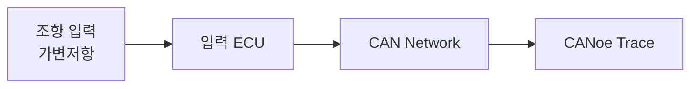
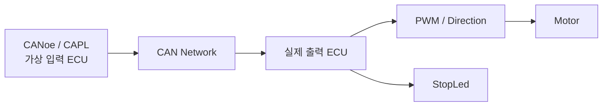
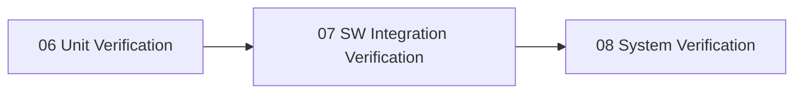
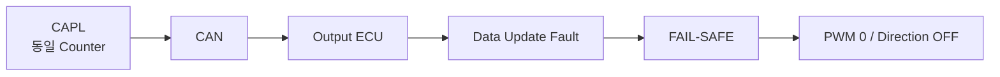
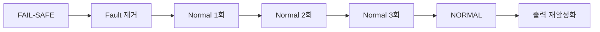
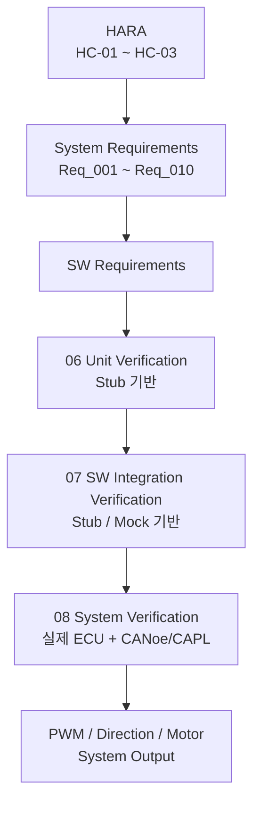

# 시스템 요구사항 검증 명세서 및 결과서

**Document ID**: STEER-08-SYSV  
**ISO 26262 Reference**: Part 4, Cl.8  
**ASPICE Reference**: SYS.5 (System Qualification Test)  
**Version**: 1.3  
**Date**: 2026-08-27  
**Status**: Completed  
**Project Title**: AUTOSAR 기반 조향 관련 오류에 대한 복구 및 진단 시스템  
**Subtitle**: CANoe/CAPL 기반 조향 Fault Injection 및 FAIL-SAFE 시스템 검증

---

## 1. 문서 목적

본 문서는 `01_Requirements.md`에서 정의한 시스템 요구사항 `Req_001 ~ Req_010`이 통합된 시스템 환경에서 충족되는지 검증한 결과를 정의한다.

시스템검증은 실제 ECU와 CAN Network를 사용하고, CANoe/CAPL Restbus Simulation을 통해 정상 조향 데이터 및 Fault 조건을 생성하여 출력 ECU의 조향 제어 및 FAIL-SAFE 동작을 확인한다.

주요 검증 대상은 다음과 같다.

- 조향 입력 및 CAN 데이터 전달
- Alive Counter 기반 데이터 갱신 이상 감지
- 조향 입력 유효 범위 이상 감지
- Fault 발생 시 FAIL-SAFE 전환
- FAIL-SAFE 상태에서 PWM 및 방향 출력 제한
- Fault 해제 후 연속 정상 조건에 따른 NORMAL 복귀
- 정상 상태에서 조향 방향 및 PWM 출력

실제 WdgM 모듈 내부 동작 및 Checkpoint 감시 기능 자체는 본 시스템검증 범위에 포함하지 않는다.

---

# 2. 시스템검증 구성

시스템검증은 두 가지 구성으로 수행한다.

## 2.1 구성 A — 입력 ECU 기능 확인



| 대상 | 확인 내용 |
|---|---|
| 조향 입력 장치 | 최소·중간·최대 입력 생성 |
| 입력 ECU | 조향값 변환 및 Alive Counter 생성 |
| CAN 통신 | 조향값 및 Counter 메시지 송신 |
| CANoe | Signal 값 및 메시지 송신 확인 |

구성 A는 실제 입력 ECU가 조향 입력을 CAN 메시지로 변환하여 정상적으로 송신하는지 확인하기 위해 사용한다.

---

## 2.2 구성 B — CANoe/CAPL Restbus 기반 출력 시스템 검증



| 구분 | 구성 |
|---|---|
| Fault 생성 | CANoe / CAPL |
| 통신 | 실제 CAN Network |
| 시험 대상 | 실제 출력 ECU |
| 정상 입력 | 유효 조향값 + 증가하는 Alive Counter |
| Fault 입력 | 동일 Alive Counter 반복, 유효 범위 밖 조향값 |
| 출력 관측 | PWM, Direction Pin, Motor 동작 |
| 보조 관측 | StopLed |

CAPL은 입력 ECU를 Restbus Simulation으로 대체하여 정상 및 비정상 CAN Signal을 생성한다.

---

# 3. 단계별 검증 관계

| 단계 | 검증 목적 |
|---|---|
| SWE.4 | 개별 C Unit 기능 검증 |
| SWE.5 | SWC 간 Interface 및 Fault 전파 검증 |
| SYS.5 | 실제 ECU 및 CAN Network 환경에서 시스템 요구사항 검증 |



단위 및 통합검증에서는 Stub/Mock을 사용하지만, 본 시스템검증에서는 실제 출력 ECU와 CAN Network를 사용한다.

---

# 4. 시험 환경

| 항목 | 구성 |
|---|---|
| 입력 ECU | MPC-5606B |
| 출력 ECU | MPC-5606B |
| AUTOSAR 환경 | Mobilgene Classic |
| Build / Download | CodeWarrior |
| Network Tool | CANoe |
| Fault Injection | CAPL |
| CAN Database | 프로젝트 DBC |
| CAN 관측 | CANoe Trace / Signal |
| 조향 입력 | 가변저항 또는 CAPL Signal |
| 출력 | PWM, Motor Direction Digital Output |
| 출력 장치 | DC Motor |
| 보조 출력 | StopLed |

---

# 5. 시험 전제조건

- 입력 및 출력 ECU에 검증 대상 Software Build가 다운로드되어 있어야 한다.
- CAN Network가 정상적으로 구성되어 있어야 한다.
- CANoe에 프로젝트 DBC가 적용되어 있어야 한다.
- CAPL에서 조향값과 Alive Counter를 변경할 수 있어야 한다.
- 출력 ECU에서 PWM 및 방향 출력이 정상적으로 연결되어 있어야 한다.
- 각 Test Case 시작 전 이전 Fault 상태가 초기화되어 있어야 한다.
- 정상 시험에서는 Alive Counter가 메시지마다 정상적으로 증가해야 한다.
- Fault 시험에서는 CAPL을 이용해 Counter 또는 조향값을 의도적으로 변경한다.

---

# 6. 시스템 Test Case

## 6.1 입력 ECU 기능 확인

| SYS-TC ID | 시험 조건·절차 | 기대 결과 | 관측 방법 | 추적 ID | 결과 |
|---|---|---|---|---|---|
| SYS-TC-IN-001 | 가변저항을 최소 위치로 설정 | 조향값 `-512`에 대응하는 CAN Signal 생성 | CANoe Signal | Req_001 / SYS-F-001 | PASS |
| SYS-TC-IN-002 | 가변저항을 중간 위치로 설정 | 조향값 `0`에 대응하는 CAN Signal 생성 | CANoe Signal | Req_001 / SYS-F-001 | PASS |
| SYS-TC-IN-003 | 가변저항을 최대 위치로 설정 | 조향값 `511`에 대응하는 CAN Signal 생성 | CANoe Signal | Req_001 / SYS-F-001 | PASS |
| SYS-TC-IN-004 | 입력 ECU 정상 동작 중 CAN 메시지 관측 | 조향값과 Alive Counter가 주기적으로 송신됨 | CANoe Trace | Req_002 / SYS-F-002 | PASS |
| SYS-TC-IN-005 | CAN 메시지를 연속 관측 | Alive Counter가 메시지마다 증가함 | CANoe Trace | Req_002 / SYS-F-002 | PASS |

---

# 6.2 정상 조향 출력

정상적인 조향 데이터가 전달될 때 출력 ECU가 조향 변화 방향과 크기에 따라 정상적으로 출력하는지 확인한다.

| SYS-TC ID | CAPL 시험 조건 | 기대 결과 | 관측 방법 | 추적 ID | 결과 |
|---|---|---|---|---|---|
| SYS-TC-NOR-001 | 증가하는 Alive Counter와 양의 조향 변화량 송신 | Right 방향 활성화 및 PWM 출력 발생 | PWM, Direction, Motor | Req_009, Req_010 / SYS-F-009, SYS-F-010 | PASS |
| SYS-TC-NOR-002 | 증가하는 Alive Counter와 음의 조향 변화량 송신 | Left 방향 활성화 및 PWM 출력 발생 | PWM, Direction, Motor | Req_009, Req_010 / SYS-F-009, SYS-F-010 | PASS |
| SYS-TC-NOR-003 | 조향 변화량을 정지 임계값 이내로 송신 | PWM 0 및 방향 출력 비활성 | PWM, Direction, Motor | Req_009, Req_010 / SYS-F-009, SYS-F-010 | PASS |

---

# 6.3 데이터 갱신 이상 Fault 시험

Alive Counter를 이용하여 조향 데이터 갱신 이상을 감지하고 FAIL-SAFE 상태로 전환되는지 검증한다.



| SYS-TC ID | CAPL 시험 조건 | 기대 결과 | 관측 방법 | 추적 ID | 결과 |
|---|---|---|---|---|---|
| SYS-TC-COM-001 | 정상 Counter 송신 | 정상 조향 출력 유지 | CANoe, PWM, Motor | Req_003 | PASS |
| SYS-TC-COM-002 | 동일 Alive Counter 1회 추가 송신 | Fault 미확정, 정상 동작 유지 | CANoe, PWM | Req_003 | PASS |
| SYS-TC-COM-003 | 동일 Alive Counter 연속 2회 송신 | 데이터 갱신 이상 감지 및 FAIL-SAFE 전환 | CANoe, PWM, Direction | Req_003, Req_006 | PASS |
| SYS-TC-COM-004 | 동일 Counter 상태 유지 | FAIL-SAFE 유지, PWM 0 및 방향 출력 차단 | PWM, Direction, Motor | Req_006, Req_007 | PASS |

---

# 6.4 조향 입력 Invalid Fault 시험

조향 입력이 정의된 유효 범위를 벗어나는 경우 FAIL-SAFE 상태로 전환되는지 검증한다.

정상 조향 입력 범위:

```text
-512 <= Steering Angle <= 511
```

| SYS-TC ID | CAPL 시험 조건 | 기대 결과 | 관측 방법 | 추적 ID | 결과 |
|---|---|---|---|---|---|
| SYS-TC-INV-001 | 조향값 `-512` 송신 | 정상 입력으로 판단 | CANoe, PWM | Req_004 | PASS |
| SYS-TC-INV-002 | 조향값 `511` 송신 | 정상 입력으로 판단 | CANoe, PWM | Req_004 | PASS |
| SYS-TC-INV-003 | 조향값 `-513` 송신 | Invalid Fault, FAIL-SAFE 전환 | CANoe, PWM, Direction | Req_004, Req_006 | PASS |
| SYS-TC-INV-004 | 조향값 `512` 송신 | Invalid Fault, FAIL-SAFE 전환 | CANoe, PWM, Direction | Req_004, Req_006 | PASS |
| SYS-TC-INV-005 | Invalid 상태를 계속 유지 | PWM 0 및 방향 출력 차단 유지 | PWM, Direction, Motor | Req_006, Req_007 | PASS |

---

# 6.5 FAIL-SAFE 출력 제한 시험

Fault 발생 시 위험한 조향 출력이 발생하지 않도록 최종 출력이 제한되는지 검증한다.

| SYS-TC ID | Fault 조건 | 기대 결과 | 관측 방법 | 추적 ID | 결과 |
|---|---|---|---|---|---|
| SYS-TC-SAFE-001 | Alive Counter 갱신 이상 | PWM 0 | PWM 측정 | Req_006, Req_007 / SYS-F-006, SYS-F-007 | PASS |
| SYS-TC-SAFE-002 | Alive Counter 갱신 이상 | Left / Right 모두 FALSE | Direction Pin | Req_006, Req_007 / SYS-F-006, SYS-F-007 | PASS |
| SYS-TC-SAFE-003 | Invalid 조향 입력 | PWM 0 | PWM 측정 | Req_006, Req_007 / SYS-F-006, SYS-F-007 | PASS |
| SYS-TC-SAFE-004 | Invalid 조향 입력 | Left / Right 모두 FALSE | Direction Pin | Req_006, Req_007 / SYS-F-006, SYS-F-007 | PASS |
| SYS-TC-SAFE-005 | Fault 상태 유지 중 조향값 변경 | 출력 차단 상태가 계속 유지됨 | PWM, Direction, Motor | Req_007 | PASS |

> StopLed는 FAIL-SAFE 상태 자체를 표시하는 시스템 상태 Interface로 사용하지 않는다. 현재 구현에서는 `Keep_Go == FALSE`인 출력 정지 조건을 보조적으로 나타내는 출력으로만 사용한다.

---

# 6.6 정상 상태 복귀 시험

FAIL-SAFE 상태에서 Fault가 해제된 이후 정상 조건이 연속적으로 확인된 경우에만 정상 상태로 복귀하는지 검증한다.



| SYS-TC ID | CAPL 시험 조건 | 기대 결과 | 관측 방법 | 추적 ID | 결과 |
|---|---|---|---|---|---|
| SYS-TC-REC-001 | Fault 해제 후 정상 메시지 1회 송신 | FAIL-SAFE 및 출력 차단 유지 | CANoe, PWM, Direction | Req_008 / SYS-F-008 | PASS |
| SYS-TC-REC-002 | 정상 메시지 연속 2회 송신 | FAIL-SAFE 및 출력 차단 유지 | CANoe, PWM, Direction | Req_008 / SYS-F-008 | PASS |
| SYS-TC-REC-003 | 정상 메시지 연속 3회 송신 | NORMAL 복귀 후 정상 조향 출력 활성화 | CANoe, PWM, Direction, Motor | Req_008 / SYS-F-008 | PASS |
| SYS-TC-REC-004 | 정상 메시지 2회 후 동일 Counter 재주입 | 복귀 Counter 초기화, FAIL-SAFE 유지 | CANoe, PWM, Direction | Req_008 / SYS-F-008 | PASS |
| SYS-TC-REC-005 | 정상 메시지 2회 후 Invalid 값 재주입 | 복귀 Counter 초기화, FAIL-SAFE 유지 | CANoe, PWM, Direction | Req_008 / SYS-F-008 | PASS |

---

# 7. 내부 SW 실행 이상 검증 범위

`Req_005`는 조향 제어와 관련된 내부 SW 실행 이상 감시를 요구한다.

현재 시스템에서는 AUTOSAR WdgM 상태를 이용하여 SW 실행 이상을 SafetyPolicy에 반영한다.

다만 본 프로젝트 환경에서는 실제 WdgM의 Supervised Entity, Checkpoint 및 Deadline/Alive Supervision을 의도적으로 위반하여 `FAILED`, `EXPIRED`, `STOPPED` 상태를 안정적으로 생성하는 시스템 Fault Injection 환경을 별도로 구성하지 않았다.

따라서 검증 범위는 다음과 같이 구분한다.

| 검증 단계 | 검증 내용 |
|---|---|
| Unit Verification | WdgM Status Stub을 이용한 `App_IsWdgmFault()` 상태 판정 |
| SW Integration Verification | Stub으로 주입한 WdgM Fault가 SafetyPolicy 및 최종 출력 차단까지 전달되는지 확인 |
| System Verification | 실제 WdgM 자체 Fault 생성 및 감시 기능은 제외 |

따라서 `Req_005`의 Application 반응 로직은 SWE.4 및 SWE.5에서 확인하였으며, 실제 WdgM 내부 감시 기능 자체에 대한 시스템 수준 검증은 본 프로젝트의 제한사항으로 관리한다.

---

# 8. 시스템 요구사항 추적성

| 시스템 요구사항 | 검증 Test Case / 단계 |
|---|---|
| Req_001 | SYS-TC-IN-001 ~ SYS-TC-IN-003 |
| Req_002 | SYS-TC-IN-004, SYS-TC-IN-005 |
| Req_003 | SYS-TC-COM-001 ~ SYS-TC-COM-004 |
| Req_004 | SYS-TC-INV-001 ~ SYS-TC-INV-005 |
| Req_005 | Unit / Integration Verification에서 Application 반응 로직 검증, 실제 WdgM 시스템 Fault Injection은 제한사항 |
| Req_006 | SYS-TC-COM-003, SYS-TC-INV-003, SYS-TC-INV-004, SYS-TC-SAFE-001 ~ SYS-TC-SAFE-004 |
| Req_007 | SYS-TC-COM-004, SYS-TC-INV-005, SYS-TC-SAFE-001 ~ SYS-TC-SAFE-005 |
| Req_008 | SYS-TC-REC-001 ~ SYS-TC-REC-005 |
| Req_009 | SYS-TC-NOR-001 ~ SYS-TC-NOR-003 |
| Req_010 | SYS-TC-NOR-001 ~ SYS-TC-NOR-003, SYS-TC-SAFE-001 ~ SYS-TC-SAFE-004 |

---

# 9. HARA 및 Safety Goal 연결

현재 HARA는 세 가지 주요 Hazard 원인 범주를 기반으로 Safety Goal을 정의한다.

| HARA ID | Safety Goal | 관련 시스템 Test Case |
|---|---|---|
| HC-01 | SG-01: 조향 데이터의 갱신 이상을 감지하고 위험한 조향 출력이 발생하지 않도록 해야 한다. | SYS-TC-COM-001 ~ SYS-TC-COM-004, SYS-TC-SAFE-001, SYS-TC-SAFE-002 |
| HC-02 | SG-02: 비정상적인 조향 입력을 감지하고 해당 입력으로 인해 위험한 조향 출력이 발생하지 않도록 해야 한다. | SYS-TC-INV-001 ~ SYS-TC-INV-005, SYS-TC-SAFE-003, SYS-TC-SAFE-004 |
| HC-03 | SG-03: 조향 제어 관련 SW 실행 이상을 감지하고 위험한 조향 출력이 발생하지 않도록 해야 한다. | SWE.4 / SWE.5 Application 반응 로직 검증 |

> HC-03에 대한 실제 WdgM 내부 Fault 생성은 시스템 수준 시험환경 제한으로 인해 본 SYS.5 직접 시험 범위에서는 제외한다.

---

# 10. 시험 결과 요약

| 시험 그룹 | 전체 | PASS | FAIL | BLOCKED |
|---|---:|---:|---:|---:|
| 입력 ECU 기능 확인 | 5 | 5 | 0 | 0 |
| 정상 조향 출력 | 3 | 3 | 0 | 0 |
| 데이터 갱신 이상 | 4 | 4 | 0 | 0 |
| Invalid 입력 | 5 | 5 | 0 | 0 |
| FAIL-SAFE 출력 제한 | 5 | 5 | 0 | 0 |
| 정상 상태 복귀 | 5 | 5 | 0 | 0 |
| **합계** | **27** | **27** | **0** | **0** |

---

# 11. 주요 검증 결과

- 실제 입력 ECU에서 조향 입력에 대응하는 CAN Signal이 생성되는 것을 확인하였다.
- Alive Counter가 정상 상태에서 지속적으로 갱신되는 것을 확인하였다.
- 동일 Alive Counter를 연속 입력하여 데이터 갱신 이상 Fault를 발생시킬 수 있음을 확인하였다.
- `-512 ~ 511` 범위를 벗어난 조향값에 대해 Invalid Fault가 발생하는 것을 확인하였다.
- 데이터 갱신 이상 및 Invalid Fault 발생 시 출력 ECU가 FAIL-SAFE 상태로 전환되는 것을 확인하였다.
- FAIL-SAFE 상태에서 PWM Duty가 0으로 제한되고 방향 출력이 비활성화되는 것을 확인하였다.
- Fault 상태가 지속되는 동안 조향 입력을 변경해도 안전 출력이 유지되는 것을 확인하였다.
- Fault 해제 후 정상 조건이 연속 3회 충족된 경우에만 정상 조향 출력이 재활성화되는 것을 확인하였다.
- 정상 복귀 과정에서 Fault가 다시 발생하는 경우 FAIL-SAFE 상태가 유지되는 것을 확인하였다.

---

# 12. 검증 제한사항

본 프로젝트의 시스템검증에는 다음 제한사항이 존재한다.

- 실제 차량 조향 시스템이 아닌 교육용 ECU 및 Motor 환경을 사용한다.
- CAPL Restbus Simulation을 통해 입력 ECU의 일부 동작을 대체한다.
- 실제 차량 주행 상태 및 차량 동역학은 검증 범위에 포함하지 않는다.
- 실제 AUTOSAR WdgM 내부 감시 기능 자체는 시스템 수준에서 Fault Injection하지 않는다.
- CAN Bus-Off, Transceiver 단선, 전원 Fault 등 물리 계층 고장은 검증하지 않는다.
- 실제 FTTI 및 ASIL 정량 검증은 수행하지 않는다.
- StopLed는 시스템 상태 모니터링 기능이 아닌 출력 정지 상태의 보조 표시로만 사용한다.

---

# 13. 시스템검증 완료 기준

시스템검증은 다음 조건을 만족할 경우 완료한 것으로 판단한다.

- 정의된 시스템 Test Case가 모두 수행되어야 한다.
- 조향 데이터 갱신 Fault가 검출되고 최종 안전 출력까지 이어져야 한다.
- Invalid 조향 입력이 검출되고 최종 안전 출력까지 이어져야 한다.
- FAIL-SAFE 상태에서 PWM 및 방향 출력이 제한되어야 한다.
- Fault 상태가 유지되는 동안 안전 출력이 유지되어야 한다.
- 정의된 정상 복귀 조건을 만족하기 전에는 정상 출력이 재활성화되지 않아야 한다.
- 정상 조건 연속 3회 만족 후 정상 출력이 재활성화되어야 한다.
- 시험 결과는 각 시스템 요구사항과 Test Case ID로 추적 가능해야 한다.
- 검증하지 못한 항목은 제한사항으로 명확히 관리해야 한다.

---

# 14. 전체 검증 흐름



---

본 문서는 SYS.5 System Qualification Test 관점에서 시스템 요구사항 충족 여부를 확인하기 위한 기준 산출물이다.

본 시스템검증에서는 실제 ECU와 CAN Network를 사용하고 CANoe/CAPL Restbus Simulation을 통해 정상 및 Fault 입력을 생성하여 시스템의 조향 제어 및 FAIL-SAFE 동작을 검증한다.

WdgM 관련 항목은 실제 WdgM 모듈 자체를 시스템 수준에서 검증했다고 주장하지 않으며, WdgM Status에 대한 Application 반응 로직은 `06_SW_Unit_Verification.md`와 `07_SW_Integration_Verification.md`에서 검증한다.

외부 NORMAL / FAIL-SAFE 상태 표시 기능은 시스템 요구사항에서 제외하며, StopLed는 최종 출력 정지 여부를 나타내는 보조 출력으로만 취급한다.

전체 HARA, 시스템 요구사항, SW 요구사항, 설계 및 검증 간 추적성은 `Traceability_Matrix.md`에서 관리한다.
