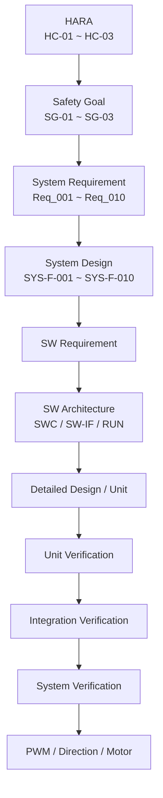

# 통합 추적성 매트릭스 (Integrated Traceability Matrix)

**Document ID**: STEER-TM-001  
**Version**: 2.2  
**Date**: 2026-08-27  
**Status**: Baseline  
**Project Title**: AUTOSAR 기반 조향 관련 오류에 대한 복구 및 진단 시스템  

---

## 1. 문서 목적

본 문서는 HARA부터 시스템 요구사항, SW 요구사항, 설계, 구현, 단위검증, SW 통합검증 및 시스템검증까지의 양방향 추적성을 관리하는 기준 문서이다.

프로젝트의 공식 추적성 흐름은 다음과 같다.

```text
HARA / Safety Goal
        ↓
System Requirement
        ↓
System Design
        ↓
SW Requirement
        ↓
SW Architecture
        ↓
SW Detailed Design / Unit
        ↓
Unit Verification
        ↓
SW Integration Verification
        ↓
System Verification
```

ID 기준:

```text
HC / SG
→ Req
→ SYS-F
→ SWR
→ SWC / SW-IF / RUN
→ SWD / UNIT
→ UT
→ ITC
→ SYS-TC
```

본 문서는 프로젝트 산출물 간 추적성의 기준 SSOT(Single Source of Truth)로 사용한다.

---

# 2. HARA → System Requirement 추적성

| HARA ID | Safety Goal | 관련 System Requirement | 설명 |
|---|---|---|---|
| HC-01 | SG-01 | Req_002, Req_003, Req_006, Req_007 | 조향 데이터 갱신 이상 감지 및 위험 출력 방지 |
| HC-02 | SG-02 | Req_001, Req_004, Req_006, Req_007 | 비정상 조향 입력 감지 및 위험 출력 방지 |
| HC-03 | SG-03 | Req_005, Req_006, Req_007 | 조향 제어 SW 실행 이상 감지 및 위험 출력 방지 |

> `Req_008` 정상 복귀는 개별 Hazard에 대한 직접 Safety Goal이 아니라 FAIL-SAFE 이후 기능 복구를 위한 시스템 요구사항으로 관리한다.

> `Req_009`, `Req_010`은 정상 조향 제어 및 출력 기능 요구사항으로 관리한다.

---

# 3. System Requirement → SW Requirement 추적성

| Req ID | System Function | SW Requirement | 설명 |
|---|---|---|---|
| Req_001 | SYS-F-001 | SWR-IN-001 | 조향 입력 수집 |
| Req_002 | SYS-F-002 | SWR-COM-001, SWR-COM-002 | 조향 정보 전달 |
| Req_003 | SYS-F-003 | SWR-DIAG-001 ~ SWR-DIAG-004 | 데이터 갱신 상태 감시 |
| Req_004 | SYS-F-004 | SWR-DIAG-005 ~ SWR-DIAG-008 | 조향 입력 유효성 검사 |
| Req_005 | SYS-F-005 | SWR-EXEC-001 ~ SWR-EXEC-003 | SW 실행 상태 감시 |
| Req_006 | SYS-F-006 | SWR-SAFE-001 | Fault 발생 시 FAIL-SAFE 전환 |
| Req_007 | SYS-F-007 | SWR-SAFE-002 ~ SWR-SAFE-005, SWR-ACT-002 | FAIL-SAFE 출력 제한 및 유지 |
| Req_008 | SYS-F-008 | SWR-REC-001 ~ SWR-REC-004 | 정상 조건 확인 후 NORMAL 복귀 |
| Req_009 | SYS-F-009 | SWR-CTRL-001, SWR-CTRL-002 | 조향 제어값 계산 |
| Req_010 | SYS-F-010 | SWR-ACT-001, SWR-ACT-002 | 최종 조향 출력 |

---

# 4. SW Requirement → Architecture / Detailed Design 추적성

## 4.1 입력 및 통신

| SW Requirement | SW Architecture | Detailed Design / Unit |
|---|---|---|
| SWR-IN-001 | SWC-001 / SW-IF-001 / RUN-001 | SWD-IN-001, SWD-IN-002 / UNIT-001 |
| SWR-COM-001 | SWC-001 / SW-IF-002 / RUN-001 | SWD-COM-001, SWD-COM-002 / UNIT-001 |
| SWR-COM-002 | SWC-002 / SW-IF-002 / RUN-002 | SWD-DIAG-001 / UNIT-002 |

---

## 4.2 데이터 갱신 진단

| SW Requirement | SW Architecture | Detailed Design / Unit |
|---|---|---|
| SWR-DIAG-001 | SWC-002 / SW-IF-002 / RUN-002 | SWD-DIAG-003, SWD-DIAG-004 / UNIT-002 |
| SWR-DIAG-002 | SWC-002 / SW-IF-002 / RUN-002 | SWD-DIAG-003, SWD-DIAG-006 / UNIT-002 |
| SWR-DIAG-003 | SWC-002 / SW-IF-003 / RUN-002 | SWD-DIAG-004, SWD-DIAG-005 / UNIT-002 |
| SWR-DIAG-004 | SWC-002 / SW-IF-003 / RUN-002 | SWD-DIAG-007 / UNIT-002 |

---

## 4.3 조향 입력 유효성 진단

| SW Requirement | SW Architecture | Detailed Design / Unit |
|---|---|---|
| SWR-DIAG-005 | SWC-002 / SW-IF-003 / RUN-002 | SWD-DIAG-002 / UNIT-002 |
| SWR-DIAG-006 | SWC-002 / SW-IF-003 / RUN-002 | SWD-DIAG-002 / UNIT-002 |
| SWR-DIAG-007 | SWC-002 / SW-IF-003 / RUN-002 | SWD-DIAG-002, SWD-DIAG-007 / UNIT-002 |
| SWR-DIAG-008 | SWC-002 / SW-IF-003 / RUN-002 | SWD-DIAG-007 / UNIT-002 |

---

## 4.4 SW 실행 상태 감시

| SW Requirement | SW Architecture | Detailed Design / Unit |
|---|---|---|
| SWR-EXEC-001 | SWC-003 / SW-IF-004 / RUN-003 | SWD-EXEC-001 / UNIT-003, UNIT-004 |
| SWR-EXEC-002 | SWC-003 / SW-IF-004 / RUN-003 | SWD-EXEC-001 / UNIT-004 |
| SWR-EXEC-003 | SWC-003 / SW-IF-004 / RUN-003 | SWD-EXEC-001 ~ SWD-EXEC-003 / UNIT-003, UNIT-004 |

> WdgM은 SW 실행 상태 감시를 구현하기 위한 AUTOSAR 메커니즘으로 사용하며, 요구사항 ID 자체는 `SWR-EXEC-*`로 관리한다.

---

## 4.5 FAIL-SAFE

| SW Requirement | SW Architecture | Detailed Design / Unit |
|---|---|---|
| SWR-SAFE-001 | SWC-003 / SW-IF-003, SW-IF-004, SW-IF-005 / RUN-003 | SWD-SAFE-001, SWD-SAFE-002 / UNIT-003 |
| SWR-SAFE-002 | SWC-003 / SW-IF-005 / RUN-003 | SWD-SAFE-003, SWD-SAFE-004 / UNIT-003 |
| SWR-SAFE-003 | SWC-003, SWC-004, SWC-005 / SW-IF-005 ~ SW-IF-007 | SWD-SAFE-003, SWD-CTRL-001, SWD-ACT-002 / UNIT-003, UNIT-005, UNIT-006 |
| SWR-SAFE-004 | SWC-003, SWC-004, SWC-005 / SW-IF-005 ~ SW-IF-007 | SWD-SAFE-004, SWD-CTRL-001, SWD-ACT-002 / UNIT-003, UNIT-005, UNIT-006 |
| SWR-SAFE-005 | SWC-003 / SW-IF-005 / RUN-003 | SWD-SAFE-003, SWD-SAFE-004 / UNIT-003 |

---

## 4.6 정상 복귀

| SW Requirement | SW Architecture | Detailed Design / Unit |
|---|---|---|
| SWR-REC-001 | SWC-003 / SW-IF-005 / RUN-003 | SWD-REC-001 / UNIT-003 |
| SWR-REC-002 | SWC-003 / SW-IF-005 / RUN-003 | SWD-REC-002, SWD-REC-003 / UNIT-003 |
| SWR-REC-003 | SWC-003 / SW-IF-005 / RUN-003 | SWD-REC-004 / UNIT-003 |
| SWR-REC-004 | SWC-003 / SW-IF-005 / RUN-003 | SWD-REC-003 / UNIT-003 |

---

## 4.7 제어 및 출력

| SW Requirement | SW Architecture | Detailed Design / Unit |
|---|---|---|
| SWR-CTRL-001 | SWC-004 / SW-IF-005, SW-IF-006 / RUN-004 | SWD-CTRL-002 ~ SWD-CTRL-008, SWD-CTRL-010 / UNIT-005 |
| SWR-CTRL-002 | SWC-004 / SW-IF-005, SW-IF-006 / RUN-004 | SWD-CTRL-005, SWD-CTRL-009 / UNIT-005 |
| SWR-ACT-001 | SWC-005 / SW-IF-006, SW-IF-007 / RUN-005 | SWD-ACT-001, SWD-ACT-004, SWD-ACT-005 / UNIT-006 |
| SWR-ACT-002 | SWC-005 / SW-IF-006, SW-IF-007 / RUN-005 | SWD-ACT-002, SWD-ACT-003 / UNIT-006 |

---

# 5. SW Requirement → Unit Verification 추적성

| SW Requirement | Unit Test |
|---|---|
| SWR-IN-001 | UT-IN-001 ~ UT-IN-003 |
| SWR-COM-001 | UT-IN-004, UT-IN-005 |
| SWR-COM-002 | UT-DIAG-001, UT-DIAG-002 |
| SWR-DIAG-001 ~ SWR-DIAG-004 | UT-DIAG-007 ~ UT-DIAG-010 |
| SWR-DIAG-005 ~ SWR-DIAG-008 | UT-DIAG-003 ~ UT-DIAG-006 |
| SWR-EXEC-001 ~ SWR-EXEC-003 | UT-SAFE-001, UT-SAFE-003, UT-EXEC-001 ~ UT-EXEC-005 |
| SWR-SAFE-001 ~ SWR-SAFE-005 | UT-SAFE-001 ~ UT-SAFE-004, UT-CTRL-001, UT-ACT-001 |
| SWR-REC-001 ~ SWR-REC-004 | UT-REC-001 ~ UT-REC-004 |
| SWR-CTRL-001, SWR-CTRL-002 | UT-CTRL-002 ~ UT-CTRL-009 |
| SWR-ACT-001, SWR-ACT-002 | UT-ACT-001 ~ UT-ACT-005 |

---

# 6. SW Requirement → Integration Verification 추적성

| SW Requirement | Integration Test |
|---|---|
| SWR-IN-001 | ITC-SW-001 |
| SWR-COM-001, SWR-COM-002 | ITC-SW-001 ~ ITC-SW-003, ITC-RUN-001 |
| SWR-DIAG-001 ~ SWR-DIAG-004 | ITC-SW-003 ~ ITC-SW-005, ITC-FLOW-001 |
| SWR-DIAG-005 ~ SWR-DIAG-008 | ITC-SW-006, ITC-SW-007, ITC-FLOW-002, ITC-FLOW-003 |
| SWR-EXEC-001 ~ SWR-EXEC-003 | ITC-EXEC-001 ~ ITC-EXEC-004, ITC-FLOW-004 |
| SWR-SAFE-001 ~ SWR-SAFE-005 | ITC-SAFE-001 ~ ITC-SAFE-003, ITC-FLOW-001 ~ ITC-FLOW-004 |
| SWR-REC-001 ~ SWR-REC-004 | ITC-REC-001 ~ ITC-REC-004 |
| SWR-CTRL-001, SWR-CTRL-002 | ITC-CTRL-001 ~ ITC-CTRL-004 |
| SWR-ACT-001, SWR-ACT-002 | ITC-ACT-001 ~ ITC-ACT-003, ITC-FLOW-001 ~ ITC-FLOW-004 |

---

# 7. System Requirement → System Verification 추적성

| System Requirement | System Test Case | 검증 상태 |
|---|---|---|
| Req_001 | SYS-TC-IN-001 ~ SYS-TC-IN-003 | Verified |
| Req_002 | SYS-TC-IN-004, SYS-TC-IN-005 | Verified |
| Req_003 | SYS-TC-COM-001 ~ SYS-TC-COM-004 | Verified |
| Req_004 | SYS-TC-INV-001 ~ SYS-TC-INV-005 | Verified |
| Req_005 | Unit / Integration에서 Application 반응 검증, 실제 WdgM 시스템 Fault Injection은 제한사항 | Partially Verified |
| Req_006 | SYS-TC-COM-003, SYS-TC-INV-003, SYS-TC-INV-004, SYS-TC-SAFE-001 ~ SYS-TC-SAFE-004 | Verified |
| Req_007 | SYS-TC-COM-004, SYS-TC-INV-005, SYS-TC-SAFE-001 ~ SYS-TC-SAFE-005 | Verified |
| Req_008 | SYS-TC-REC-001 ~ SYS-TC-REC-005 | Verified |
| Req_009 | SYS-TC-NOR-001 ~ SYS-TC-NOR-003 | Verified |
| Req_010 | SYS-TC-NOR-001 ~ SYS-TC-NOR-003, SYS-TC-SAFE-001 ~ SYS-TC-SAFE-004 | Verified |

---

# 8. HARA → System Verification 추적성

| HARA ID | Safety Goal | 관련 시스템 요구사항 | 시스템 검증 | 상태 |
|---|---|---|---|---|
| HC-01 | SG-01 | Req_002, Req_003, Req_006, Req_007 | SYS-TC-COM-001 ~ SYS-TC-COM-004, SYS-TC-SAFE-001, SYS-TC-SAFE-002 | Verified |
| HC-02 | SG-02 | Req_001, Req_004, Req_006, Req_007 | SYS-TC-INV-001 ~ SYS-TC-INV-005, SYS-TC-SAFE-003, SYS-TC-SAFE-004 | Verified |
| HC-03 | SG-03 | Req_005, Req_006, Req_007 | Unit/Integration에서 WdgM Status에 대한 Application 반응 및 출력 차단 검증 | Partially Verified |

> HC-03의 실제 WdgM 내부 Supervision Fault 생성 및 시스템 수준 Fault Injection은 본 프로젝트 시험환경의 제한사항으로 관리한다.

---

# 9. End-to-End 추적성

## 9.1 조향 데이터 갱신 이상

```text
HC-01
→ SG-01
→ Req_003
→ SYS-F-003
→ SWR-DIAG-001 ~ SWR-DIAG-004
→ SWC-002 CanMonitor
→ UNIT-002
→ UT-DIAG-007 ~ UT-DIAG-010
→ ITC-FLOW-001
→ SYS-TC-COM-001 ~ SYS-TC-COM-004
→ FAIL-SAFE 출력 검증
```

---

## 9.2 비정상 조향 입력

```text
HC-02
→ SG-02
→ Req_004
→ SYS-F-004
→ SWR-DIAG-005 ~ SWR-DIAG-008
→ SWC-002 CanMonitor
→ UNIT-002
→ UT-DIAG-003 ~ UT-DIAG-006
→ ITC-FLOW-002 / ITC-FLOW-003
→ SYS-TC-INV-001 ~ SYS-TC-INV-005
→ FAIL-SAFE 출력 검증
```

---

## 9.3 SW 실행 이상

```text
HC-03
→ SG-03
→ Req_005
→ SYS-F-005
→ SWR-EXEC-001 ~ SWR-EXEC-003
→ WdgM Status + SafetyPolicy
→ UNIT-003 / UNIT-004
→ UT-EXEC-001 ~ UT-EXEC-005
→ ITC-EXEC-001 ~ ITC-EXEC-004
→ ITC-FLOW-004
→ Application FAIL-SAFE 반응 검증
```

> 실제 WdgM 모듈의 Supervision Fault 생성 자체는 본 프로젝트 시스템 시험 범위에서 제외한다.

---

# 10. 정상 복귀 추적성

정상 복귀는 별도의 HARA Event가 아니라 FAIL-SAFE 이후 시스템 기능 복구를 위한 요구사항으로 관리한다.

```text
Req_008
→ SYS-F-008
→ SWR-REC-001 ~ SWR-REC-004
→ SWC-003 SafetyPolicy
→ UNIT-003
→ UT-REC-001 ~ UT-REC-004
→ ITC-REC-001 ~ ITC-REC-004
→ SYS-TC-REC-001 ~ SYS-TC-REC-005
```

---

# 11. 산출물 기준선

| 단계 | 기준 문서 | 주요 ID |
|---|---|---|
| HARA | `00a_HARA_Worksheet.md` | HC-01 ~ HC-03, SG-01 ~ SG-03 |
| 시스템 요구사항 | `01_Requirements.md` | Req_001 ~ Req_010 |
| 시스템 설계 | `02_System_Design.md` | SYS-F-001 ~ SYS-F-010 |
| SW 요구사항 | `03_SW_Requirements.md` | SWR-IN, SWR-COM, SWR-DIAG, SWR-EXEC, SWR-SAFE, SWR-REC, SWR-CTRL, SWR-ACT |
| SW 아키텍처 | `04_SW_Architecture_Design.md` | SWC-001 ~ SWC-005, SW-IF-001 ~ SW-IF-007, RUN-001 ~ RUN-005 |
| SW 상세설계·구현 | `05_SW_Detailed_Design_Unit_Construction.md` | SWD-*, UNIT-001 ~ UNIT-006 |
| SW 단위검증 | `06_SW_Unit_Verification.md` | UT-IN, UT-DIAG, UT-SAFE, UT-REC, UT-EXEC, UT-CTRL, UT-ACT |
| SW 통합검증 | `07_SW_Integration_Verification.md` | ITC-SW, ITC-EXEC, ITC-SAFE, ITC-CTRL, ITC-ACT, ITC-FLOW, ITC-REC, ITC-RUN |
| 시스템검증 | `08_System_Verification.md` | SYS-TC-IN, SYS-TC-NOR, SYS-TC-COM, SYS-TC-INV, SYS-TC-SAFE, SYS-TC-REC |

---

# 12. 추적성 상태 정의

| 상태 | 의미 |
|---|---|
| Verified | 관련 요구사항이 정의된 검증 단계에서 확인됨 |
| Partially Verified | 일부 요구 또는 Application 반응은 검증되었으나 전체 시스템 수준 검증에는 제한사항 존재 |
| Not Verified | 검증되지 않음 |
| N/A | 해당 검증 단계의 대상이 아님 |

현재 프로젝트에서 `Req_005 / HC-03`은 WdgM Status에 대한 Application의 Fault 처리 및 FAIL-SAFE 전파는 Unit / Integration Verification에서 확인하였으나, 실제 WdgM 내부 Supervision Fault 생성은 시스템 수준에서 직접 검증하지 않았으므로 `Partially Verified`로 관리한다.

---

# 13. 변경 영향 관리

요구사항 또는 구현 변경 시 다음 항목을 함께 검토한다.

| 변경 대상 | 영향 분석 대상 |
|---|---|
| HARA / Safety Goal | System Requirement, System Test |
| System Requirement | SYS-F, SWR, System Test |
| SW Requirement | SWC, SW-IF, SWD, Unit Test, Integration Test |
| Interface | SW-IF, RTE API, 연결 SWC, Integration Test |
| Alive Counter 임계값 | SWR-DIAG, SWD-DIAG, UT-DIAG, ITC, SYS-TC-COM |
| 조향 유효 범위 | SWR-DIAG, SWD-DIAG, UT-DIAG, SYS-TC-INV |
| 정상 복귀 횟수 | SWR-REC, SWD-REC, UT-REC, ITC-REC, SYS-TC-REC |
| 안전 출력 정책 | SWR-SAFE, SWR-ACT, ControlCalc, PwmActuator, 관련 검증 |
| HW Mapping | UNIT-006, IoHwAb Interface, Integration Mock, System Output Test |

모든 변경은 변경 사유, 영향받는 ID, 소스코드 변경 및 재검증 결과와 연결하여 관리한다.

---

# 14. 프로젝트 추적성 요약



---

본 문서는 프로젝트 산출물 간 양방향 추적성의 기준 문서이다.

HARA에서 도출된 Safety Goal은 시스템 요구사항으로 구체화하고, 시스템 요구사항은 SW 요구사항, Architecture, Detailed Design, 구현 및 검증 Test Case까지 연결한다.

데이터 갱신 이상, 비정상 조향 입력 및 SW 실행 이상이라는 세 가지 주요 Fault 경로는 각각 관련 요구사항과 설계 및 검증 결과로 추적한다.

정상 복귀는 별도의 HARA Event가 아니라 `Req_008`을 기반으로 한 시스템 복구 요구사항으로 관리한다.

외부 NORMAL / FAIL-SAFE 상태 표시 기능은 본 프로젝트의 공식 요구사항 및 추적성 범위에 포함하지 않는다.

StopLed는 별도의 Fault 상태 표시 요구사항이 아니라 `Keep_Go`에 따른 출력 정지 상태를 나타내는 Actuator 보조 출력으로 관리한다.
